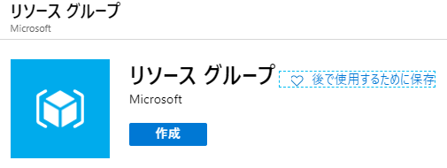
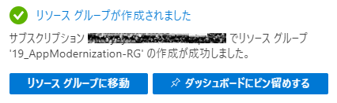
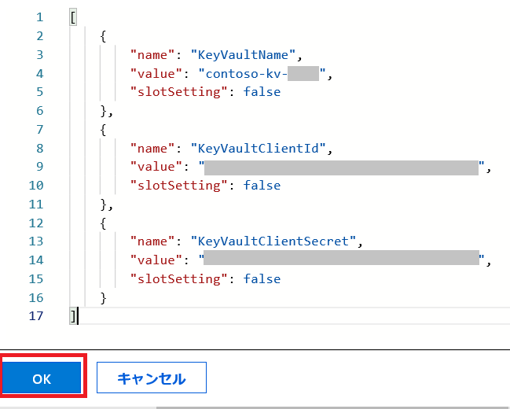
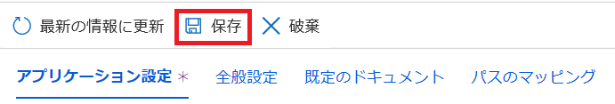
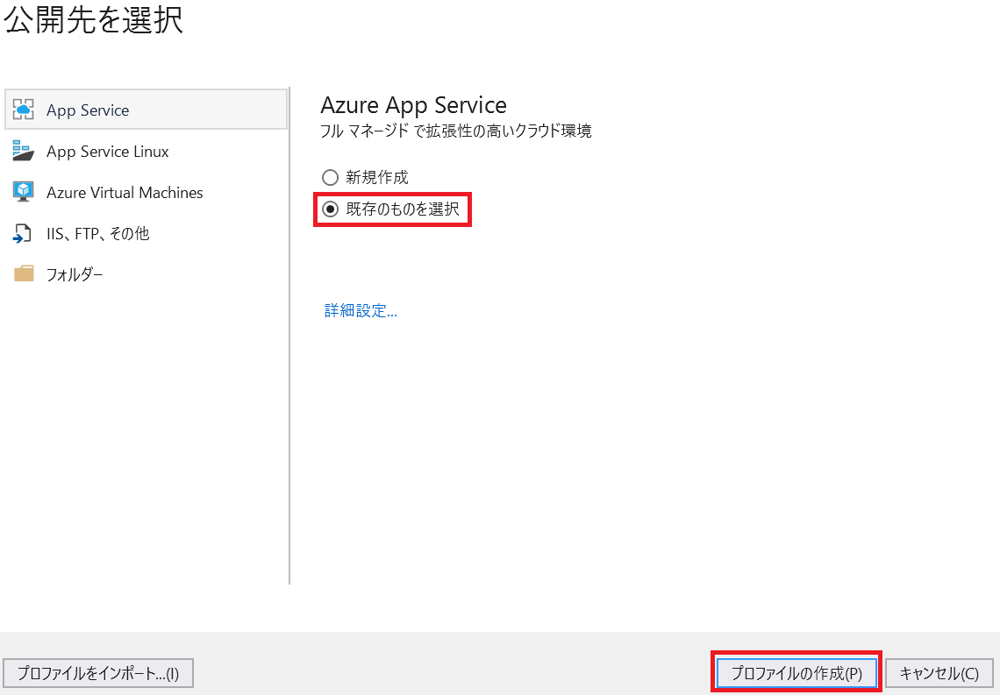
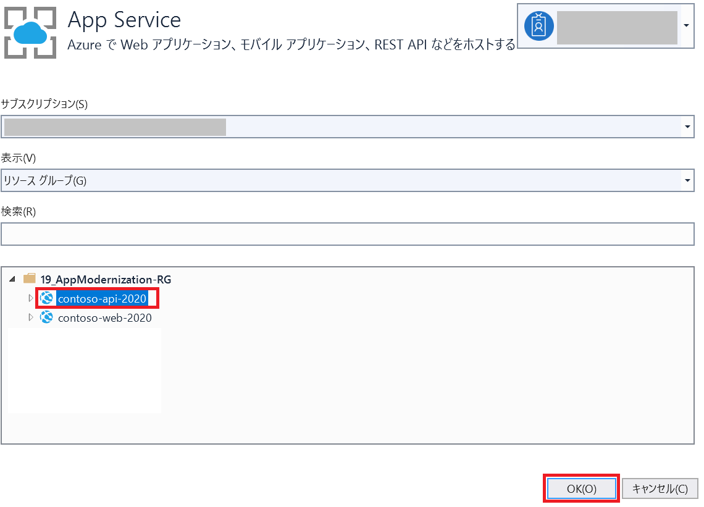
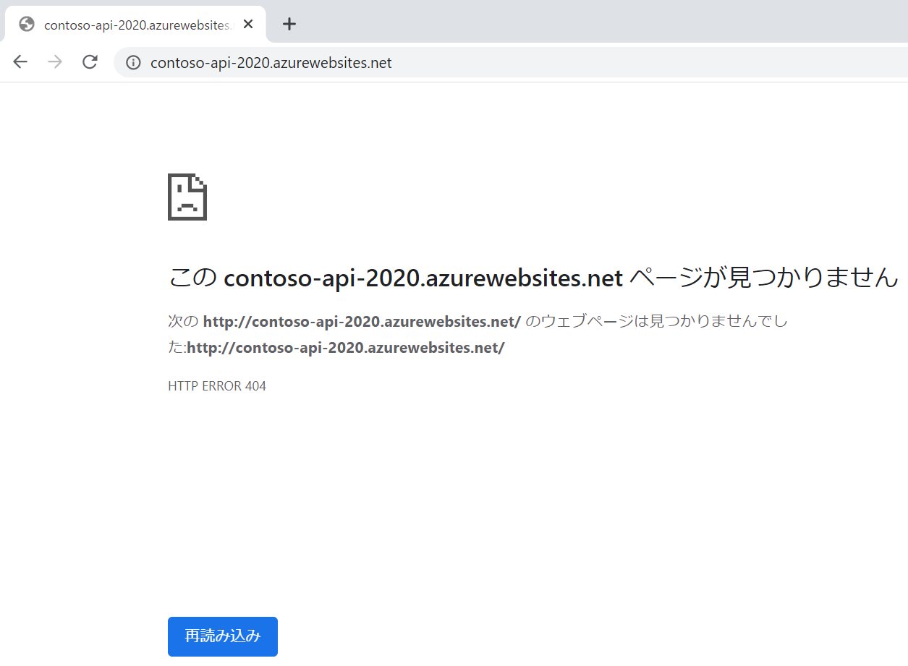
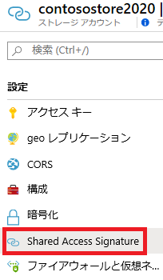

App modernization  
Hands-on lab step-by-step  
March 2020

<br />

**Contents**

- [App modernization hands-on lab step-by-step](#app-modernization-hands-on-lab-step-by-step)
  - [要約および学習目標](#要約および学習目標)
  - [概要](#概要)
  - [ソリューション アーキテクチャ](#ソリューション-アーキテクチャ)
  - [要件](#要件)
  - [Exercise 1: 環境のセットアップ](#exercise-1-環境のセットアップ)
      - [Task 1: リソース グループの作成](#task-1-リソース-グループの作成)
      - [Task 2: リソース グループへのアクセス権限の付与](#task-2-リソース-グループへのアクセス権限の付与)
      - [Task 3: ストレージ アカウントの作成](#task-3-ストレージ-アカウントの作成)
      - [Task 4: SQL Server 2008 R2 仮想マシンの作成](#task-4-sql-server-2008-r2-仮想マシンの作成)
      - [Task 5: Azure SQL Database のプロビジョニング](#task-5-azure-sql-database-のプロビジョニング)
      - [Task 6: Azure Database Migration Service の作成](#task-6-azure-database-migration-service-の作成)
      - [Task 7: API App のプロビジョニング](#task-7-api-app-のプロビジョニング)
      - [Task 8: Azure Functions のプロビジョニング](#task-8-azure-functions-のプロビジョニング)
      - [Task 9: Cognitive Search Service のプロビジョニング](#task-9-cognitive-search-service-のプロビジョニング)
      - [Task 10: Cognitive Service アカウントの作成](#task-10-cognitive-service-アカウントの作成)
      - [Task 11: Azure Key Vault の作成](#task-11-azure-key-vault-の作成)
      - [Task 12: API Management のプロビジョニング](#task-12-api-management-のプロビジョニング)
      - [Task 13: SQL Server データベースの復元](#task-12-sql-server-データベースの復元)
      - [Task 14: Data Migration Assistant のインストール](#task-13-data-migration-assistant-のインストール)
  - [Exercise 2: Azure SQL Database へのオンプレミス データベースの移行](#exercise-2-azure-sql-database-へのオンプレミス-データベースの移行)
    - [Task 1: ContosoInsurance の構成](#task-1-contosoinsurance-の構成)
    - [Task 2: Azure SQL Database への移行の評価の実行](#task-2-azure-sql-database-への移行の評価の実行)
    - [Task 3: Data Migration Assistant を使用したデータベース スキーマの移行](#task-3-data-migration-assistant-を使用したデータベース-スキーマの移行)
    - [Task 4: SQL Server 2008 R2 仮想マシンの IP アドレスの取得](#task-4-sql-server-2008-r2-仮想マシンの-ip-アドレスの取得)
    - [Task 5: Azure Database Migration Service を使用したデータベースの移行](#task-5-azure-database-migration-service-を使用したデータベースの移行)
  - [Exercise 3: データベースのアップグレード後のセキュリティ強化](#exercise-3-データベースのアップグレード後のセキュリティ強化)
    - [Task 1: データの検出と分類の構成](#task-3-データの検出と分類の構成)
    - [Task 2: Advanced Data Security の脆弱性評価のレビュー](#task-2-advanced-data-security-の脆弱性評価のレビュー)
    - [Task 3: 動的データ マスクの有効化](#task-3-動的データ-マスクの有効化)
  - [Exercise 4: Key Vault の構成](#exercise-4-key-vault-の構成)
    - [Task 1: Key Vault アクセス ポリシーの追加](#task-1-key-vault-アクセス-ポリシーの追加)
    - [Task 2: SQL 接続文字列を格納する新しいシークレットの作成](#task-2-sql-接続文字列を格納する新しいシークレットの作成)
    - [Task 3: サービス プリンシパルの作成](#task-3-サービス-プリンシパルの作成)
    - [Task 4: Key Vault へのサービス プリンシパル アクセスの割り当て](#task-4-key-vault-へのサービス-プリンシパル-アクセスの割り当て)
  - [Exercise 5: Azure App Services への Web API の展開](#exercise-5-azure-app-services-への-web-api-の展開)
    - [Task 1: Visual Studio でソリューションを開く](#task-1-visual-studio--ソリューションを開く)
    - [Task 2: Key Vault を使用するための Web API の更新](#task-2-key-vault-を使用するための-web-wpi-の更新)
    - [Task 3: Azure 内の API App への Key Vault 構成セクションのコピー](#task-3-azure-内の-api-app-への-key-vault-構成セクションのコピー)
    - [Task 4: Azure への API の展開](#task-4-azure-への-api-の展開)
  - [Exercise 6: Azure App Services への Web アプリケーションの展開](#exercise-6-azure-app-services-への-web-アプリケーションの展開)
    - [Task 1: Web App のアプリケーション設定への API App URL の追加](#task-1-web-app-のアプリケーション設定への-api-app-url-の追加)
    - [Task 2: Azure への Web アプリケーションの展開](#task-2-azure-への-web-アプリケーションの展開)
  - [Exercise 7: Blob ストレージへの保険契約ドキュメントのアップロード](#exercise-7-blob-ストレージへの保険契約ドキュメントのアップロード)
    - [Task 1: PDF ファイルを格納するコンテナーの作成](#task-1-pdf-ファイルを格納するコンテナーの作成)
    - [Task 2: SAS トークンの作成](#task-2-sas-トークンの作成)
    - [Task 3: AzCopy を使用した Blob ストレージへの PDF の一括アップロード](#task-3-azcopy-を使用した-blob-ストレージへの-pdfの一括アップロード)
  - [Exercise 8: PDF にアクセスするための Azure Functions の作成](#exercise-8-pdf-にアクセスするための-azure-functions-の作成)
    - [Task 1:  Azure Functions へのアプリケーション設定の追加](#task-1-azure-functions-へのアプリケーション設定の追加)
    - [Task 2: プロジェクト環境変数の追加](#task-2-プロジェクト環境変数の追加)
    - [Task 3: Visual Studio での Azure Functions の作成](#task-3-visual-studio-での-azure-functions-の作成)
    - [Task 4: ローカル環境での関数のテスト](#task-4-ローカル環境での関数のテスト)
    - [Task 5: Azure Functions への関数の展開](#task-5-azure-functions-への関数の展開)
    - [Task 6: Azure Functions での Application Insights の有効化](#task-6-azure-functions-での-application-insights-の有効化)
    - [Task 7: Web Apps のアプリケーション設定への Azure Functions URL の追加](#task-7-web-apps-のアプリケーション設定への-azure-functions-url-の追加)
    - [Task 8: Web アプリからドキュメント取得のテスト](#task-8-web-アプリからドキュメント取得のテスト)
    - [Task 9: ライブ メトリックス ストリームの表示](#ライブ-メトリックス-ストリームの表示)
  - [Exercise 9: 保険契約ドキュメントへのフルテキスト検索機能の追加](#exercise-9-保険契約ドキュメントへのフルテキスト検索機能の追加)
    - [Task 1: ストレージ アカウントへの Azure Cognitive Search の追加](#task-1-ストレージ-アカウントへの-azure-cognitive-search-の追加)
    - [Task 2: 検索結果のレビュー](#task-2-検索結果のレビュー)
  - [Exercise 10: API Management への API のインポートと公開](#exercise-10-api-management-への-api-のインポートと公開)
    - [Task 1: API App のインポート](#task-1-api-app-のインポート)
    - [Task 2: Azure Functions のインポート](#task-2-azure-functions-のインポート)
    - [Task 3: 開発者ポータルからの API キーの取得](#task-3-開発者ポータルからの-api-キーの取得)
    - [Task 4: API Management エンドポイントを使用するための Web App の更新](#task-4-api-management-エンドポイントを使用するための-web-app-の更新)
  - [Exercise 11: PowerApps でのアプリの作成](#exercise-11-powerapps-でのアプリの作成)
    - [Task 1: PowerApps アカウントへのサインアップ](#task-1-powerapps-アカウントへのサインアップ)
    - [Task 2: 新しい SQL 接続の作成](#task-2-新しい-sql-接続の作成)
    - [Task 3: 新しいアプリの作成](#task-3-新しいアプリの作成)
    - [Task 4: アプリの設計](#task-4-アプリの設計)
    - [Task 5: アプリ設定の編集とアプリの実行](#task-5-アプリ設定の編集とアプリの実行)
  - [ワークショップ後の作業](#ワークショップ後の作業)
    - [Task 1: リソース グループの削除](#task-1-リソース-グループの削除)
    - [Task 2: Contoso-apps サービス プリンシパルの削除](#task-2-contoso-apps-サービス-プリンシパルの削除)

# **App modernization hands-on lab step-by-step**

## **要約および学習目標**
このハンズオン ラボでは、データベースのアップグレードと Azure への移行やサーバーレスおよびクラウド サービスの活用を目的としたアプリケーションの更新など、レガシ オンプレミス アプリケーションを最新化する手順を実装します。
このハンズオン ラボは、クラウド サービスを使用してレガシ オンプレミス アプリケーションおよびインフラストラクチャを最新化するためのソリューションを構築する能力の向上を目的としています。

## **概要**
Contoso, Ltd. (Contoso) は古くから存在する業界に新規参入した企業です。ニュージーランドのオークランドで 2011 年に設立された Contoso は、十分な保険に入っていない個人を対象としたニッチな市場で広範な長期保険サービスを提供しています。当初の予想よりも早いペースで成長を続けた Contoso では、その成長のスピードに対応することが困難になりつつありました。創業直後の 1 年間だけでも、同社のサービスに対する需要に応えるために 100 人以上の従業員を新規に雇用しました。Contoso は、保険契約と関連ドキュメントを管理するためにカスタム開発された PolicyConnect という Windows Forms アプリケーションを使用しています。PolicyConnect はオンプレミスの SQL Server 2008 R2 データベースをデータストアとして使用し、契約ドキュメントの格納には LAN 上のファイル サーバーが使用されています。契約の管理を目的としたこのアプリケーションとプロセスに対する負荷は限界に近づいています。
最近、Contoso は、契約者、仲買人、および従業員が Contoso ネットワークへの VPN 接続なしで契約情報にアクセスできる新しい Web およびモバイル プロジェクトを開始しました。Web プロジェクトは、REST API を使用して PolicyConnect データベースにアクセスする新しい .NET Core 2.2 MVC Web アプリケーションです。Contoso は、モバイル アプリや WinForms バージョンの PolicyConnect を始めとするすべてのアプリケーションで REST API を共有することを計画しています。現在は、オンプレミスで実行するプロトタイプの Web アプリケーションが存在し、Contoso では、このアプリをクラウドでホストすることが検討されています。しかし、Contoso にはクラウドの経験がないので、クラウドのすべてのマネージド サービスのメリットを活用する方法が不明です。同社は、現在までに作成されたアプリをクラウド ネイティブ アプリケーションに変換する方法を模索しています。
モバイル アプリの開発はまだ開始されていません。Contoso は、.NET 開発者が Android および iOS 上に PolicyConnect を実装するための容易なアプローチを探しています。
Contoso のアプリケーションをクラウドでホストするための準備の一環として、同社では、既存の SQL Server データベースを Azure 内の PaaS SQL サービスに移行することが計画されています。Contoso は、Azure の完全なマネージド SQL サービスで提供される高度なセキュリティ機能を活用したいと考えています。クラウドに移行することにより、社内の技術的能力が向上し、クラウドの強化機能やサービスを活用できるようになることが期待されています。Contoso が追加したいと考えている新しい機能は、仲買人からのドキュメントの自動転送、仲買人向けのセキュアなアクセス、契約情報へのアクセス、および分散する従業員が利用できる信頼性の高い契約情報の抽出です。PolicyConnect WinForms アプリケーションを使用する方針は確定していますが、クラウド ベースの API およびサービスを使用するためにアプリケーションを更新することが検討されています。さらに、Web およびモバイル アプリから取得できるように契約ドキュメントをクラウド ストレージに格納することも検討されています。

## **ソリューション アーキテクチャ**

最初の手順は、**Azure Database Migration Service (DMS)** を使用して Contoso の SQL Server 2008 R2 データベースを **Azure SQL Database** に移行することです。Contoso では **Data Migration Assistant (DMA)** を使用して、Azure の完全なマネージド SQL データベース サービスに移行できることが確認されています。この評価では、Azure SQL Database の使用に関連する互換性の問題やサポートされていない機能は検出されませんでした。次に、Web および API アプリを **Azure App Services** に展開します。また、PolicyConnect へのリモート アクセスを提供するために、Xamarin を使用して Android および iOS 向けに構築されたモバイル アプリを作成します。Web App でホストされる Web サイトはブラウザー ベースのクライアント用のユーザー インターフェイスを提供し、Xamarin.Forms ベースのアプリが モバイル デバイス用の UI を提供します。モバイル アプリと Web サイトは両方とも、**API Management** の背後に配置された **Azure Functions** でホストされる Web サービスに依存します。レガシ Windows Forms デスクトップ アプリケーションの API をホストするために **API App** も展開します。**Blob Storage** に格納されたデータベースおよび契約ドキュメントへのアクセスを提供するために Azure Functions および Azure Functions プロキシによって軽量のサーバーレス API が提供されます。
API Management は、開発チームとアフィリエイト パートナー向けの API ストアを作成するために使用します。接続文字列などの機密構成データは **Key Vault** に格納され、必要な時に API または Web アプリからアクセスされるので、これらの設定がファイル システムに保存されることはありません。API App は、**Azure Cache for Redis** を使用してキャッシュ アサイド パターンを実装します。Blob Storage 内の契約ドキュメントにインデックスを作成するためにフルテキスト 検索を使用します。**Azure Search** のコグニティブ スキルを使用して検索インデックス エンリッチメントを有効にするために **Cognitive Services** を使用します。承認されたビジネス ユーザーにモバイル アプリおよび Web CRUD (create、read、update、delete) アプリケーションの作成を許可するために **PowerApps** を使用します。これらのアプリは、SQL Database および Azure Storage と対話します。**Microsoft Flow** によってモバイル通知を送信するための Office 365 電子メールおよびサービスとのオーケストレーションが実現します。これらのオーケストレーションは、PowerApps から独立して使用することに加えて、PowerApps から起動して追加ロジックを提供することができます。このソリューションでは、Azure AD で維持されているユーザーおよびアプリケーション ID を使用します。
>メモ: ここで紹介するソリューションは、考えられるさまざまなアプローチの中の 1 つです。

## **要件**
- Microsoft Azure サブスクリプション
  - 無料アカウントでは、このワークショップを実行することはできません
- Azure Active Directory テナント内での権限
   - Azure Active Directory アプリケーションおよびサービス プリンシパルの作成
   - サブスクリプションでの役割の割り当て
   - リソース プロバイダーの登録

## **Exercise 1: 環境のセットアップ**

### **Task 1**: リソース グループの作成
1. Web ブラウザーの新しいタブ、またはインスタンスを起動し、Azure ポータル（<https://portal.azure.com>）を開く
2. 「＋リソースの作成」をクリック

   

3. 画面上部の検索ボックスに「**resource**」と入力  
表示される候補から **Resouce Group** を選択

   

4. リソース グループ作成の「基本」ブレード内で、次の構成オプションを指定

   a. リソースグループ名（任意、サブスクリプション内で一意）
   b. リージョン（任意、このワークショップで使用する地域）

   

5. 「**確認および作成**」をクリック
6. エラーがないことを確認し「**作成**」をクリックし、新しいリソース グループを作成

### **Task 2**: リソース グループへのアクセス権限の付与
1. 作成したリソースの管理ブレードへ移動
2. 「**アクセス制御 (IAM)**」をクリック

   

3. 「カスタム ロールを作成する」の「**追加**」をクリック

   

4. カスタム ロールの作成の「基本」ブレードで、次の構成オプションを指定

   a. カスタム ロール名（任意）  
   b. ベースラインのアクセス許可（**ロールを複製します** を選択）  
   c. 複製するロール（**共同作成者** を選択）

   

5. 「**次へ**」をクリック
6. 「アクセス許可」ブレードで割り当てられている許可/除外権限を確認  
「**次へ**」をクリック

   

7. 「割り当て可能なスコープ」ブレードで、現在のリソース グループが表示されていることを確認  
「**確認と作成**」をクリック

   

8. 「**作成**」をクリックし、プロビジョニングを開始
9. リソースグループの「アクセス制御 (IAM)」タブで「ロールの割り当てを追加する」の「**追加**」をクリック
0. 「ロール割り当ての追加」フォームで、次の構成オプションを指定

   

   a. 役割（上記手順で作成したカスタム ロールを選択）  
   b. 選択（権限を付与するユーザーを選択

   

   >作成したカスタム ロールが表示されるまで時間がかかる場合があります。  
   Azure AD 外のユーザーを追加する場合は、メールアドレスを入力してください。

   ※Azure AD 外のユーザーの場合は、下記の招待メールが届きます。

   

   「**Get Started**」をクリックすることで、組織へのアクセス権が付与されます。

1. カスタム グループへ追加したユーザーで Azure ポータルを開く
2. リソース グループへアクセスできることを確認

### **Task 3**: ストレージ アカウントの作成

### **Task 4**: SQL Server 2008 R2 仮想マシンの作成

### **Task 5**: Azure SQL Database のプロビジョニング
このタスクでは、Azure SQL Database (Azure SQL DB) を展開します。
  1. [Azure Portal](https://portal.azure.com/) で**ポータルメニューの表示**を選択し、メニューから**リソースの作成**を選択
  2. Azure Market Place の検索ウィンドウに "sql database" と入力しエンターを押し、その検索結果から **SQL Database**を選択し**作成**を選択
  3. SQL データベースの作成の**基本**タブで以下を入力
     - プロジェクトの詳細
       - **サブスクリプション** : ハンズオンラボでで使用するサブスクリプションを選択
       - **リソースグループ** : 既存のリソースグループのリストから "hands-on-lab-SUFFIX" リソースグループを選択
     - データベースの詳細
       - **データベース名** : "contosoInsurance" と入力
       - **サーバー** : **新規作成**を選択し、新しいサーバーのブレードで以下を入力
         - **サーバー名** : "contosoinsuranceSUFFIX" と入力
         - **サーバー管理者ログイン** : "demouser" と入力
         - **パスワード** : "Password.1!!" と入力
         - **場所** : ハンズオンラボで使用するリソースのリージョンを選択
         - **Azure サービスにサーバーへのアクセスを許可する** : チェックボックスをオン
         - **OK** を選択
       - **SQL エラスティック プールを使用しますか?** : いいえ を選択
       - **コンピューティングとストレージ** : デフォルトで選択されている 汎用目的, Gen5, 2 仮想コア, 32 GB ストレージのままで OK ( もし、これと異なるものが選択されている場合、\[ データベースの構成 ] から選択し直してください ) 
  4. **次: ネットワーク**を選択
  5. 選択されている接続方法が**アクセスなし**となっていることを確認
  6. **次: 追加設定**を選択
  7. **追加設定**タブで**Advanced Data Security**の**無料試用版の開始**を選択
  8. **確認および作成**を選択
  9. **確認および作成**タブで**作成**を選択し SQL Database を展開

### **Task 6**: Azure Database Migration Service の作成
このタスクでは、Azure Database Migration Service (DMS) のインスタンスを展開します。
  1. [Azure Portal](https://portal.azure.com/) で**ポータルメニューの表示**を選択し、メニューから**リソースの作成**を選択
  2. Azure Market Place の検索ウィンドウに "database migration" と入力しエンターを押し、その検索結果から **Azure Database Migration サービス**を選択し**作成**を選択
  3. 移行サービスの作成の**基本**タブで以下を入力
     > Note: `あなたのサブスクリプションは Microsoft.DataMigration への適切なアクセスを持っていません`というメッセージが表示された場合、次に進む前にブラウザウィンドウをリフレッシュ ( 再読み込み ) してください。もしメッセージが引き続き表示される場合、リソースプロバイダーが正常に登録されていることを確認してください。正常に登録されている場合、このメッセージを無視しても大丈夫です。
     - プロジェクトの詳細
       - **サブスクリプション** : ハンズオンラボでで使用するサブスクリプションを選択
       - **リソースグループ** : 既存のリソースグループのリストから "hands-on-lab-SUFFIX" リソースグループを選択
     - インスタンスの詳細
       - **移行サービス名** : "contoso-dms-SUFFIX" と入力
       - **場所** : ハンズオンラボで使用するリソースのリージョンを選択
       - **サービスモード** : Azure を選択
       - **価格レベル** : \[ レベルの構成 ] を選択し、遷移した画面で Premium: 4 vCores を選択し \[ 適用 ] を選択
  4. **次: ネットワーク**を選択
  5. **ネットワーク**タブにおいて既存の仮想ネットワークのリストから **hands-on-lab-SUFFIX-vnet/default** の横にあるチェックボックスを選択します。これにより、DMS インスタンスは LabVM や SqlServer2008 仮想マシンと同じ VNet に展開されます。
  6. **確認および作成**を選択
  7. **作成**を選択
  8. Azure Data Migration Service の展開には 15 分程かかります。この待ち時間の間に次のタスクに進むことができます。

### **Task 7**: Web App のプロビジョニング
このタスクでは、Contoso Insurance の Web アプリケーションの実行環境を提供する App Service (Web App) を展開します。
  1. [Azure Portal](https://portal.azure.com/) で**ポータルメニューの表示**を選択し、メニューから**リソースの作成**を選択
  2. Azure Market Place の検索ウィンドウに "web app" と入力しエンターを押し、その検索結果から **Web アプリ**を選択
  3. Web アプリのブレードから**作成**を選択
  4. Web アプリの作成の**基本**タブで以下を入力
     - プロジェクトの詳細
       - **サブスクリプション** : ハンズオンラボでで使用するサブスクリプションを選択
       - **リソースグループ** : 既存のリソースグループのリストから "hands-on-lab-SUFFIX" リソースグループを選択
     - インスタンスの詳細
       - **名前** : "contoso-web-SUFFIX" と入力
       - **公開** : コード を選択
       - **ランタイムスタック** : .NET Core 3.0 を選択
       - **オペレーティングシステム** : Windows を選択
       - **地域** : ハンズオンラボで使用するリソースのリージョンを選択
     - App Service プラン
       - **プラン** : **新規作成**を選択し名前に**hands-on-lab-asp**を入力
       - **SKU とサイズ** : デフォルトで選択されている Standard S1 のままで OK ( もし、これと異なるものが選択されている場合、\[ サイズを変更します ] から選択し直してください ) 
  5. **次: 監視**を選択
  6. **監視**タブにおいて Application Insights を有効にするで**いいえ**を選択
  7. **確認および作成**を選択
  8. **作成**を選択
  9. Web App の展開には数分かかります。この待ち時間の間に次のタスクに進むことができます。

### **Task 8**: API App のプロビジョニング

### **Task 9**: Azure Functions のプロビジョニング
このタスクでは、Azure BLOB ストレージから PDF ドキュメントを取得するために使用する Function App を展開します。
  1. [Azure Portal](https://portal.azure.com/) で**ポータルメニューの表示**を選択し、メニューから**リソースの作成**を選択
  2. Azure Market Place の検索ウィンドウに "function app" と入力しエンターを押し、その検索結果から **関数アプリ**を選択
  3. 関数アプリのブレードから**作成**を選択
  4. 関数アプリの作成の**基本**タブで以下を入力
     - プロジェクトの詳細
       - **サブスクリプション** : ハンズオンラボでで使用するサブスクリプションを選択
       - **リソースグループ** : 既存のリソースグループのリストから "hands-on-lab-SUFFIX" リソースグループを選択
     - インスタンスの詳細
       - **関数アプリ名** : "contoso-func-SUFFIX" と入力
       - **公開** : コード を選択
       - **ランタイムスタック** : .NET Core を選択
       - **バージョン** : 3.1 を選択
       - **地域** : ハンズオンラボで使用するリソースのリージョンを選択
  5. **ホスト中**を選択
    - **ストレージアカウント** : Task 3 で作成したストレージアカウントを選択
    - **オペレーティングシステム** : Windows を選択
    - **プランの種類** : 消費量 ( サーバーレス )　を選択
  6. **次: 監視**を選択
    - **Application Insights を有効にする** : **いいえ** を選択
  7. **確認および作成**を選択
  8. **作成**を選択 

### **Task 10**: Cognitive Search Service のプロビジョニング
このタスクでは、Azure Cognitive Search Service を展開します。
  1. [Azure Portal](https://portal.azure.com/) で**ポータルメニューの表示**を選択し、メニューから**リソースの作成**を選択
  2. Azure Market Place の検索ウィンドウに "Azure Cognitive Search" と入力しエンターを押し、その検索結果から **Azure Cognitive Search**を選択
  3. Azure Cognitive Search のブレードから**作成**を選択
  4. 新しい検索サービスの作成の**基本**タブで以下を入力
     - プロジェクトの詳細
       - **サブスクリプション** : ハンズオンラボでで使用するサブスクリプションを選択
       - **リソースグループ** : 既存のリソースグループのリストから "hands-on-lab-SUFFIX" リソースグループを選択
     - インスタンスの詳細
       - **URL** : "contoso-search-SUFFIX" と入力
       - **場所** : ハンズオンラボで使用するリソースのリージョンを選択
       - **価格レベル** : デフォルトで選択されている Standard のままで OK ( もし、これと異なるものが選択されている場合、\[ 価格レベルの変更 ] から選択し直してください )
  5. **確認および作成**を選択
  6. **作成**を選択
  7. Azure Cognitive Search Service の展開には 10 分程かかります。この待ち時間の間に次のタスクに進むことができます。
  
### **Task 11**: Cognitive Service アカウントの作成
このタスクでは、Azure Cognitive Search Account を展開します。
  1. [Azure Portal](https://portal.azure.com/) で**ポータルメニューの表示**を選択し、メニューから**リソースの作成**を選択
  2. Azure Market Place の検索ウィンドウに "cognitive services" と入力しエンターを押し、その検索結果から **Cognitive Services**を選択
  3. Cognitive Service のブレードから**作成**を選択
  4. 新しい検索サービスの作成の**基本**タブで以下を入力
     - **名前** : "ontoso-cog-services" と入力
     - **サブスクリプション** : ハンズオンラボでで使用するサブスクリプションを選択
     - **場所** : ハンズオンラボで使用するリソースのリージョンを選択
     - **価格レベル** : S0 を選択
     - **リソースグループ** : 既存のリソースグループのリストから "hands-on-lab-SUFFIX" リソ      - 注意事項を確認しチェックボックスにチェック
  . **作成**を選択

### **Task 12**: Azure Key Vault の作成

### **Task 13**: API Management のプロビジョニング

### **Task 14**: SQL Server データベースの復元

### **Task 15**: Data Migration Assistant のインストール

## **Exercise 2: Azure SQL Database へのオンプレミス データベースの移行**
所要時間：45分

この実習では、Microsoft Data Migration Assistant (DMA) を使用して、Azure SQL Database に移行するために ContosoInsurance データベースにアクセスします。この評価を実行すると、オンプレミス データベースと Azure SQL Database の間の機能等価性および互換性の問題の詳細を示すレポートが生成されます。
DMA を使用すると、新しいバージョンの SQL Server または Azure SQL Databaseのデータベース機能に影響する可能性のある互換性の問題を削除して最新のデータ プラットフォームにアップグレードできます。DMA では、ターゲット環境用のパフォーマンスおよび信頼性向上に関する推奨事項が提供され、スキーマ、データ、および含まれないオブジェクトをソース サーバーからターゲット サーバーに移行することが可能になります。

### 参考情報
- Data Migration Assistant の概要  
<https://docs.microsoft.com/ja-jp/sql/dma/dma-overview?view=azuresqldb-mi-current>

### **Task 1**: ContosoInsurance の構成
評価を開始する前に、SQL Server 2008 R2 インスタンスで ContosoInsurance データベースを構成する必要があります。このタスクでは、SQL Server 2008 R2 インスタンス上の ContosoInsurance データベースに対して SQL スクリプトを実行します。

### **Task 2**: Azure SQL Database への移行の評価の実行
Contoso は、評価を実行して、Azure SQL Database にデータベースを移行する際に対処する必要のある潜在的な問題を識別したいと考えています。このタスクでは、Microsoft Data Migration Assistant (DMA) を使用して、Azure SQL Database に対して ContosoInsurance データベースの評価を実行します。

### **Task 3**: Data Migration Assistant を使用したデータベース スキーマの移行
評価結果をレビューしてデータベースを Azure SQL Database に移行できることを確認した後、  
Data Migration Assistant を使用してスキーマを Azure SQL Database に移行します。

### **Task 4**: SQL Server 2008 R2 仮想マシンの IP アドレスの取得
このタスクでは、Azure Cloud Shell を使用して SqlServer2008 VM の IP アドレスを取得します。  
このアドレスは、DMS から SqlServer2008 VM に接続するために必要です。

### **Task 5**: Azure Database Migration Service を使用したデータベースの移行
この時点で、DMAを使用したデータベーススキーマの移行が完了しています。このタスクでは、Azure Database Migration Service を使用して ContosoInsurance データベースのデータを新しい Azure SQL Database に以降します。
Azure Database Migration Service はマイクロソフトの既存のツールおよびサービスのいくつかの機能と統合して、包括的で高可用性を備えたデータベース移行ソリューションを提供します。このサービスは Data Migration Assistant を使用して、移行を実行する前に必要な変更をガイドする推奨事項を提供する評価レポートを生成します。移行プロセスを開始する準備ができたら、必要なすべての手順が Azure Database Migration Service によって実行されます。

## **Exercise 3: データベースのアップグレード後のセキュリティ強化**
この実習では、Azure SQL Database のいくつかのセキュリティ機能を確認し、Azure SQL Database を利用する際のセキュリティの利点をレビューします。SQL Database 向け Advanced Data Security (ADS) は、機密データの検出と分類、潜在的なデータベースの脆弱性の検出と緩和、およびデータベースに対する脅威を示す可能性のある異常なアクティビティの検出に関する機能を始めとする高度なセキュリティ機能を提供します。

### 参考情報
- Azure SQL Database 向け Advanced Data Security  
<https://docs.microsoft.com/ja-jp/azure/sql-database/sql-database-advanced-data-security>
- SQL データの検出と分類  
<https://docs.microsoft.com/ja-jp/sql/relational-databases/security/sql-data-discovery-and-classification?view=sql-server-2017&tabs=t-sql>
- SQL の脆弱性評価サービス  
<https://docs.microsoft.com/ja-jp/azure/sql-database/sql-vulnerability-assessment>

### **Task 1**: データの検出と分類の構成
このタスクでは、Advanced Data Security の SQL データの検出と分類機能を確認します。データの検出と分類では、データベース内の機密データの検出、分類、ラベル付け、レポート作成を行うための新しいツールが導入されましたこの機能では、データベースだけでなく、データベース内のデータの保護を目的とした新しい SQL 情報保護パラダイムを構成する高度なサービスのセットが提供されます。最も機密性の高いデータ (ビジネス、財務、医療など) の検出と分類は、組織の情報保護の達成において極めて重要な役割を果たすことができます。

### **Task 2**: Advanced Data Security の脆弱性評価のレビュー
このタスクでは、ContosoInsurance データベースに対して ADS で生成された評価レポートをレビューします。SQL の脆弱性評価サービスは、セキュリティ状態を可視化し、セキュリティの問題を解決してデータベース セキュリティを強化するための手順を示すサービスです。

### **Task 3**: 動的データ マスクの有効化
このタスクでは、Azure SQL Database  で動的データ マスク (DDM) を有効化して、クエリー結果からのデータベース内の機密データへのアクセスを制限します。この機能ではアプリケーション レイヤーへの影響を最小限に抑えた状態で公開する機密データを指定できるので、機密データへの不正アクセスの防止に役立ちます。これはポリシー ベースのセキュリティ機能で、指定したデータベース フィールドに対するクエリーの結果セット内の機密データを非表示にします。データベース内のデータは変更されることはありません。

## **Exercise 4: Key Vault の構成**
所要時間：15分

セキュリティ強化の一環として、Contoso は、アプリケーション構成ファイルでプレーン テキストとして表示されないように、アプリケーション シークレットをセキュアな方法で格納することを求めています。この実習では、Azure に移行した後に Contoso の Web アプリケーションと API アプリケーションのアプリケーション シークレットをセキュアに格納する Azure Key Vault を構成します。

### **Task 1**: Key Vault アクセス ポリシーの追加
このタスクでは、Key Vault にアクセス ポリシーを追加してアカウントでシークレットを作成します。

### **Task 2**: SQL 接続文字列を格納する新しいシークレットの作成
このタスクでは、Azure SQL Database の ContosoInsurance データベースへの接続文字列をキー コンテナーにシークレットとして追加します。

### **Task 3**: サービス プリンシパルの作成
このタスクでは、Azure Cloud Shell および Azure コマンド ライン インターフェイス (CLI) を使用して、Azure Key Vault に格納されたシークレットへのアクセスを Web アプリと API アプリに提供するために使用する Azure Active Directory (Azure AD) アプリケーションおよびサービス プリンシパル (SP) を作成します。  
>**重要**: このタスクを完了するには、Azure AD テナント内でアプリケーションの作成と役割の割り当てを行うアクセス許可が必要です。

### **Task 4**: Key Vault へのサービス プリンシパル アクセスの割り当て
このタスクでは、前の手順で作成したサービス プリンシパルにリソース グループの Reader の役割を割り当てます。その後、アクセス ポリシーをキー コンテナーに追加して、キー コンテナーに格納されたシークレットの読み取りを許可します。

## **Exercise 5: Azure App Services への Web API の展開**
所要時間：45分
  
Contoso の開発者はクラウドへの社内アプリの移行作業を続けています。開発者からは、ASP.NET Core を使用して開発されたソリューションが提供されています。アプリを Azure に展開し、新しいアプリ サービスと通信するための構成を行う準備がほとんど整いました。要求されたサービスは既にプロビジョニングされているので、残りの作業は Azure Key Vault を API に統合し、アプリケーション レベルの構成設定を適用して Visual Studio ソリューションからアプリを展開することです。このタスクでは、Azure Portal を使用してアプリケーション設定を Web API に適用します。アプリケーション設定が完了したら、 Web App と API App を Visual Studio から Azure に展開します。
  
### **Task 1**: Visual Studio でソリューションを開く
このタスクでは、`Contoso` スターター ソリューションを Visual Studio で開きます。Visual Studio ソリューションには以下のプロジェクトが含まれています
  
  - **Contoso.Azure**: ソリューション内で Azure サービスと通信するためにその他のプロジェクトで使用されるヘルパー クラスを含む共通のライブラリ
  - **Contoso.Data**: データ アクセス オブジェクトを含むライブラリ
  - **Contoso.FunctionApp**: Blob ストレージから保険契約ドキュメントを取得するために使用される Azure Function を含みます
  - **Contoso.Web**: ASP.NET Core 2.2 PolicyConnect Web アプリケーション
  - **Contoso.WebApi**: データベースと通信するために Web アプリケーションで使用される ASP.NET Core 2.2 Web API
  
  1. ファイル エクスプローラーで `C:\MCW\MCW-App-modernization-master\Hands-on lab\lab-files\src` に移動し、`Contoso.sln` ファイルをダブルクリックしてソリューションを Visual Studio で開く
  
     
  
  2. ファイルを開く方法を尋ねるメッセージが表示されたら **Visual Studio 2019** を選択し**OK**を選択
  
     
  
  3. Azure アカウントの資格情報を使用して Visual Studio にサインイン  
  
     
  
  4. セキュリティ警告メッセージが表示された場合、**ソリューション内のすべてのプロジェクトに対して確認メッセージを表示する**ボックスをオフにして**OK**を選択
  
     
  
### **Task 2**: Key Vault を使用するための Web API の更新
このタスクでは、アプリケーション シークレットの格納と取得を目的として Azure Key Vault を使用するために `Contoso.WebApi` プロジェクトを更新します。接続情報を `Contoso.WebApi` プロジェクトの `appsettings.json` ファイルに追加し、いくつかのコードを追加して Azure Key Vault の使用を有効化します。
  > Key Vault との対話を有効化するために必要な NuGet パッケージはプロジェクト内で既に参照されています。追加されているパッケージは `Microsoft.Extensions.Configuration.AzureKeyVault` です。
  
  1. Visual Studio のソリューション エクスプローラーで `Contoso.WebApi` プロジェクトを展開し `Program.cs` ファイルをダブルクリックして開く
  
     
   
  2. `Program.cs` ファイルで `CreateWebHostBuilder` メソッド内の `TODO #1 ブロック` (23 行目) を見つける
  
     
  
  3. 次のコードを使用してブロック内のコードを完了し Key Vault を構成に追加し Key Vault に適切な接続情報を提供
   
     ```
     config.AddAzureKeyVault(
         KeyVaultConfig.GetKeyVaultEndpoint(buildConfig["KeyVaultName"]),
         buildConfig["KeyVaultClientId"],
         buildConfig["KeyVaultClientSecret"]
      );
      ``` 
    
  4. `Program.cs` を保存し更新された `CreateWebHostBuilder` メソッドは次のようになる
  
     
  
  5. 次に `Contoso.WebApi` プロジェクトの `Startup.cs` ファイルを更新するためにソリューション エクスプローラーでこのファイルをダブルクリック
  
  6. 前の実習では、Azure SQL Database の接続文字列を Key Vault に追加し、シークレットに `SqlConnectionString` という名前を割り当てた。次は以下のコードを使用して、`Startup.cs` ファイルの `Configuration` プロパティ内の `TODO #2` ブロック (38 行目) を更新する。この更新により、アプリケーションでシークレット名を使用して Key Vault から接続文字列を取得することができる
  
     
     
     ```
     services.AddDbContext<ContosoDbContext>(options =>  
         options.UseSqlServer(Configuration["SqlConnectionString"]));
     ```
    
  7. `Startup.cs` を保存し更新された `Configuration` プロパティは次のようになる
  
     
  
  8. これで Web API が完全に構成され、Azure Key Vault からシークレットを取得できるようになる
  
### **Task 3**: Azure 内の API App への Key Vault 構成セクションのコピー  
Web API を Azure に展開する前に、必要なアプリケーション設定を Azure API App の構成に追加する必要があります。このタスクでは、API App の構成エディターを使用して、Key Vault への接続と Key Vault からのシークレットの取得を行うために必要な構成設定を追加します。
  
  1. [Azure Portal](https://portal.azure.com/) 左側のナビゲーション メニューで**リソース グループ**選択し、**hands-on-lab-SUFFIX** リソース グループを選択し、リソースのリストから **contoso-api-UniqueId** App サービスを選択して **API App** に移動
      
     
  
  2. API App ブレードの左側のメニューで**構成**を選択
  
     
  
  3. 構成ブレードの**アプリケーション設定**タブで**高度な編集**を選択 ( Advanced edit では JSON を構成に直接貼り付け可能 )
  
     
  
  4. 詳細エディターを使用し 3 つの Key Vault 設定すべてを一度に追加するために詳細エディターの内容を以下で置き換え
  
     - `your-key-vault-name`: 以前の実習でテキストエディターにコピーしたキーコンテナーの名前に置き換え
     - `your-service-principal-application-id`: サービス プリンシパルを作成したときに出力として表示された `appId` の値で置き換え
     - `your-service-principal-password`: これは、サービス プリンシパルを作成したときに出力として表示された `password` の値で置き換え
       
     ```
     [
         {
             "name": "KeyVaultName",
             "value": "<your-key-vault-name>"
         },
         {
             "name": "KeyVaultClientId",
             "value": "<your-service-principal-application-id>"
         },
         {
             "name": "KeyVaultClientSecret",
             "value": "<your-service-principal-password>"
         }
     ]
     ```
  
  5. エディターの最終的なコンテンツ例は以下
  
       ```
       [
           {
               "name": "KeyVaultName",
               "value": "contosokvjt7yc3zphxfda"
           },
           {
               "name": "KeyVaultClientId",
               "value": "94ee2739-794b-4038-a378-573a5f52918c"
           },
           {
               "name": "KeyVaultClientSecret",
               "value": "b9a3a8b7-574d-467f-8cae-d30d1d1c1ac4"
           }
       ]
       ```
         
  6. **OK** を選択
  
     
  
  7. **構成** ブレードで**保存**を選択
  
     
  
  8. アプリケーションの再起動確認で**続行**を選択
  
     
    
### **Task 4**: Azure への API の展開
このタスクでは、Visual Studio を使用して API プロジェクトを Azure の API App に展開します。
  
  1. Visual Studio ソリューション エクスプローラーで **Contoso.Web** プロジェクトを右クリックし、コンテキスト メニューから**発行**を選択
  
     
  
  2. **発行先を選択**ダイアログで **App Service** を選択し**既存のものを選択**を選択して**プロファイルの作成**を選択
  
     
  
  3. **App Service** ダイアログで使用する Azure サブスクリプションを選択し、必要に応じて適切な資格情報を使用してログインし以前に発行したサブスクリプションが選択されていることを確認。そして、hands-on-lab-SUFFIX リソース グループの下にある API App (contoso-**api** で始まるリソース) を選択
  
     
  
  4. **OK** を選択
  
  5. Visual Studio で `Contoso.WebApi` プロジェクトの発行ページに戻り、**発行**を選択して Web API を Azure API App に発行
  
     
  
  6. Web API が正常に発行されたことを示すステータスがサイトへの URL と共に Visual Studio の **Web  公開アクティビティ** ビューに表示される
  
     
  
     >  **Web 公開アクティビティ** ビューが表示されない場合は、**表示**メニューから**その他のウィンドウ**、**Web 公開アクティビティ**の順に選択します
  
  7. Web ブラウザーが開いて発行済みサイトが表示される。表示されない場合は、ブラウザー ウィンドウで発行済み Web API の URL を開く。最初はページが見つからないことを示すメッセージが表示される。
  
     
  
  8. API App が正常に機能していることを確認するにはブラウザーのアドレス バーの末尾に `/swagger` を追加する。 ( 例 : https://contoso-api-jjbp34uowoybc.azurewebsites.net/swagger/ )。API の Swagger UI ページが表示され使用可能な API エンドポイントのリストが表示される )
  
     
  
     > [Swagger UI](https://swagger.io/tools/swagger-ui/) では、OpenAPI Specification に従い REST API の文書が自動的に生成される。開発者はこの文書を使用し実装ロジックなしで API のエンドポイントを可視化し容易に操作が可能
  
  9. いずれかの `GET` エンドポイントを選択し、**Try it out** を選択して API の機能をテスト
  
     
  
  10. **Execute** を選択
  
      
  
  11. 応答に 200 の Response Code が表示され、Response 本文に JSON オブジェクトが表示される
  
      
      @@@この結果がエラー500 なのであとで確認
  
## **Exercise 6: Azure App Services への Web アプリケーションの展開**
この実習では、Contoso.Web Web アプリケーションを更新して新しく展開した API App に接続し、Web App を Azure App Services に展開します。
  
### **Task 1**: Web App のアプリケーション設定への API App URL の追加
所要時間：10分
  
このタスクでは、Azure Cloud Shell および Azure CLI を使用して発行済み API App の URL を Web App のアプリケーション設定に追加し、Web App が API App と連動するための準備を行います。  
  
  1. [Azure Portal](https://portal.azure.com/) の画面右上のメニューから Azure Cloud Shell アイコンを選択
  
     
    
  2. ブラウザー ウィンドウの下部に表示される Cloud Shell ウィンドウで **PowerShell** を選択
  
     
  
  3. PowerShell Azure プロンプトが表示される
  
     
  
  4. Cloud Shell プロンプトで以下のコマンドを `<your-resource-group-name>` の箇所をリソース グループの名前で置き換え実行し API App URL と Web App の両方の情報を取得
  
     ```
     $resourceGroup = "<your-resource-group-name>"
     az webapp list -g $resourceGroup --output table
     ```
     
      > メモ: 複数の Azure サブスクリプションがありこのハンズオン ラボで使用しているアカウントが自分のデフォルト アカウントでない場合、 Azure Cloud Shell プロンプトで `az account list --output table` を実行してサブスクリプションのリストを出力し、このラボで使用しているアカウントのサブスクリプション ID をコピーしてから `az account set --subscription <サブスクリプション ID>` を実行して Azure CLI コマンドに適切なアカウントを設定する必要がある可能性があります
  
  5. 出力された次の手順で使用する API App の **DefaultHostName** 値 ("contoso-**api**" で始まるリソース名) および Web App の **Name** の 2 つの値をコピーします
  
     
  
  6. 次にコマンドの値を以下のように置換し、Azure Cloud Shell コマンド プロンプトから実行
  
     - `<your-web-app-name>`: 以前の手順でコピーした Web App 名で置き換え
     - `<your-api-default-host-name>`: 以前の手順でコピーした Web API デフォルトホスト名で置き換え
     
     ```
     $webAppName = "<your-web-app-name>"
     $defaultHostName = "<your-api-default-host-name>"
     az webapp config appsettings set -n $webAppName -g $resourceGroup --settings "ApiUrl=https://$defaultHostName"
     ```
  
  7. 出力結果から Web App のアプリケーション設定に新しく追加された設定を確認
  
     
  
### **Task 2**: Azure への Web アプリケーションの展開
このタスクでは、Contoso.Web アプリケーションを Azure Web App に発行します。
  
  1. LabVM 上の Visual Studio のソリューション エクスプローラーで `Contoso.Web` プロジェクトを右クリックし、コンテキスト メニューから**発行**を選択
  
     
  
  2. **発行先を選択**ダイアログで **App Service** を選択し**既存のものを選択** を選択して**プロファイルの作成**を選択
  
     
  
  3. **App Service** ダイアログで使用する Azure サブスクリプションを選択し、必要に応じて適切な資格情報を使用してログインし、以前に発行したサブスクリプションが選択されていることを確認。そして、hands-on-lab-SUFFIX リソース グループの下にある Web App ("contoso-**web**" で始まるリソース) を選択
  
     
  
  4. **OK** を選択
  
  5. Visual Studio で `Contoso.Web` プロジェクトの発行ページに戻り、**発行**を選択して Web App を Azure Web App に発行
  
     
  
  6. Web App が正常に発行されたことを示すステータスがサイトへの URL と共に Visual Studio の **Web  公開アクティビティ** ビューに表示される
  
     
  
  7. Web ブラウザーが開いて発行済みサイトが表示される。表示されない場合は、ブラウザー ウィンドウで発行済み Web App の URL を開く
  
  8. PolicyConnect Web ページで以下の資格情報を入力して **Log in** を選択
  
     - **Username**: demouser
     - **Password**: Password.1!!
     
      
  
  9. ログイン後、上部のメニューから **Managed Policy Holders** を選択
  
     
  
  10. Policy Holders ページで契約名義人のリストおよび契約に関する情報をレビューするためにいずれかのレコードの横にある **Details** リンクを選択 ( この情報は、Azure Key Vault に格納された接続文字列を使用して Azure SQL Database から取得 )
  
      
      @@@API の結果がエラーなのでここが表示されないので後で確認
  
  11. Policy Holder Details ページで **File Path** の下にあるリンクを選択し、ページが見つからないことを示すエラーページが表示されることを確認
  
      
      @@@API の結果がエラーなのでここが表示されないので後で確認
  　　
  12. Contoso では保険契約ドキュメントはネットワーク ファイル共有に格納されているため、展開した Web アプリからはアクセスできない。次の実習では、この問題に対処する
  
## **Exercise 7: Blob ストレージへの保険契約ドキュメントのアップロード**
所要時間：10分
  
現在、Contoso では、スキャンしたすべての PDF ファイルをローカル ネットワーク内に格納しています。Contoso は、PDF ファイルをワークフローからクラウドに自動的に格納したいと考えています。この実習では、Blob コンテナーにファイルを格納するためのストレージ アカウントを準備します。次に、既存の PDF ファイルを一括アップロードします。
  
参考情報
- AzCopy  
<https://docs.microsoft.com/ja-jp/azure/storage/common/storage-use-azcopy-v10>
  
### **Task 1**: PDF ファイルを格納するコンテナーの作成
このタスクでは、ストレージ アカウントにスキャン済み保険契約ドキュメントを格納する新しい Blob コンテナーを作成します。
  
  1. [Azure Portal](https://portal.azure.com/)の 左側のナビゲーション メニューから**リソース グループ**を選択し、**hands-on-lab-SUFFIX** リソース グループを選択してリソースの一覧から **contosoUniqueId** ストレージ アカウントを選択して**ストレージ アカウント**リソースに移動
   
     
    
  2. ストレージ アカウントの概要ブレードのサービスの下にある**コンテナー**を選択
  
     
  
  3. コンテナーブレードで**コンテナー**を選択し、新しいコンテナーダイアログでコンテナー名として`policies` と入力しパブリック アクセス レベルを**プライベート:匿名アクセスなし**に設定して **OK**を選択
  
     
  
  4. 作成されたコンテナーをコンテナーブレードで選択し、左側のメニューで**プロパティ**を選択し、プロパティブレードから URL をコピーし、後で参照するために URL をテキスト エディターに貼り付け
  
     
  
  5. Azure Portal のストレージ アカウントブレードの左側のメニューから**アクセス キー**を選択し、タスク 3 の AzCopy でストレージ コンテナーに接続するために必要なストレージ アカウントのアクセス キーを取得し **key1 キー** の値をテキスト エディターにコピー
  
     
  
### **Task 2**: SAS トークンの作成
このタスクでは、ストレージ アカウントの SAS (Shared Access Signature) トークンを生成します。これは後の実習で Azure Function を使用して Azure ストレージの `policies` コンテナーからファイルを取得するために使用します。
  
  1. Azure Portal のストレージ アカウントブレードの左側のメニューから **Shared access signature** を選択
  
     
   
  2. Shared access signature ブレードで **SAS と接続文字列を生成する** を選択し、SAS トークン値の右側にあるクリップボードにコピーボタンを選択して SAS トークン値をコピー
  
     
  
  3. 後で使用するために、SAS トークンをテキスト エディターに貼り付け
  
### **Task 3**: AzCopy を使用した Blob ストレージへの PDF の一括アップロード
このタスクでは、AzCopy を使用して PDF ファイルを "オンプレミス" の場所から Azure ストレージの policies コンテナーにコピーします。
  
  1. LabVM で Web ブラウザーを開き https://aka.ms/downloadazcopy から最新バージョンの AzCopy をダウンロード
  
  2. ダウンロードしたインストーラーを実行し、ライセンス許諾書に同意した上ですべての既定値を受け入れて AzCopy のインストールを完了
  
  3. LabVM のタスク バーで検索を実行し **cmd** と入力して Enter キーを押しでコマンド プロンプト ウィンドウを起動
  
  4. コマンド プロンプトで以下のコマンドを実行しカレントディレクトリを AzCopy ディレクトリに変更 ( 既定では、AzCopy は 64 ビットのマシンでは `C:\Program Files (x86)\Microsoft SDKs\Azure\AzCopy` にあり、32 ビットのマシンの場合は `Program Files (x86)` を `Program Files` に変更)    
      ```
      cd C:\Program Files (x86)\Microsoft SDKs\Azure\AzCopy
      ```
  
  5. トークン化された値を置換し以下のコマンドをコマンド プロンプトに入力
  
     - `[FILE-SOURCE]`: これは GitHub repo からのダウンロード コピーを行った `policy-documents` フォルダーのパスとなり `C:\MCW` に解凍している場合のパスは `C:\MCW\MCW-App-modernization-master\Hands-on lab\lab-files\policy-documents`
     - `[STORAGE-CONTAINER-URL]`: これは以前のタスクの手順でコピーしたストレージ アカウントの policies コンテナーの URL (https://contosojt7yc3zphxfda.blob.core.windows.net/policieshttps://contosojt7yc3zphxfda.blob.core.windows.net/policies など )
     - `[STORAGE-ACCOUNT-KEY]`: これは以前のタスクの手順でコピーした Blob ストレージ アカウント キー (eqgxGSnCiConfgshXQ1rFwBO+TtCH6sduekk6s8PxPBxHWOmFumycTeOlL3myb8eg4Ba2dn7rtdHnk/1pi6P/w== など )
     ```
     AzCopy /Source:"[FILE-SOURCE]" /Dest:"[STORAGE-CONTAINER-URL]" /DestKey:"[STORAGE-ACCOUNT-KEY]" /S
     ```
  
  6. 最終的なコマンド例
      ```
     AzCopy /Source:"C:\MCW\MCW-App-modernization-master\Hands-on lab\lab-files\policy-documents" /Dest:"https://contosojt7yc3zphxfda.blob.core.windows.net/policies" /DestKey:"XJT3us2KT1WQHAQBbeotrRCWQLZayFDNmhLHt3vl2miKOHeXasB7IUlw2+y4afH6R/03wbTiRK9SRqGXt9JVqQ==" /S
      ```
  
  7. コマンドの出力で 650 ファイルが正常に転送されたことを確認
  
     
  
  8. Azure ストレージ アカウントの policies コンテナーに移動してアップロードを確認
  
     
  
## **Exercise 8: PDF にアクセスするための Azure Functions の作成**
所要時間：30分
  
Contoso はアプリケーションを準備するためにいくつかの更新を行いましたが、API に組み込むことのできていない機能がいくつかあります。Contoso は、PoC ( 概念実証 ) API ソリューションをセットアップして、アプリケーションのユーザーが Azure ストレージ アカウントから保険契約情報を直接取得できるようにしたいと考えています。この実習では、Azure Functions を作成し、サーバーレス テクノロジを使用して、この機能を有効にします。
  
### **Task 1**:  Azure Functions へのアプリケーション設定の追加
このタスクでは、Azure Cloud Shell および Azure CLI を使用して、ストレージ アカウントの policies コンテナー URL および SAS トークン値を Function App のアプリケーション設定に追加し、新しい関数と連動するよう Azure Function App を準備します。
  
  1. [Azure Portal](https://portal.azure.com/)で画面右上のメニューから Azure Cloud Shell アイコンを選択
    
     

  2. ブラウザー ウィンドウの下部に表示される Cloud Shell ウィンドウで **PowerShell** を選択
    
     
  
  3. Cloud Shell が正常に要求されたことを示すメッセージが表示され PS Azure プロンプトが表示
    
     
  
  4. `<your-resource-group-name>` をリソース グループ名で置き換え Cloud Shell プロンプトで以下のコマンドを実行し Function App 名を取得
     ```
     $resourceGroup = "<your-resource-group-name>"
     az functionapp list -g $resourceGroup --output table
     ```
   
     > メモ: 複数の Azure サブスクリプションがありこのハンズオン ラボで使用しているアカウントが自分のデフォルト アカウントでない場合、  
    Azure Cloud Shell プロンプトで `az account list --output table` を実行してサブスクリプションのリストを出力し、  
    このラボで使用しているアカウントのサブスクリプション ID をコピーしてから `az account set --subscription <サブスクリプション ID>`
    を実行して Azure CLI コマンドに適切なアカウントを設定する必要がある可能性があります  
  
  5. 次の手順で使用するために出力の Name の値をコピー
    
     
  
  6. `policies` コンテナーの URL および以前の手順でテキスト エディターにコピーした `SAS トークン`の値を以下のように置換し Azure Cloud Shell コマンド プロンプトから実行
     - `<your-function-app-name>`: 以前の手順でコピーした Function App 名で置き換え
     - `<your-policies-container-url>`: 以前の手順でコピーした `policies` コンテナー URL で置き換え
     - `<your-storage-account-sas-token>`: 以前の手順でコピーしたストレージ アカウントの `SAS トークン`で置き換え

     ```
     $functionAppName = "<your-function-app-name>"
     $storageUrl = "<your-policies-container-url>"
     $storageSas = "<your-storage-account-sas-token>"
     az functionapp config appsettings set -n $functionAppName -g $resourceGroup --settings "PolicyStorageUrl=$storageUrl" "PolicyStorageSas=$storageSas"
     ```
  
### **Task 2**: プロジェクト環境変数の追加
Azure Functions は環境変数を使用して構成設定を取得します。作成した Azure Functions をローカルでテストするには、これらの設定を開発用マシンでユーザー環境変数として追加するか、プロジェクト設定に追加する必要があります。
このタスクでは、LabVM でいくつかの環境変数を作成し、LabVM 上でローカルに Function App のデバッグを行えるようにします。
  
  1. ソリューション エクスプローラーで **Contoso-FunctionApp** プロジェクトを右クリックして **プロパティ** を選択
  
  2. **デバッグ**タブを選択
  
  3. **環境変数**セクションで**追加**を選択して以下の情報を入力
     - **名前**: **PolicyStorageSas**と入力
     - **値**: 以前の手順でコピーした **SAS トークン**を貼り付け
  
  4. **OK** を選択
  
  5. **追加**を再度選択し新しいユーザー変数ダイアログで次の情報を入力
     - **名前**: **PolicyStorageUrl** と入力
     - **値**: 以前の手順でコピーした **policies** コンテナーの URL を貼り付け
     
     
  
  6. プロジェクトを保存
  
### **Task 3**: Visual Studio での Azure Functions の作成
このタスクでは、Visual Studio を使用して Azure Functions を作成します。この関数は、Blob ストレージから保険契約ドキュメントを取得するサーバーレス API として機能します。
  
  1. LabVM で Visual Studio に戻りソリューション エクスプローラーで `Contoso.FunctionApp` を展開し `PolicyDocsFunction.cs` をダブルクリックして開く
    
     
  
  2. `PolicyDocsFunction.cs` ファイルで `TODO #3` ブロック (14 行目以降) を確認
    
     
  
  3. 契約名義人リストおよび契約番号を渡すためのブロック内のコードと "get" リクエストだけを許可するようコードを以下のように更新
    
     ```
     [FunctionName("PolicyDocs")]
         public static async Task<IActionResult> Run(
            [HttpTrigger(AuthorizationLevel.Function, "get", Route = "policies/{policyHolder}/{policyNumber}")] HttpRequest req, string policyHolder, string policyNumber, ILogger log)
     ```

     > このコードでは許容可能な動詞から `"post"` を削除し、HttpTrigger のルートを `null` から `policies/{policyHolder}/{policyNumber}`に更新することで関数をパラメーター化し、Run メソッドに `string` パラメーターを追加することで関数内でこれらのパラメーターを取得および使用可能にする
  
  4. `PolicyDocsFunction.cs` ファイル内の `GetDocumentsFromStorage` メソッド内で `TODO #4`  ブロックを確認
    
      
  
  5. ブロック内のコードを更新し上記の手順で追加した環境変数から `PolicyStorageUrl` および `PolicyStorageSas` の値を取得するようコードを以下のように更新
    
      ```
      var containerUri = Environment.GetEnvironmentVariable("PolicyStorageUrl");
      var sasToken = Environment.GetEnvironmentVariable("PolicyStorageSas");
      ```

      > API を Azure API App に展開すると `Environment.GetEnvironmentVariables()` は指定された値を構成済みアプリケーション設定内で検索
  
  6. `PolicyDocsFunction.cs` を保存
  
  7. Function のコードをレビューし、その仕組みを理解しておいてください。 Azure Functions は Http リクエストを受け取るたびに `HttpTrigger` を実行します。また Http リクエストは `GET` リクエストにのみに制限するように構成されており、 
  Function App でリクエストを PolicyDocs 関数にルーティングするために、リクエストは `https://<function-name>.azurewebsites.net/policies/{policyHolder}/{policyName}` の形式である必要があります。関数内で、Http リクエストは ストレージ アカウントの `policies` コンテナー の URL に対して発行され、指定した契約名義人および契約番号の PDF ドキュメントが取得されます。PDF ドキュメントは PDF 添付ファイルとしてブラウザーに返されます
  
  8. これで Function App が完全に構成され、パラメーター化された値の取得およびストレージ アカウントの `policies` コンテナーからドキュメントの取得を行う  
  
### **Task 4**: ローカル環境での関数のテスト
このタスクでは、Visual Studio デバッガ―から関数をローカルで実行し、適切に構成されていること、およびストレージ アカウントの `policies` コンテナーからドキュメントを取得できることを確認します。
  
 > 重要: Windows Server 2008 R2 の Internet Explorer には PDF ドキュメントを開く機能が含まれていません。このタスクでダウンロードしてドキュメントを表示するには、LabVM で [Chrome ブラウザーをダウンロードしてインストール](https://www.google.com/chrome/)する必要があります。
  
  1. Visual Studio のソリューション エクスプローラーで `Contoso.FunctionApp` プロジェクトを右クリックし**デバッグ**、**新しいインスタンスを開始**の順に選択
    
     

  2. メッセージが表示されたら、Function App がローカル マシンのリソースにアクセスすることを許可
  
  3. 新しいコンソール ダイアログが表示され Function App が読み込まれるので、コンソールの出力で関数のローカル URL を確認
    
     
  
  4. `PolicyDocs` の後ろにある URL をコピーしてテキスト エディターに貼り付け
    
     ```
     http://localhost:7071/api/policies/{policyHolder}/{policyNumber}
     ```
  
  5. トークン化された値を次のように置換
    
     - {policyHolder}: Acevedo
     - {policyNumber}: ACE5605VZZ2ACQ

     更新した URL 例は以下
      ```
      http://localhost:7071/api/policies/Acevedo/ACE5605VZZ2ACQ
      ```
  
  6. 更新した URL を新しい Chrome Web ブラウザー ウィンドウのアドレス バーに入力して Enter 
  
  7. 契約ドキュメントが新しいブラウザー ウィンドウで開く
    
      
  
  8. 関数が適切に機能することを確認した後、コンソール ウィンドウを閉じるか、Visual Studio ツールバーの停止ボタンを選択して Visual Studio のデバッグ セッションを停止
    
### **Task 5**: Azure Functions への関数の展開
このタスクでは、関数を Azure Functions に展開します。Azure Functions では、Web アプリケーションが関数を使用して契約ドキュメントを取得します。
  
  1. LabVM 上の Visual Studio のソリューション エクスプローラーで `Contoso.FunctionApp` プロジェクトを右クリックし、コンテキスト メニューから**発行**を選択
    
      
  
  2. **発行先を選択**ダイアログで **Azure Functions Consumption Plan** を選択し、**既存のものを選択** を選択し、パッケージ ファイルから実行ボックスをオンにしたままにして**プロファイルの作成**を選択
    
      
  
  3. App Service ダイアログで使用する Azure サブスクリプションを選択し、必要に応じて適切な資格情報を使用してログインし、以前に発行したサブスクリプションが選択されていることを確認。そして、hands-on-lab-SUFFIX リソース グループの下にある Function App ("contoso-**func**" で始まるリソース) を選択
    
      
  
  4. **OK** を選択
  
  5. Visual Studio で `Contoso.FunctionApp` プロジェクトの発行ページに戻り、**発行**を選択して Function App を Azure Functions に発行
    
      
  
  6. 正常に発行されたことを示すメッセージが Visual Studio の出力パネルに表示されることを確認
  
  7. これで PolicyConnect Web アプリケーション内で Azure Function App を使用する準備が完了
  
### **Task 6**: Azure Functions での Application Insights の有効化
このタスクでは、Application Insights を Azure Functions に追加し、関数に対するリクエストのインサイトを収集します。
  
  1. [Azure Portal](https://portal.azure.com/) で左側のナビゲーション メニューで**リソース グループ**を選択し、**hands-on-lab-SUFFIX** リソース グループを選択し、リソースのリストから **contoso-func-UniqueId** App サービスを選択して **Function App** に移動
    
      
  
  2. Function App ブレードの上部に表示されている **Configure Application Insights to capture function logs.** を選択
    
      
  
  3. アプリケーション インサイト ブレードで**新しいリソースを作成**を選択し、contoso-ai-SUFFIX などのグローバルに一意の名前を入力して**OK**を選択
    
      
  
  4. Application Insights リソースを作成した後、Function App の概要ブレードに戻り、構成済み機能]の **Application Insights** を選択
    
      
  
  5. Application Insights ブレードの左側のメニューから**ライブ メトリックス ストリーム**を選択
    
      
     
      > メモ: アプリがオフラインであることを示すメッセージが表示される場合もありますが、この問題は次のタスクで処理します。
  
  6. ライブ メトリックス ストリーム ウィンドウは、次のタスクで参照するために開いたままにする
  
### **Task 7**: Web Apps のアプリケーション設定への Azure Functions URL の追加
このタスクでは、Azure Functions の URL を Web App のアプリケーション設定に追加します。
  
  1. [Azure Portal](https://portal.azure.com/) の画面右上のメニューから Azure Cloud Shell アイコンを選択
    
      
  
  2. ブラウザー ウィンドウの下部に表示される Cloud Shell ウィンドウで **PowerShell** を選択
    
      
  
  3. PowerShell Azure プロンプトが表示される
    
      
  
  4. `<your-resource-group-name>` をリソース グループ名で置き換え Cloud Shell プロンプトで以下のコマンドを実行し Function App の URL を取得
     ```
     az functionapp list -g <your-resource-group-name> --output table
     ```
        
        > メモ: 複数の Azure サブスクリプションがありこのハンズオン ラボで使用しているアカウントが自分のデフォルト アカウントでない場合、Azure Cloud Shell プロンプトで `az account list --output table` を実行してサブスクリプションのリストを出力し、このラボで使用しているアカウントのサブスクリプション ID をコピーしてから `az account set --subscription <サブスクリプション ID>` を実行して Azure CLI コマンドに適切なアカウントを設定する必要がある可能性があります
  
  5. 後で使用するために **DefaultHostName** 値をテキスト エディターにコピー
    
      
  
  6. `<your-resource-group-name>` をリソース グループの名前で置き換えCloud Shell プロンプトで以下のコマンドを実行し、Web App 名を取得
     ```
     az webapp list -g <your-resource-group-name> --output table
     ```
  
  7. 後で使用するために Web App の名前 ("contoso-**web**" で始まるリソース名) をテキスト エディターにコピー
    
     
  
  8. Function App に必要な最後の設定の Default Host Key を取得するには、Azure Portal で Function App に移動し概要ブレードで **Function App** の設定を選択
    
     
  
  9. Function App の設定 タブの**ホスト キー**セクションでキーの右側にある**コピー**操作リンクを選択し、既定のキーをコピーし次の手順で参照するために値をテキスト エディターにコピー
    
     
  
  10. 次に、以下のコマンドのトークン化された値を次のように置換し、Azure Cloud Shell コマンド プロンプトから実行
    
      -`<your-web-app-name>`: コピーした Function App の DefaultHostName で置き換え
      -`<your-function-app-default-host-name>`: ピーした Function App の `DefaultHostName` で置き換え
      -`<your-function-app-default-host-key>`: コピーした Function App の既定のホスト キーで置き換え

      ```
      $webAppName = "<your-web-app-name>"
      $defaultHostName = "<your-function-app-default-host-name>"
      $defaultHostKey = "<your-function-app-default-host-key>"
      az webapp config appsettings set -n $webAppName -g $resourceGroup --settings "PolicyDocumentsPath=https://$defaultHostName/api/policies/{policyHolder}/{policyNumber}?code=$defaultHostKey"
      ```
  
  11. Web App のアプリケーション設定に新しく追加した `PolicyDocumentsPath` 設定が表示される
    
      
  
### **Task 8**: Web アプリからドキュメント取得のテスト
このタスクでは、PolicyConnect Web アプリを開いて保険契約ドキュメントをダウンロードします。以前の手順ではページが見つからないことを示すエラーが表示されていました。
  
  1. Web ブラウザーを開いて発行済みの Web App の URL に移動
     
     > メモ: URL が不明な場合は、Azure Portal の Web App リソースの概要ブレードから取得できます。
  
  2. PolicyConnect Web ページで以下の資格情報を入力して **Log in** を選択
    
       - **Username**: demouser
       - **Password**: Password.1!!
       
      
  
  3. ログインしたら、上部のメニューから **Managed Policy Holders** を選択
    
      

  4. Azure Key Vault に格納された接続文字列を使用して Azure SQL Database から取得された情報が Policy Holders ページに契約名義人のリストおよび契約に関する情報が表示された後、いずれかのレコードの横にある [Details] リンクを選択
    
     
  
  5. Policy Holder Details ページでマウス カーソルを **File Path** の下のドキュメント リンクの上に置き、下部に表示されるパスが Function App をポイントしていることと契約名義人の姓と契約番号がパスの下に挿入されていることを確認
    
     
  
  6. **File Path** の下のリンクを選択して、契約ドキュメントをダウンロード
    
     
  
### **Task 9**: ライブ メトリックス ストリームの表示
  
  1. Azure Portal で Application Insights のライブ メトリックス ストリームに戻る
  
  2. Function App に関するリクエストのテレメトリーを示すダッシュボードが表示され、右側の [Sample Telemetry] セクションの下に、先の手順で作成したドキュメント リクエストが表示されていることを確認。 "PolicyDocs function received a request..."で始まるメッセージのトレースを選択し、その下のパネルに詳細を表示
    
     
  
## **Exercise 9: 保険契約ドキュメントへのフルテキスト検索機能の追加**
所要時間：15分

Contoso は保険契約ドキュメントのフルテキスト検索を実行する機能を実装したいと考えています。以前、Contoso では、使用可能な状態でドキュメントから情報を取得することができませんでしたが、『Azure Search Service でのコグニティブ検索』で紹介されている技法を検索インデックスで活用することを検討しています。この実習では、Blob ストレージ コンテナーのコグニティブ検索を構成します。

参考情報

- Azure Cognitive Search における AI の概要  
<https://docs.microsoft.com/ja-jp/azure/search/cognitive-search-concept-intro>
### **Task 1**: ストレージ アカウントへの Azure Search の追加

### **Task 2**: 検索結果のレビュー
このタスクでは、検索インデックスに対してクエリーを実行し、コグニティブ検索によって保険契約ドキュメントに追加されたエンリッチメントをレビューします。

## **Exercise 10: API Management への API のインポートと公開**
所要時間：30分

この実習では、API Management から API App および Azure Functions API エンドポイントを発行します。

### **Task 1**: API App のインポート
このタスクでは、OpenAPI 仕様を使用して、API App に関連付けられた Swagger 定義を活用し API Management に API App をインポートします。

### **Task 2**: Azure Functions のインポート
このタスクでは、Azure Functions を API Management にインポートします。

### **Task 3**: 開発者ポータルからの API キーの取得
このタスクでは、開発者ポータルで API を確認してキーを取得します。開発者ポータルでは、API およびエンドポイントのリストに加えて、API とエンドポイントに関する有益な情報が表示されます。

### **Task 4**: API Management エンドポイントを使用するための Web App の更新
このタスクでは、Azure Cloud Shell および Azure CLI を使用して、PolicyConnect Web App の Url および PolicyDocumentsPath 設定を更新します。API Management アクセス キーに新しい設定も追加します。

## **Exercise 11: PowerApps でのアプリの作成**
所要時間：15分

モバイル アプリの作成には長い開発プロセスが必要なので、Contoso は PowerApps を使用してモバイル アプリケーションを作成し、現在のアプリでは提供されていない機能を迅速に追加することが検討されています。このシナリオでは、現在のアプリでは実行できない保険契約の値 (Silver、Gold、Platinum など) を編集する機能を実装します。このタスクでは、PowerApps で作成した新しいアプリを実行し、ContosoInsurance データベースに接続して基本的な CRUD (Create、Read、Update、および Delete) 操作を Policies テーブルに対して実行します。

### **Task 1**: PowerApps アカウントへのサインアップ

### **Task 2**: 新しい SQL 接続の作成

### **Task 3**: 新しいアプリの作成

### **Task 4**: アプリの設計

### **Task 5**: アプリ設定の編集とアプリの実行

## **ワークショップ後の作業**
ワークショップで使用した Azure リソースを削除します。

### **Task 1**: リソース グループの削除

### **Task 2**: Contoso-apps サービス プリンシパルの削除

***
このドキュメントに含まれているURL およびその他のインターネット Web サイトの参照を始めとする情報は予告なく変更されることがあります。別途明示されている場合を除き、本書内で例として使用されている会社、組織、製品、ドメイン名、電子メール アドレス、ロゴ、人物、場所、およびイベントは架空のもので、実在する企業、組織、製品、ドメイン名、電子メール アドレス、ロゴ、人、場所、または人とは関係ありません。ユーザーは該当するすべての著作権法に従う責任があります。このドキュメントを使用する場合は、適用される著作権関連の法律に従っていただくものとします。このドキュメントのいかなる部分も、米国 Microsoft Corporation の書面による許諾を受けることなく、その目的を問わず、どのような形態であっても、複製または譲渡することは禁じられています。ここでいう形態とは、複写や記録など、電子的な、または物理的なすべての手段を含みます。ただしこれは、著作権法上のお客様の権利を制限するものではありません。
マイクロソフトは、この文書に記載されている事項に関して、特許、申請中特許、商標、著作権、および他の知的財産権を所有する場合があります。別途マイクロソフトのライセンス契約上に明示の規定のない限り、このドキュメントはこれらの特許、商標、著作権、またはその他の無体財産権に関する権利をユーザーに許諾するものではありません。
製造業者名、製品名、または URL は情報提供の目的でのみ使用されています。明示、黙示、または法律の規定にかかわらず、これらの製造業者やマイクソフト テクノロジを含む製品の使用に関してマイクロソフトはいかなる責任も負わないものとします。製造業者または製品が記載されていることにより、マイクロソフトによる製造業者または製品の保証が示唆されるものではありません。サード パーティのサイトへのリンクが記載されている可能性があります。そのようなサイトはマイクロソフトの管理下にないので、マイクロソフトは、リンク先のサイトのコンテンツやリンク先のサイトに含まれるリンク、またはそのようなサイトの更新に関していかなる責任も負わないものとします。マイクロソフトは、リンク先のサイトから提供されるウェブキャストまたはその他の形式の送信に責任を負わないものとします。マイクロソフトは、これらのリンクをユーザーの利便性のみを目的として提供しています。含まれるリンクは、サイトやそこに含まれる製品に対するマイクロソフトの保証を示唆するものではありません。

&copy; 2020 Microsoft Corporation. All rights reserved.

マイクロソフトおよび <https://www.microsoft.com/en-us/legal/intellectualproperty/Trademarks/Usage/General.aspx> に記載されている商標は、Microsoft グループ企業の商標ですその他すべての商標は各社が所有しています。
