App modernization  
Hands-on lab step-by-step  
March 2020

<br />

**Contents**

- [App modernization hands-on lab step-by-step](#app-modernization-hands-on-lab-step-by-step)
  - [要約および学習目標](#要約および学習目標)
  - [概要](#概要)
  - [ソリューション アーキテクチャ](#ソリューション-アーキテクチャ)
  - [要件](#要件)
  - [Exercise 1: 環境のセットアップ](#exercise-1-環境のセットアップ)
      - [Task 1: リソース グループの作成](#task-1-リソース-グループの作成)
      - [Task 2: リソース グループへのアクセス権限の付与](#task-2-リソース-グループへのアクセス権限の付与)
      - [Task 3: ストレージ アカウントの作成](#task-3-ストレージ-アカウントの作成)
      - [Task 4: 仮想ネットワークの作成](#task-4-仮想ネットワークの作成)
      - [Task 5: SQL Server 2008 R2 仮想マシンの作成](#task-5-sql-server-2008-r2-仮想マシンの作成)
      - [Task 6: Azure SQL Database のプロビジョニング](#task-6-azure-sql-database-のプロビジョニング)
      - [Task 7: Azure Database Migration Service の作成](#task-7-azure-database-migration-service-の作成)
      - [Task 8: Web App のプロビジョニング](#task-8-web-app-のプロビジョニング)
      - [Task 9: API App のプロビジョニング](#task-9-api-app-のプロビジョニング)
      - [Task 10: Azure Functions のプロビジョニング](#task-10-azure-functions-のプロビジョニング)
      - [Task 11: Cognitive Search Service のプロビジョニング](#task-11-cognitive-search-service-のプロビジョニング)
      - [Task 12: Cognitive Service アカウントの作成](#task-12-cognitive-service-アカウントの作成)
      - [Task 13: Azure Key Vault の作成](#task-13-azure-key-vault-の作成)
      - [Task 14: API Management のプロビジョニング](#task-14-api-management-のプロビジョニング)
      - [Task 15: SQL Server データベースの復元](#task-15-sql-server-データベースの復元)
      - [Task 16: Data Migration Assistant のインストール](#task-16-data-migration-assistant-のインストール)
  - [Exercise 2: Azure SQL Database へのオンプレミス データベースの移行](#exercise-2-azure-sql-database-へのオンプレミス-データベースの移行)
    - [Task 1: ContosoInsurance の構成](#task-1-contosoinsurance-の構成)
    - [Task 2: Azure SQL Database への移行の評価の実行](#task-2-azure-sql-database-への移行の評価の実行)
    - [Task 3: SQL Server 2008 R2 仮想マシンの IP アドレスの取得](#task-3-sql-server-2008-r2-仮想マシンの-ip-アドレスの取得)
    - [Task 4: 仮想マシンのネットワーク設定](#task-4-仮想マシンのネットワーク設定)
    - [Task 5: SQL Database のファイアウォール設定](#task-5-SQL-Database-のファイアウォール設定)
    - [Task 6: Data Migration Assistant を使用したデータベース スキーマの移行](#task-6-data-migration-assistant-を使用したデータベース-スキーマの移行)
    - [Task 7: Azure Database Migration Service を使用したデータベースの移行](#task-7-azure-database-migration-service-を使用したデータベースの移行)
  - [Exercise 3: データベースのアップグレード後のセキュリティ強化](#exercise-3-データベースのアップグレード後のセキュリティ強化)
    - [Task 1: データの検出と分類の構成](#task-3-データの検出と分類の構成)
    - [Task 2: Advanced Data Security の脆弱性評価のレビュー](#task-2-advanced-data-security-の脆弱性評価のレビュー)
    - [Task 3: 動的データ マスクの有効化](#task-3-動的データ-マスクの有効化)
  - [Exercise 4: Key Vault の構成](#exercise-4-key-vault-の構成)
    - [Task 1: SQL 接続文字列を格納する新しいシークレットの作成](#task-1-sql-接続文字列を格納する新しいシークレットの作成)
    - [Task 2: サービス プリンシパルの作成](#task-2-サービス-プリンシパルの作成)
    - [Task 3: Key Vault へのサービス プリンシパル アクセスの割り当て](#task-3-key-vault-へのサービス-プリンシパル-アクセスの割り当て)
  - [Exercise 5: Azure App Services への Web API の展開](#exercise-5-azure-app-services-への-web-api-の展開)
    - [Task 1: Visual Studio でソリューションを開く](#task-1-visual-studio--ソリューションを開く)
    - [Task 2: Key Vault を使用するための Web API の更新](#task-2-key-vault-を使用するための-web-wpi-の更新)
    - [Task 3: Azure 内の API App への Key Vault 構成セクションのコピー](#task-3-azure-内の-api-app-への-key-vault-構成セクションのコピー)
    - [Task 4: Azure への API の展開](#task-4-azure-への-api-の展開)
  - [Exercise 6: Azure App Services への Web アプリケーションの展開](#exercise-6-azure-app-services-への-web-アプリケーションの展開)
    - [Task 1: Web App のアプリケーション設定への API App URL の追加](#task-1-web-app-のアプリケーション設定への-api-app-url-の追加)
    - [Task 2: Azure への Web アプリケーションの展開](#task-2-azure-への-web-アプリケーションの展開)
  - [Exercise 7: Blob ストレージへの保険契約ドキュメントのアップロード](#exercise-7-blob-ストレージへの保険契約ドキュメントのアップロード)
    - [Task 1: PDF ファイルを格納するコンテナーの作成](#task-1-pdf-ファイルを格納するコンテナーの作成)
    - [Task 2: SAS トークンの作成](#task-2-sas-トークンの作成)
    - [Task 3: AzCopy を使用した Blob ストレージへの PDF の一括アップロード](#task-3-azcopy-を使用した-blob-ストレージへの-pdfの一括アップロード)
  - [Exercise 8: PDF にアクセスするための Azure Functions の作成](#exercise-8-pdf-にアクセスするための-azure-functions-の作成)
    - [Task 1:  Azure Functions へのアプリケーション設定の追加](#task-1-azure-functions-へのアプリケーション設定の追加)
    - [Task 2: プロジェクト環境変数の追加](#task-2-プロジェクト環境変数の追加)
    - [Task 3: Visual Studio での Azure Functions の作成](#task-3-visual-studio-での-azure-functions-の作成)
    - [Task 4: ローカル環境での関数のテスト](#task-4-ローカル環境での関数のテスト)
    - [Task 5: Azure Functions への関数の展開](#task-5-azure-functions-への関数の展開)
    - [Task 6: Azure Functions での Application Insights の有効化](#task-6-azure-functions-での-application-insights-の有効化)
    - [Task 7: Web Apps のアプリケーション設定への Azure Functions URL の追加](#task-7-web-apps-のアプリケーション設定への-azure-functions-url-の追加)
    - [Task 8: Web アプリからドキュメント取得のテスト](#task-8-web-アプリからドキュメント取得のテスト)
    - [Task 9: ライブ メトリックス ストリームの表示](#ライブ-メトリックス-ストリームの表示)
  - [Exercise 9: 保険契約ドキュメントへのフルテキスト検索機能の追加](#exercise-9-保険契約ドキュメントへのフルテキスト検索機能の追加)
    - [Task 1: ストレージ アカウントへの Azure Cognitive Search の追加](#task-1-ストレージ-アカウントへの-azure-cognitive-search-の追加)
    - [Task 2: 検索結果のレビュー](#task-2-検索結果のレビュー)
  - [Exercise 10: API Management への API のインポートと公開](#exercise-10-api-management-への-api-のインポートと公開)
    - [Task 1: API App のインポート](#task-1-api-app-のインポート)
    - [Task 2: Azure Functions のインポート](#task-2-azure-functions-のインポート)
    - [Task 3: 開発者ポータルからの API キーの取得](#task-3-開発者ポータルからの-api-キーの取得)
    - [Task 4: API Management エンドポイントを使用するための Web App の更新](#task-4-api-management-エンドポイントを使用するための-web-app-の更新)
  - [Exercise 11: PowerApps でのアプリの作成](#exercise-11-powerapps-でのアプリの作成)
    - [Task 1: PowerApps アカウントへのサインアップ](#task-1-powerapps-アカウントへのサインアップ)
    - [Task 2: 新しい SQL 接続の作成](#task-2-新しい-sql-接続の作成)
    - [Task 3: 新しいアプリの作成](#task-3-新しいアプリの作成)
    - [Task 4: アプリの設計](#task-4-アプリの設計)
    - [Task 5: アプリ設定の編集とアプリの実行](#task-5-アプリ設定の編集とアプリの実行)
  - [ワークショップ後の作業](#ワークショップ後の作業)
    - [Task 1: リソース グループの削除](#task-1-リソース-グループの削除)
    - [Task 2: Contoso-apps サービス プリンシパルの削除](#task-2-contoso-apps-サービス-プリンシパルの削除)

# **App modernization hands-on lab step-by-step**

## **要約および学習目標**
このハンズオン ラボでは、データベースのアップグレードと Azure への移行やサーバーレスおよびクラウド サービスの活用を目的としたアプリケーションの更新など、レガシ オンプレミス アプリケーションを最新化する手順を実装します。
このハンズオン ラボは、クラウド サービスを使用してレガシ オンプレミス アプリケーションおよびインフラストラクチャを最新化するためのソリューションを構築する能力の向上を目的としています。

## **概要**
Contoso, Ltd. (Contoso) は古くから存在する業界に新規参入した企業です。ニュージーランドのオークランドで 2011 年に設立された Contoso は、十分な保険に入っていない個人を対象としたニッチな市場で広範な長期保険サービスを提供しています。当初の予想よりも早いペースで成長を続けた Contoso では、その成長のスピードに対応することが困難になりつつありました。創業直後の 1 年間だけでも、同社のサービスに対する需要に応えるために 100 人以上の従業員を新規に雇用しました。Contoso は、保険契約と関連ドキュメントを管理するためにカスタム開発された PolicyConnect という Windows Forms アプリケーションを使用しています。PolicyConnect はオンプレミスの SQL Server 2008 R2 データベースをデータストアとして使用し、契約ドキュメントの格納には LAN 上のファイル サーバーが使用されています。契約の管理を目的としたこのアプリケーションとプロセスに対する負荷は限界に近づいています。
最近、Contoso は、契約者、仲買人、および従業員が Contoso ネットワークへの VPN 接続なしで契約情報にアクセスできる新しい Web およびモバイル プロジェクトを開始しました。Web プロジェクトは、REST API を使用して PolicyConnect データベースにアクセスする新しい .NET Core 2.2 MVC Web アプリケーションです。Contoso は、モバイル アプリや WinForms バージョンの PolicyConnect を始めとするすべてのアプリケーションで REST API を共有することを計画しています。現在は、オンプレミスで実行するプロトタイプの Web アプリケーションが存在し、Contoso では、このアプリをクラウドでホストすることが検討されています。しかし、Contoso にはクラウドの経験がないので、クラウドのすべてのマネージド サービスのメリットを活用する方法が不明です。同社は、現在までに作成されたアプリをクラウド ネイティブ アプリケーションに変換する方法を模索しています。
モバイル アプリの開発はまだ開始されていません。Contoso は、.NET 開発者が Android および iOS 上に PolicyConnect を実装するための容易なアプローチを探しています。
Contoso のアプリケーションをクラウドでホストするための準備の一環として、同社では、既存の SQL Server データベースを Azure 内の PaaS SQL サービスに移行することが計画されています。Contoso は、Azure の完全なマネージド SQL サービスで提供される高度なセキュリティ機能を活用したいと考えています。クラウドに移行することにより、社内の技術的能力が向上し、クラウドの強化機能やサービスを活用できるようになることが期待されています。Contoso が追加したいと考えている新しい機能は、仲買人からのドキュメントの自動転送、仲買人向けのセキュアなアクセス、契約情報へのアクセス、および分散する従業員が利用できる信頼性の高い契約情報の抽出です。PolicyConnect WinForms アプリケーションを使用する方針は確定していますが、クラウド ベースの API およびサービスを使用するためにアプリケーションを更新することが検討されています。さらに、Web およびモバイル アプリから取得できるように契約ドキュメントをクラウド ストレージに格納することも検討されています。

## **ソリューション アーキテクチャ**

最初の手順は、**Azure Database Migration Service (DMS)** を使用して Contoso の SQL Server 2008 R2 データベースを **Azure SQL Database** に移行することです。Contoso では **Data Migration Assistant (DMA)** を使用して、Azure の完全なマネージド SQL データベース サービスに移行できることが確認されています。この評価では、Azure SQL Database の使用に関連する互換性の問題やサポートされていない機能は検出されませんでした。次に、Web および API アプリを **Azure App Services** に展開します。また、PolicyConnect へのリモート アクセスを提供するために、Xamarin を使用して Android および iOS 向けに構築されたモバイル アプリを作成します。Web App でホストされる Web サイトはブラウザー ベースのクライアント用のユーザー インターフェイスを提供し、Xamarin.Forms ベースのアプリが モバイル デバイス用の UI を提供します。モバイル アプリと Web サイトは両方とも、**API Management** の背後に配置された **Azure Functions** でホストされる Web サービスに依存します。レガシ Windows Forms デスクトップ アプリケーションの API をホストするために **API App** も展開します。**Blob Storage** に格納されたデータベースおよび契約ドキュメントへのアクセスを提供するために Azure Functions および Azure Functions プロキシによって軽量のサーバーレス API が提供されます。
API Management は、開発チームとアフィリエイト パートナー向けの API ストアを作成するために使用します。接続文字列などの機密構成データは **Key Vault** に格納され、必要な時に API または Web アプリからアクセスされるので、これらの設定がファイル システムに保存されることはありません。API App は、**Azure Cache for Redis** を使用してキャッシュ アサイド パターンを実装します。Blob Storage 内の契約ドキュメントにインデックスを作成するためにフルテキスト 検索を使用します。**Azure Search** のコグニティブ スキルを使用して検索インデックス エンリッチメントを有効にするために **Cognitive Services** を使用します。承認されたビジネス ユーザーにモバイル アプリおよび Web CRUD (create、read、update、delete) アプリケーションの作成を許可するために **PowerApps** を使用します。これらのアプリは、SQL Database および Azure Storage と対話します。**Microsoft Flow** によってモバイル通知を送信するための Office 365 電子メールおよびサービスとのオーケストレーションが実現します。これらのオーケストレーションは、PowerApps から独立して使用することに加えて、PowerApps から起動して追加ロジックを提供することができます。このソリューションでは、Azure AD で維持されているユーザーおよびアプリケーション ID を使用します。
>メモ: ここで紹介するソリューションは、考えられるさまざまなアプローチの中の 1 つです。

## **要件**
- Microsoft Azure サブスクリプション
  - 無料アカウントでは、このワークショップを実行することはできません
- Azure Active Directory テナント内での権限
   - Azure Active Directory アプリケーションおよびサービス プリンシパルの作成
   - サブスクリプションでの役割の割り当て
   - リソース プロバイダーの登録

## **Exercise 1: 環境のセットアップ**
所要時間：70分

この実習では、Azure リソースを手動でプロビジョニングおよび構成するための段階的な手順を提供します。
>多くの Azure リソースでは、グローバルに一意の名前が必要です。手順書に表示される名前にエイリアス、イニシャル、数字を付与、または別の値に置き換えて、リソースに一意の名前が付けられるようにするひつようがあります。

### **Task 1**: リソース グループの作成
このタスクでは、ワークショップで使用するリソース グループの作成を行います。リソース グループは、Azure ソリューションの関連するリソースを保持するコンテナーであり、グループ内のすべてのリソースで同じライフサイクルを共有します。

1. Web ブラウザーの新しいタブ、またはインスタンスを起動し、**Azure ポータル**（<https://portal.azure.com>）を開く

2. **＋リソースの作成** をクリック

   

3. 画面上部の検索ボックスに **resource** と入力し、表示される候補から **Resouce Group** を選択

   

4. リソース グループ作成の**基本**タブで、次を入力  
   - **リソースグループ名**（任意、サブスクリプション内で一意）  
   - **リージョン**（任意、このワークショップで使用する地域）

   

5. **確認および作成**をクリック

6. 確認および作成タブで**作成**をクリックし、新しいリソース グループを作成

### **Task 2**: リソース グループへのアクセス権限の付与
1. 作成したリソースの管理ブレードへ移動

2. **アクセス制御 (IAM)** をクリック

   

3. **カスタム ロールを作成する**の**追加**をクリック

   

4. カスタム ロールの作成の**基本**ブレードで、次の構成オプションを指定
   - **カスタム ロール名**: 任意
   - **ベースラインのアクセス許可**: **ロールを複製します** を選択
   - **複製するロール**: **共同作成者** を選択

   

5. **次へ**をクリック

6. **アクセス許可**タブで割り当てられている許可/除外権限を確認し、**次へ**をクリック

   

7. **割り当て可能なスコープ**タブで、現在のリソース グループが表示されていることを確認  
   **確認と作成**をクリック

   

8. **作成**をクリックし、プロビジョニングを開始
9. リソースグループの**アクセス制御 (IAM)** タブで**ロールの割り当てを追加する**の**追加**をクリック
0. **ロール割り当ての追加**フォームで、以下の構成オプションを指定

   

1. **ロール割り当ての追加**フォームで次を構成
    - **役割**: 上記手順で作成したカスタム ロールを選択  
    - **選択**: 権限を付与するユーザーを選択

      

    >作成したカスタム ロールが表示されるまで時間がかかる場合があります。  
     Azure AD 外のユーザーを追加する場合は、メールアドレスを入力してください。

   ※Azure AD 外のユーザーの場合は、下記の招待メールが届きます。 

   

   「**Get Started**」をクリックすることで、組織へのアクセス権が付与されます。

1. カスタム グループへ追加したユーザーで [Azure ポータル](https://portal.azure.com/)を開く
2. リソース グループへアクセスできることを確認

### **Task 3**: ストレージ アカウントの作成
このタスクでは、SQL Advanced Data Security を使用して実行される脆弱性評価だけでなく、ポリシー ドキュメントの格納に使用する Azure ストレージ アカウントをプロビジョニングします。
1. [Azure ポータル](https://portal.azure.com/)で**＋リソースの作成**を選択

   

2. 新規画面にて**ストレージ**を選択し、**ストレージ アカウント**をクリック

   

3. **ストレージ アカウントの作成**の**基本**タブで、次の構成を設定

   - プロジェクトの詳細
      - **サブスクリプション**： ワークショップで使用するサブスクリプション
      - **リソース グループ**： 先の手順で作成したリソース グループ
   - インスタンスの詳細
      - **ストレージ アカウント名**： 任意（一意の名前、小文字と数字で3～24文字で指定）
      - **場所**： リソース グループと同じリージョンを選択
      - **パフォーマンス**： Standard
      - **アカウントの種類**： StorageV2 (汎用 v2)
      - **レプリケーション**： ローカル冗長ストレージ (LRS)
      - **アクセス層 (既定)**： ホット

   

4. **確認および作成**をクリック
5. 検証に成功したメッセージを確認し**作成**をクリック

### **Task 4**: 仮想ネットワークの作成
このタスクでは、仮想マシンを配置するための仮想ネットワークを作成します。

   1. **＋リソースの作成**をクリック
 
      

   2. 新規画面にて**ネットワーク**を選択し**仮想ネットワーク**をクリック

      

   3. **仮想ネットワークの作成**の**基本**タブで、次の構成を設定
      - プロジェクトの詳細
         - **サブスクリプション**： ワークショップで使用するサブスクリプション
         - **リソース グループ**： 先の手順で作成したリソース グループ
      - インスタンスの詳細
         - **名前**： 任意（英数字、アンダースコア、ピリオド、ハイフンのみ）
         - **地域**： リソース グループと同じリージョンを選択

      
   
   4. **次：IP アドレス** **>** をクリック

   5. **IP アドレス**タブで IP アドレス空間とサブネットを構成

      ※ 本ワークショップでは既定の IP アドレス空間（10.0.0.0/16）、default サブネット（10.0.0.0/24）のままで OK

      

   6. **確認および作成**をクリック
   7. **作成**をクリックし、仮想ネットワークのプロビジョニングを開始

### **Task 5**: SQL Server 2008 R2 仮想マシンの作成
このタスクでは、Azure 仮想マシンをプロビジョニングします。   
仮想マシンは Windows Server 2008 R2 イメージ上の SQL Server 2008 SP3 Standard を使用します。

1. **＋リソースの作成**をクリック

   

2. Azure Marketplace の検索ボックスに **SQL Server 2008 R2 SP3 on Windows Server 2008 R2** を入力し Enter キーを押下

   

4. **ソフトウェア プランの選択**から**SQL Server 2008 R2 SP3 Standard on Windows Server 2008 R2**を選択
5. **作成**をクリック

   
  
6. **仮想マシンの作成**の**基本**タブで、次の構成を設定
   - プロジェクトの詳細
      - **サブスクリプション**： ワークショップで使用するサブスクリプション
      - **リソース グループ**： 先の手順で作成したリソース グループ
   - インスタンスの詳細
      - **仮想マシン名**： SqlServer2008
      - **地域**： リソース グループと同じリージョンを選択
      - **可用性オプション**： インフラストラクチャ冗長は必要ありません
      - **イメージ**： SQL Server 2008 R2 SP3 on Windows Server 2008 R2
      - **Azure スポット インスタンス**： いいえ
      - **サイズ**： Standard D2 v3（サイズを変更しますをクリックして選択）
   - 管理者アカウント
      - **ユーザー名**： demouser
      - **パスワード**： Password.1!!
   - 受信ポートの規則
      - **パブリック受信ポート**： 選択したポートを許可する
      - **受信ポートを選択**： RDP (3389)
   - お金を節約
      - **Windows Server ライセンスを既にお持ちの場合**： いいえ

   
  
7. **次：ディスク** **>** をクリック

8. **ディスク**タブで **OS ディスクの種類**を **Standard SSD** に変更

   

9. **次：ネットワーク** **>** をクリック
0. **ネットワーク**タブで、次の構成を設定
   - **仮想ネットワーク**： 先の手順で作成した仮想ネットワーク
   - **サブネット**： 仮想ネットワーク内のサブネット
   - **パブリック IP**： 既定のまま（新規作成）

   

1. **SQL Server の設定**タブを選択

   
  
2. **SQL Serer の設定**タブで、以下の構成を設定
   - SQL 認証
      - **SQL 認証**： 有効化
      - **ログイン名**： demouser
      - **パスワード**： Password.1!!

   

3. **確認と作成**をクリック
4. **作成**をクリックし、仮想マシンのプロビジョニングを開始

### **Task 6**: Azure SQL Database のプロビジョニング
このタスクでは、Azure SQL Database (Azure SQL DB) を展開します。

1. **＋リソースの作成**をクリック

   

2. 新規画面にて**データベース**を選択し、**SQL Database**をクリック

   

3. **SQL Database の作成**の**基本**タブで、次の構成を設定
   - プロジェクトの詳細
      - **サブスクリプション**： ワークショップで使用するサブスクリプション
      - **リソース グループ**： 先の手順で作成したリソース グループ
   - データベースの詳細
      - **データベース名**： ContosoInsurance
      - **サーバー**： 任意（contosoinsurance サフィックスを付けて新規作成）
      - **SQL エラスティック プールを使用しますか**： いいえ
      - **コンピューティングとストレージ**： 汎用目的 Gen5、2 仮想コア、32 GB ストレージ（既定）

   

   ※新しいサーバーの作成フォーム
      - **サーバー名**： 任意（contosoinsurance サフィックスを付与）
      - **サーバー管理者ログイン**： demouser
      - **パスワード**： Password.1!!
      - **場所**： リソース グループと同じリージョン  
      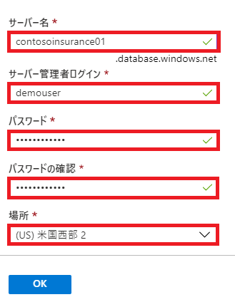

4. **次：ネットワーク** **>** をクリック
5. **ネットワーク**タブで**接続方法**の**アクセスなし**が選択されていることを確認し、**確認および作成**をクリック

   

6. **作成**をクリックし、SQL Database のプロビジョニングを開始

### **Task 7**: Azure Database Migration Service の作成
このタスクでは、Azure Database Migration Service (DMS) のインスタンスを展開します。
1. **＋リソースの作成**をクリック

   

2. Azure Marketplace の検索ボックスに **Azure Database Migration Service** と入力し Enter キーを押下

   

3. Azure Database Migration サービス ブレードにて**作成**をクリック

   

4. **SQL Database の作成**の**基本**タブで、次の構成を設定

   - プロジェクトの詳細
      - **サブスクリプション**： ワークショップで使用するサブスクリプション
      - **リソース グループ**： 先の手順で作成したリソース グループ
   - インスタンスの詳細
      - **移行サービス名**： contoso-dms
      - **場所**： リソース グループと同じリージョン
      - **サービス モード**： Azure
      - **価格レベル**： Premium（レベルの構成をクリックし選択）

   

5. **ネットワーク**タブで SQL Server 2008 仮想マシンが配置されている仮想ネットワークを選択し、**確認および作成**をクリック

   

6. **作成**をクリックし、Azure Data Migration Service のプロビジョニングを開始

### **Task 8**: Web App のプロビジョニング
このタスクでは、Contoso Insurance の Web アプリケーションの実行環境を提供する App Service (Web App) を展開します。

1. **＋リソースの作成**をクリック

   

2. 新規画面にて **Web** を選択し、**Web アプリ**をクリック

   

3. **Web アプリ**の**基本**タブで、次の構成を設定
   - プロジェクトの詳細
      - **サブスクリプション**： ワークショップで使用するサブスクリプション
      - **リソース グループ**： 先の手順で作成したリソース グループ
   - インスタンスの詳細
      - **名前**： 任意（一意の名前）
      - **公開**： コード
      - **ランタイム スタック**： .NET Core 3.0
      - **オペレーティング システム**： Windows
      - **地域**： リソース グループと同じリージョン
   - App Service プラン
      - **Windows プラン**： 新規作成をクリックし、任意の名前で作成
      - **SKU とサイズ**： Standard S1　ACU 合計 100, 1.75 GB メモリ

   

   ※App Service プランの作成

   

4. **次：監視** **>** をクリック

5. **監視**タブで **Application Insights を有効にする**を**いいえ**に設定

   

6. **確認および作成**をクリック

7. **作成**をクリックし、Web アプリのプロビジョニングを開始

### **Task 9**: API App のプロビジョニング
このタスクでは、Contoso Insurance API をホスティングする App Service（Web App）を展開します。

1. **＋リソースの作成**をクリック

   

2. 新規画面にて **Web** を選択し、**Web アプリ**をクリック

   

3. **Web アプリ**の**基本**タブで、次の構成を設定
   - プロジェクトの詳細
      - **サブスクリプション**： ワークショップで使用するサブスクリプション
      - **リソース グループ**： 先の手順で作成したリソース グループ
   - インスタンスの詳細
      - **名前**： 任意（一意の名前）
      - **公開**： コード
      - **ランタイム スタック**： .NET Core 3.0
      - **オペレーティング システム**： Windows
      - **地域**： リソース グループと同じリージョン
   - App Service プラン
      - **Windows プラン**： 先の Web アプリで作成した App Service プランを選択
      - **SKU とサイズ**： Standard S1　ACU 合計 100, 1.75 GB メモリ

    

4. **次：監視** **>** をクリック

5. **監視**タブで **Application Insights を有効にする**を**いいえ**に設定

   

6. **確認および作成**をクリック

7. **作成**をクリックし、Web アプリのプロビジョニングを開始

### **Task 10**: Azure Functions のプロビジョニング
このタスクでは、Azure BLOB ストレージから PDF ドキュメントを取得するために使用する Function App を展開します。

1. **＋リソースの作成**をクリック

   

2. Azure Marketplace の検索ボックスに **function** と入力し、表示される候補より **Function App** を選択

   

3. **関数アプリ**ブレードで**作成**をクリック

   

4. **関数アプリの作成**の**基本**タブで、次の構成を設定
   - プロジェクトの詳細
      - **サブスクリプション**： ワークショップで使用するサブスクリプション
      - **リソース グループ**： 先の手順で作成したリソース グループ
   - インスタンスの詳細
      - **関数アプリ名**： 任意（一意の名前）
      - **公開**： コード
      - **ランタイム スタック**： .NET Core
      - **バージョン**： 3.1
      - **地域**： リソース グループと同じリージョン

   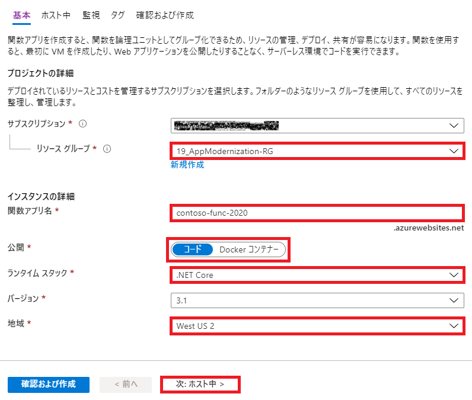

5. **次：ホスト中** **>** をクリック

6. **ホスト中**タブで、次の構成を設定
   - **ストレージ アカウント**： 既定のまま（新規作成）
   - **オペレーティング システム**： Windows
   - **プランの種類**： 消費量 (サーバーレス)

   

7. **次：監視** **>** をクリック

8. **監視**タブで**Application Insights を有効にする**を**いいえ**に設定

   

9. **確認および作成**をクリック

0. **作成**をクリックし、関数アプリのプロビジョニングを開始

### **Task 11**: Cognitive Search Service のプロビジョニング
このタスクでは、Azure Cognitive Search Service を展開します。

1. **＋リソースの作成**をクリック

   

2. Azure Marketplace の検索ボックスに **Azure Cognitive Search** と入力し Enter キーを押下

3. **Azure Cognitive Search** ブレードで**作成**をクリック

   

4. **Azure Cognitive Search の作成**の**基本**タブで、次の構成を設定
   - プロジェクトの詳細
      - **サブスクリプション**： ワークショップで使用するサブスクリプション
      - **リソース グループ**： 先の手順で作成したリソース グループ
   - インスタンスの詳細
      - **URL**： 任意（2～60文字、小文字、数字、ダッシュのみ使用可）
      - **場所**： リソース グループと同じリージョン
      - **価格レベル**： Standard

   

5. **確認および作成**をクリック

6. **作成**をクリックし、Azure Cognitive Search のプロビジョニングを開始

### **Task 12**: Cognitive Service アカウントの作成
このタスクでは、Azure Cognitive Search Account を展開します。

1. **＋リソースの作成**をクリック

   

2. Azure Marketplace の検索ボックスに **cognitive service** と入力し、表示される候補より **Cognitive Services** を選択

   

3. **Cognitive Services** ブレードで**作成**をクリック

   

4. **Cognitive Services の作成**の**基本**タブで、次の構成を設定
   - **名前**： 任意（2～64文字、英数字、ダッシュのみ使用可）
   - **サブスクリプション**： ワークショップで使用するサブスクリプション
   - **場所**： リソース グループと同じリージョン
   - **価格レベル**： S0
   - **リソース グループ**： 先の手順で作成したリソース グループ
   - **以下の通知を読み、理解しました** にチェック

   

5. **作成**をクリックし、Cognitive Services のプロビジョニングを開始

### **Task 13**: Azure Key Vault の作成
このタスクでは、Azure Key Vault のプロビジョニングを行います。  
Azure Key Vault はアプリケーション シークレットを安全に保存するために使用できます。

1. **＋リソースの作成**をクリック

   

2. Azure Marketplace の検索ボックスに **key vault** と入力し、表示される候補より **Key Vault** を選択

   

3. **Key Vault** ブレードで**作成**をクリック

   

4. **Key Vault の作成**の**基本**タブで、次の構成を設定
   - プロジェクトの詳細
      - **サブスクリプション**： ワークショップで使用するサブスクリプション
      - **リソース グループ**： 先の手順で作成したリソース グループ
   - インスタンスの詳細
      - **Key Vault 名**： 任意
      - **地域**： リソース グループと同じリージョン
      - **価格レベル**： 標準
      - **論理的な削除**： 無効化

   

5. **確認および作成**をクリック

6. **作成**をクリックし、Key Vault のプロビジョニングを開始

### **Task 14**: API Management のプロビジョニング
このタスクでは、API Management をプロビジョニングします。  
API Management は、Contoso Insurance API を管理するために使用します。

1. **＋リソースの作成**をクリック

   

2. Azure Marketplace の検索ボックスに **API Management** と入力し Enter キーを押下

3. **API Management** ブレードで**作成**をクリック

   

4. **API Management の作成**フォームで、次の構成を設定
   - **名前**： 任意（一意、英数字のみ使用可）
   - **サブスクリプション**： ワークショップで使用するサブスクリプション
   - **リソース グループ**： 先の手順で作成したリソース グループ
   - **場所**： リソース グループと同じリージョン
   - **組織名**： Contoso Insurance
   - **管理者のメール アドレス**： 任意（ワークショップ参加者のメール アドレス）
   - **価格レベル**： 開発者 (いいえ SLA)
   - **Application Insights を有効にする** へのチェックはなし

   

5. **作成**をクリックし、API Management のプロビジョニングを開始

>API Management は作成の完了まで時間がかかるので、作成をクリック後、次のタスクの実行に移ります。

### **Task 15**: SQL Server データベースの復元
このタスクでは、SqlServer2008 仮想マシンへの RDP 接続を行い、サーバー OS への Internet Explorer のセキュリティ設定の無効化、および SQL Server へのデータベースの復元を行います。

1. [Azure ポータル](https://portal.azure.com)でリソース グループをクリック

   

2. リストから作成したリソース グループを選択

3. リソース グループ内のリソースの一覧より **SqlServer2008** 仮想マシンをクリック

   

4. 左側のメニューで**接続**タブを選択し、**RDP ファイルのダウンロード** をクリック

   

5. ダウンロードした RDP ファイルを開き、**接続**をクリック

   

6. プロンプトが表示されるので、次の資格情報を入力し **OK** をクリック

   

7. メッセージが表示されるので **はい** をクリックし、仮想マシンへ接続

   

8. ログイン後、サーバー マネージャーを起動  
※自動的に開始されない場合は、スタート メニューから起動

9. **Security Information** の **Configure IE ESC** をクリック

   

0. **Internet Explorer Enhanced Security** ダイアログが表示  
**Administrators**, **Users** ともに **Off** を選択し **OK** をクリック

   

1. [ContosoInsurance データベースのバックアップ](https://raw.githubusercontent.com/microsoft/MCW-App-modernization/master/Hands-on%20lab/lab-files/Database/ContosoInsurance.zip) をダウンロードし、zip ファイルを C:\ContosoInsurance に展開

   

2. スタート メニューから **SQL Server Management Studio** を起動

   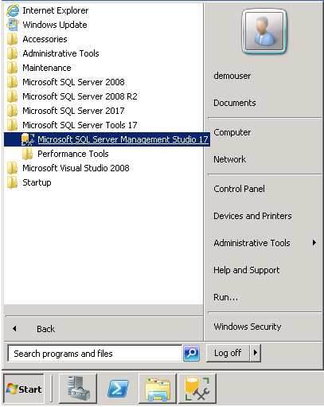

3. **Connect to Server** ダイアログ ボックスで **Connect** をクリック 

   

4. オブジェクト エクスプローラー内の **Databases** を右クリック  
コンテキスト メニューより **Attach...** を選択

   

5. **Attach Databases** ダイアログの **General** ページで **Add** ボタンをクリック  
zip ファイルを展開したフォルダから **ContosoInsurance.mdf** を選択し **OK** をクリック

   

6. **Attach Databases** ダイアログでデータベースの詳細にデータとログ ファイルが表示されていることを確認  
**OK** をクリックし、データベースをアタッチ

   

7. **Databases** リストに **ContosoInsurance** が表示されることを確認

   

### **Task 16**: Data Migration Assistant のインストール
このタスクでは、SqlServer2008 仮想マシンに Microsoft Data Migration Assistant（DMA）をインストールします。

1. Web ブラウザーを起動し <https://www.microsoft.com/en-us/download/details.aspx?id=53595> へ移動

2. **Download** をクリック

   

3. ダウンロードしたインストーラーを実行

4. **Microsoft Data Migration Assistant Setup** ウィザードの開始画面で **Next** をクリック

   

5. ライセンス条項とプライバシー ポリシーに同意し **Next** をクリック

   

6. **Install** をクリックし、インストールを開始

   

7. **Finish** をクリックし、インストーラーを終了

   

## **Exercise 2: Azure SQL Database へのオンプレミス データベースの移行**
所要時間：45分

この実習では、Microsoft Data Migration Assistant (DMA) を使用して、Azure SQL Database に移行するために ContosoInsurance データベースにアクセスします。この評価を実行すると、オンプレミス データベースと Azure SQL Database の間の機能等価性および互換性の問題の詳細を示すレポートが生成されます。
DMA を使用すると、新しいバージョンの SQL Server または Azure SQL Databaseのデータベース機能に影響する可能性のある互換性の問題を削除して最新のデータ プラットフォームにアップグレードできます。DMA では、ターゲット環境用のパフォーマンスおよび信頼性向上に関する推奨事項が提供され、スキーマ、データ、および含まれないオブジェクトをソース サーバーからターゲット サーバーに移行することが可能になります。

### 参考情報
- Data Migration Assistant の概要  
<https://docs.microsoft.com/ja-jp/sql/dma/dma-overview?view=azuresqldb-mi-current>
- Azure SQL Database と Azure SQL Data Warehouse の IP ファイアウォール規則  
<https://docs.microsoft.com/ja-jp/azure/sql-database/sql-database-firewall-configure>

### **Task 1**: ContosoInsurance の構成
評価を開始する前に、SQL Server 2008 R2 インスタンスで ContosoInsurance データベースを構成する必要があります。このタスクでは、SQL Server 2008 R2 インスタンス上の ContosoInsurance データベースに対して SQL スクリプトを実行します。

1. [Azure ポータル](https://portal.azure.com)から Exercise 1 で作成した SqlServer2008 仮想マシンを選択

2. 左側のメニューから**接続**を選択し、**RDP ファイルのダウンロード**をクリック

3. 以下の資格情報を入力し、SqlServer2008 仮想マシンへ接続
   - **アカウント名**： demouser
   - **パスワード**： Password.1!!

4. **Microsoft SQL Server Management Studio 17** を起動

5. **Connect Server** ダイアログでサーバー名 **SQLSERVER2008**、認証 **Windows Authentication** が選択されていることを確認し、**Connect** をクリック

   

6. オブジェクト エクスプローラー内の **Databases** を展開し **ContosoInsurance ** を選択

   

7. ツールバーの **New Query** をクリック

   

8. スクリプトを実行し、次の構成を設定
   - sa パスワードのリセット
   - 混合モード認証の有効化
   - WorkshopUser アカウントの作成
   - データベース復旧モデルを FULL に変更

   ```sql
   USE master;
   GO

   -- SET the sa password
   ALTER LOGIN [sa] WITH PASSWORD=N'Password.1!!';
   GO

   -- Enable Mixed Mode Authentication
   EXEC xp_instance_regwrite N'HKEY_LOCAL_MACHINE',
   N'Software\Microsoft\MSSQLServer\MSSQLServer', N'LoginMode', REG_DWORD, 2;
   GO

   -- Create a login and user named WorkshopUser
   CREATE LOGIN WorkshopUser WITH PASSWORD = N'Password.1!!';
   GO

   EXEC sp_addsrvrolemember
       @loginame = N'WorkshopUser',
       @rolename = N'sysadmin';
   GO

   USE ContosoInsurance;
   GO

   IF NOT EXISTS (SELECT * FROM sys.database_principals WHERE name = N'WorkshopUser')
   BEGIN
       CREATE USER [WorkshopUser] FOR LOGIN [WorkshopUser]
       EXEC sp_addrolemember N'db_datareader', N'WorkshopUser'
   END;
   GO

   -- Update the recovery model of the database to FULL
   ALTER DATABASE ContosoInsurance SET RECOVERY FULL;
   GO
   ```
9. ツールバーの **Execute** をクリックし、スクリプトを実行

   

0. オブジェクト エクスプローラーでサーバー名を右クリックし、コンテキスト メニューから **Restart** をクリック  

   

1. プロンプトが表示されるので **Yes** をクリック  
混合モード認証と新しい sa パスワードの有効化のために SQL Server を再起動

   

### **Task 2**: Azure SQL Database への移行の評価の実行
Contoso は、評価を実行して、Azure SQL Database にデータベースを移行する際に対処する必要のある潜在的な問題を識別したいと考えています。このタスクでは、Microsoft Data Migration Assistant (DMA) を使用して、Azure SQL Database に対して ContosoInsurance データベースの評価を実行します。

1. SqlServer2008 仮想マシンのスタート メニューから **Data Migration Assistant** を起動

   

2. 画面左のメニューから **＋** アイコンをクリック

   

3. New Project で次を設定
   - **Project Type**: Assesment
   - **Project name**: 任意
   - **Assesment Type**: Database Engine
   - **Source server type**: SQL Server
   - **Target server type**: Azure SQL Database  
   

4. **Create** をクリック

5. **Check database compatibility** と **Check feature parity** のチェックを確認

   

6. **Next** をクリック

7. **Connect to a Server** ダイアログで、次の接続情報を設定
   - **Server name**: SqlServer2008
   - **Authentication type**: SQL Server Authentication
   - **Username**: WorkshopUser
   - **Password**: Password.1!!
   - **Encrypt connectoin**: チェック
   - **Trust server certificate**: チェック  
      

8. **Add sources** ダイアログで **ContosoInsurance** をチェック

   

9. **Add** をクリック

0. **Start Assesment** をクリック

   

1. SQL Database へ移行するための評価レポートを確認  
**SQL Server feature parity** にはサポートされない機能や推奨事項を表示

   

   >Analysis Services および Reporting Services がサポートされていないことを表記  
   これらは ContosoInsurance データベース内のオブジェクトへの影響しない 

2. **Compatibility issues** をクリックし、互換性の問題を確認

   

   >レポートには何も表示されていないことを確認

### **Task 3**: SQL Server 2008 R2 仮想マシンの IP アドレスの取得
このタスクでは、Azure Cloud Shell を使用して SqlServer2008 VM の IP アドレスを取得します。  
このアドレスは、DMS から SqlServer2008 VM に接続するために必要です。

1. [Azure ポータル](https://portal.azure.com)の画面上部のメニューから **Azure Cloud Chell** アイコンをクリック

   

2. ブラウザ下部に開く Cloud Shcell ウィンドウで **PowerShell** を選択

   >ストレージがマウントされていないメッセージが表示された場合  
   このワークショップで利用しているサブスクリプションを選択し、**ストレージの作成**をクリック

   

   >Bash, PowerShell の切替は、メニューからも可能  

   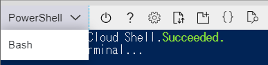

3. 次のコマンドを入力

   ```powershell
   $resourceGroup = "ワークショップで使用するリソース グループ名"
   ```

4. 次に SqlServer2008 仮想マシンのパブリック IP アドレスを取得する PowerShell コマンドを入力して実行

   ```powershell
   az vm list-ip-addresses -g $resourceGroup -n SqlServer2008 --output table
   ```

   

5. **PublicIPAddresses** プロパティの値をコピー  
後で参照できるようメモ帳などのテキスト エディタに貼り付け

   

6. Azure SQL Database のサーバー名を取得する次のコマンドを実行

   ```powershell
   az sql server list -g $resourceGroup
   ```

   

7. **fullyQualifiedDomainName** 値をテキスト エディターにコピーして貼り付け

### **Task 4**: 仮想マシンのネットワーク設定
1. [Azure ポータル](https://portal.azure.com)から Exercise 1 で作成した SqlServer2008 仮想マシンを選択

2. **ネットワーク**タブを選択し、**受信ポートの規則を追加する**をクリック

   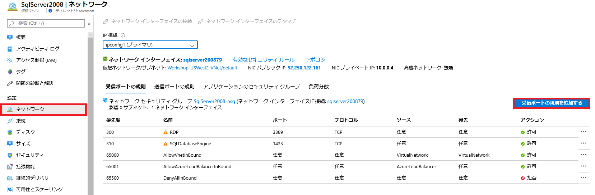

3. **受信セキュリティ規則の追加**フォームで、次の構成を設定
   - **ソース**: Any
   - **ソース ポート範囲**: *
   - **宛先**: Any
   - **宛先ポート範囲**: 1433
   - **プロトコル**: TCP
   - **アクション**: 許可
   - **優先度**: 310（任意）
   - **名前**: SQLDatabaseEngine（任意）
   
   

4. 作成したルールが追加されたことを確認

   

### **Task 5**: SQL Database のファイアウォール設定
このタスクでは、SqlServer2008 仮想マシン、および他の Azure サービスから SQL Database にアクセスできるように Azure SQL Server にファイアウォール規則を作成します。Azure SQL Server には、最大 128 個のサーバー レベルの規則を作成できます。

1. [Azure ポータル](https://portal.azure.com/)でワークショップで使用しているリソース グループのリストより Azure SQL Server を選択

   

2. **概要**タブの**ファイアウォール設定の表示**をクリック

   

3. 次の構成を設定
   - **Azure サービスおよびリソースにこのサーバーへのアクセスを許可する**: はい
   - **クライアント IP アドレス**
      - **規則名**: SqlServer2008
      - **開始 IP**: Task 3 で取得した仮想マシンのパブリック IP アドレス
      - **終了 IP**: Task 3 で取得した仮想マシンのパブリック IP アドレス

      

4. **保存**をクリック

5. **サーバーのファイアウォール規則が正常に更新されました** メッセージの **OK** をクリック

   

### **Task 6**: Data Migration Assistant を使用したデータベース スキーマの移行
評価結果をレビューしてデータベースを Azure SQL Database に移行できることを確認した後、  
Data Migration Assistant を使用してスキーマを Azure SQL Database に移行します。

1. DMA を起動し、画面左のメニューより **＋** アイコンをクリック

2. New Project ダイアログで、次を設定
   - **Project type**: Migration
   - **Project name**: 任意
   - **Source server type**: SQL Server
   - **Target server type**: Azure SQL Database
   - **Migration scope**: Schema only  
      

3. **Create** をクリック

4. **Select source** タブで、次を入力
   - **Server name**: SqlServer2008
   - **Authentication type**: SQL Server Authentication
   - **Username**: WorkshopUser
   - **Password**: Password.1!!
   - **Encrypt connection**: チェック
   - **Trust server certificate**: チェック  
   

5. **Connect** をクリック  
**ContosoInsurance** データベースが選択されていることを確認

   

6. **Next** をクリック

7. **Select target** タブで、次を入力
   - **Server name**: SQL Database のサーバー名
   - **Authentication type**: SQL Server Authentication
   - **Username**: demouser
   - **Password**: Password.1!!
   - **Encrypt connection**: チェック
   - **Trust server certificate**: チェック  
   

8. **Connect** をクリック
**ContosoInsurance** データベースが選択されていることを確認

   

9. **Next** をクリック

0. **Select objects** タブで、すべてのオブジェクトが選択されていることを確認

   

1. **Generate SQL script** をクリック

2. 表示されるスクリプトを確認  
**Assesment issues** に問題が表示されていないことも確認

   

3. **Deploy schema** をクリック

4. スキーマ展開後、結果にエラーがないことを確認

   

5. SQL Server Management Studio を起動

6. **Connect to Server** ダイアログに次の情報を入力
   - **Server name**: SQL Database のサーバ名
   - **Authentication**: SQL Server Authentication
   - **Login**: demouser
   - **Password**: Password.1!!  
   

7. **Connect** をクリック

8. オブジェクト エクスプローラーで **Databases** - **ContosoInsurance** を展開

   

   >スキーマが作成されていることを確認

### **Task 7**: Azure Database Migration Service を使用したデータベースの移行
この時点で、DMAを使用したデータベーススキーマの移行が完了しています。このタスクでは、Azure Database Migration Service を使用して ContosoInsurance データベースのデータを新しい Azure SQL Database に以降します。
Azure Database Migration Service はマイクロソフトの既存のツールおよびサービスのいくつかの機能と統合して、包括的で高可用性を備えたデータベース移行ソリューションを提供します。このサービスは Data Migration Assistant を使用して、移行を実行する前に必要な変更をガイドする推奨事項を提供する評価レポートを生成します。移行プロセスを開始する準備ができたら、必要なすべての手順が Azure Database Migration Service によって実行されます。

1. [Azure ポータル](https://portal.azure.com)で、ワークショップで使用しているリソース グループ内のリストから **Azure Database Migration サービス** を選択

   

2. Azure Database Migration サービス ブレードで **＋ 新しい移行プロジェクト** を選択

   

3. 新しい移行プロジェクト フォームで、次の構成を設定
   - **プロジェクト名**: DataMigration
   - **ソース サーバーの種類**: SQL Server
   - **ターゲット サーバーの種類**: Azure SQL Database
   - **アクティビティの種類を選択します**: オフラインデータの移行

   

4. **アクティビティの作成と実行** をクリック

5. **移行ソースの詳細** フォームで、次の構成を設定
   - **ソース SQL Server インスタンス名**: SqlServer2008 のパブリック IP アドレス
   - **認証の種類**: SQL 認証
   - **ユーザー名**: WorkshopUser
   - **パスワード**: Password.1!!
   - 接続のプロパティ
      - **接続を暗号化する**: チェック
      - **サーバー証明書を信頼する**: チェック
   - TLS 1.2 security protocol
      - **My server has TLS 1.2 enabled**: チェック

   

   ※SqlServer 2008 のパブリック IP アドレスは Task 3 で取得したものを使用

6. **保存** をクリック

7. **移行ターゲットの詳細**フォームで、次の構成を設定
   - **ターゲット サーバー名**: Azure SQL Server の FQDN
   - **認証の種類**: SQL 認証
   - **ユーザー名**: demouser
   - **パスワード**: Password.1!!
   - 接続のプロパティ
      - **接続を暗号化する**: チェック

   

   ※ Azure SQL Server の FQDN は Task 3 で取得したものを使用

8. **ターゲット データベースへマッピング** フォームで **ContosoInsurance** データベースが選択されていることを確認

   

9. **保存**をクリック

0. **テーブルの選択** フォームで、すべてのテーブルが選択されていることを確認

   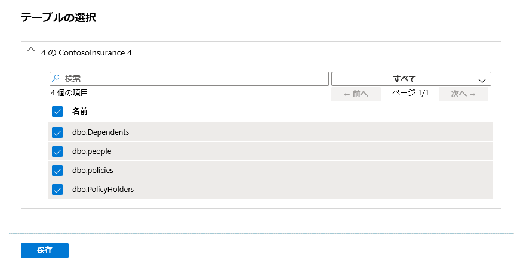

1. **保存**をクリック

2. **移行の概要**フォームで**活動名**に任意の名前を入力

   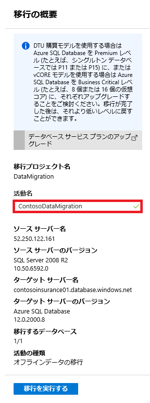

3. **移行を実行する**をクリック

4. データの移行が開始

   

   >移行は数分で完了します。  
   **更新**をクリックすることで、状態の変更を確認できます。

   

## **Exercise 3: データベースのアップグレード後のセキュリティ強化**
この実習では、Azure SQL Database のいくつかのセキュリティ機能を確認し、Azure SQL Database を利用する際のセキュリティの利点をレビューします。SQL Database 向け Advanced Data Security (ADS) は、機密データの検出と分類、潜在的なデータベースの脆弱性の検出と緩和、およびデータベースに対する脅威を示す可能性のある異常なアクティビティの検出に関する機能を始めとする高度なセキュリティ機能を提供します。

### 参考情報
- Azure SQL Database 向け Advanced Data Security  
<https://docs.microsoft.com/ja-jp/azure/sql-database/sql-database-advanced-data-security>
- SQL データの検出と分類  
<https://docs.microsoft.com/ja-jp/sql/relational-databases/security/sql-data-discovery-and-classification?view=sql-server-2017&tabs=t-sql>
- SQL の脆弱性評価サービス  
<https://docs.microsoft.com/ja-jp/azure/sql-database/sql-vulnerability-assessment>

### **Task 1**: データの検出と分類の構成
このタスクでは、Advanced Data Security の SQL データの検出と分類機能を確認します。データの検出と分類では、データベース内の機密データの検出、分類、ラベル付け、レポート作成を行うための新しいツールが導入されましたこの機能では、データベースだけでなく、データベース内のデータの保護を目的とした新しい SQL 情報保護パラダイムを構成する高度なサービスのセットが提供されます。最も機密性の高いデータ (ビジネス、財務、医療など) の検出と分類は、組織の情報保護の達成において極めて重要な役割を果たすことができます。

1. [Azure ポータル](https://portal.azure.com/)で、ワークショップで使用しているリソース グループのリストから **ContosoInsurance** SQL Database を選択

   

2. SQL Database ブレードで **Advanced Data Security** タブを選択

3. **データの検出と分類**タイルをクリック

   

4. **分類の推奨事項が指定された 7 個のデータが見つかりました**をクリック

   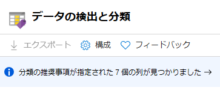

5. **分類の追加**をクリック

   

6. **分類の追加**フォームで、次の構成を設定
   - **スキーマ名**: dbo
   - **テーブル名**: people
   - **列名**: DOB (date)
   - **情報の種類**: Date Of Birth
   - **機密ラベル**: Highly Confidential -GDPR

   

7. **分類の追加**をクリック

8. **すべての選択**をクリックし、すべての列を選択

9. **選択した推奨事項を受け入れます**をクリック

   

0. **保存**をクリック

   

1. **概要**タブを選択し、データ分類状態のレポートを表示

   

### **Task 2**: Advanced Data Security の脆弱性評価のレビュー
このタスクでは、ContosoInsurance データベースに対して ADS で生成された評価レポートをレビューします。SQL の脆弱性評価サービスは、セキュリティ状態を可視化し、セキュリティの問題を解決してデータベース セキュリティを強化するための手順を示すサービスです。

1. SQL Database の **Advanced Data Security**タブに戻り、**脆弱性評価**タイルをクリック

   

2. **スキャン**をクリック

   

3. スキャン完了後、**概要**タブを選択し、ダッシュボードを確認  
ダッシュボードには、失敗および合格したチェックの数、重要度レベルごとのリスクの概要の内訳が表示

   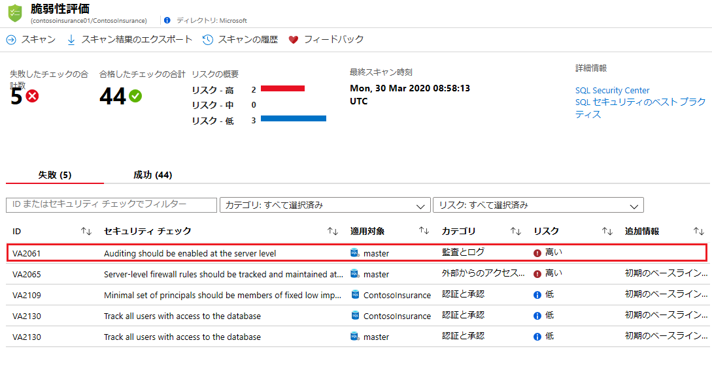

4. 失敗したチェックのいずれかを選択

5. 詳細な説明が表示

   

   >結果の詳細は、理由についてより深い洞察を提供  
   調査結果、推奨設定の影響、および調査結果の修正方法の詳細を説明

### **Task 3**: 動的データ マスクの有効化
このタスクでは、Azure SQL Database  で動的データ マスク (DDM) を有効化して、クエリー結果からのデータベース内の機密データへのアクセスを制限します。この機能ではアプリケーション レイヤーへの影響を最小限に抑えた状態で公開する機密データを指定できるので、機密データへの不正アクセスの防止に役立ちます。これはポリシー ベースのセキュリティ機能で、指定したデータベース フィールドに対するクエリーの結果セット内の機密データを非表示にします。データベース内のデータは変更されることはありません。

1. SQL Database ブレードの左側のメニューから**動的データ マスク**タブを選択

   

2. **＋ マスクの追加**をクリック

   

3. マスク ルール ブレードで、次の構成を設定
   - **スキーマ**: dbo
   - **テーブル**: table
   - **列**: DOB (date)
   - **マスク フィールド形式**: 既定値 (0, xxxx, 01-01-1900)

   

4. **追加**をクリック

5. マスク ルールが追加されたことを確認し、**保存**をクリック

   

6. **動的データ マスキングの設定が正常に保存されました**で **OK** をクリック

   

7. SqlServer2008 仮想マシンへ RDP で、次の資格情報を使用し接続
   - **Server name**: Azure SQL Server の FQDN
   - **Authentication type**: SQL Authentication
   - **Login**: demouser
   - **Password**: Password.1!!

   

8. スタート メニューから **SQL Server Management Studio** を起動

9. オブジェクト エクスプローラーで **Databases** を展開  
**ContosoInsurance** を右クリックし、コンテキスト メニューから **New Query** を選択

   

0. 次のクエリを記述

   ```sql
   CREATE USER DDMUser WITHOUT LOGIN;  
   GRANT SELECT ON [dbo].[people] TO DDMUser;
   ```

1. ツール バーの **Execute** をクリックし、クエリを実行し、テストを行うユーザーを作成  
画面下部にコマンドが正常に完了したメッセージが表示されることを確認

   

2. ツール バーの **New Query** をクリック

   

3. 作成したユーザーで **people** テーブルに SELECT 句を実行するクエリを記述

   ```sql
   EXECUTE AS USER = 'DDMUser';  
   SELECT * FROM [dbo].[people];  
   REVERT;
   ```
4. **Execute** をクリックし、クエリを実行

   

   >DOB 列が設定したマスク形式で定義した 1900-01-01 と表示されていることを確認

5. ツール バーの **New Query** をクリック

6. 新しいクエリ ウィンドウに次のクエリを記述

   ```sql
   SELECT TOP 100 * FROM [dbo].[people]
   ```

7. **Execute** をクリックし、現在ログインしている特権ユーザー（demouser）でクエリを実行

   

   >DOB 列の値が表示されることを確認

## **Exercise 4: Key Vault の構成**
所要時間：15分

セキュリティ強化の一環として、Contoso は、アプリケーション構成ファイルでプレーン テキストとして表示されないように、アプリケーション シークレットをセキュアな方法で格納することを求めています。この実習では、Azure に移行した後に Contoso の Web アプリケーションと API アプリケーションのアプリケーション シークレットをセキュアに格納する Azure Key Vault を構成します。

### **Task 1**: SQL 接続文字列を格納する新しいシークレットの作成
このタスクでは、Azure SQL Database の ContosoInsurance データベースへの接続文字列をキー コンテナーにシークレットとして追加します。

1. [Azure ポータル](https://portal.azure.com/)で、ワークショップで使用しているリソース グループのリストから **ContosoInsurance** SQL Database を選択

   

2. SQL Database ブレードのメニューから **接続文字列**を選択

3. **ADO.NET** の接続文字列をコピー

   

4. コピーした接続文字列をメモ帳などのテキスト エディターに貼り付け

5. テキスト エディターでトークン化されたされたパスワード値 **{your_password}** を **Password.1!!** に置き換え

6. 変更後の接続文字列をコピー
   ```csharp {.scroll}
   Server=tcp:{your_sql_server},1433;Initial Catalog=ContosoInsurance;Persist Security Info=False;User ID=demouser;Password=Password.1!!;MultipleActiveResultSets=False;Encrypt=True;TrustServerCertificate=False;Connection Timeout=30;
   ```

7. [Azure ポータル](https://portal.azure.com)で、ワークショップで使用するリソース グループのリストから **Key Vault** リソースを選択

   

8. Key Vault ブレードで **シークレット** を選択し、**生成/インポート** をクリック

   

9. **シークレットの作成** フォームで、次の構成を設定
   - **アップロード オプション**: 手動
   - **名前**: SqlConnectionString
   - **値**: Sql Database への接続文字列

   

0. **作成**をクリック

### **Task 2**: サービス プリンシパルの作成
このタスクでは、Azure Cloud Shell および Azure コマンド ライン インターフェイス (CLI) を使用して、Azure Key Vault に格納されたシークレットへのアクセスを Web アプリと API アプリに提供するために使用する Azure Active Directory (Azure AD) アプリケーションおよびサービス プリンシパル (SP) を作成します。  
>**重要**: このタスクを完了するには、Azure AD テナント内でアプリケーションの作成と役割の割り当てを行うアクセス許可が必要です。

1. [Azure ポータル](https://portal.azure.com/)の画面右上のメニューから Azure Cloud Shell のアイコンをクリック

   

2. PS Azure プロンプトが表示

   

3. 次のコマンドを実行

   ```powershell
   az account list --output table
   ```

   > **Note**: 複数の Azure サブスクリプションがあり、このワークショップで使用しているアカウントがデフォルトのアカウントでない場合は、**az account set --subscription {your-subscription-id}** を実行

4. ワークショップで使用するサブスクリプション Id をコピー

5. Cloud Shell プロンプトで次のコマンドを実行

   ```powershell {.scroll}
   $subscriptionId = "<your-subscription-id>"
   $resourceGroup = "<your-resource-group-name>"
   az ad sp create-for-rbac -n "contoso-apps" --role reader --scopes subscriptions/$subscriptionId/resourceGroups/$resourceGroup
   ```

   >your-subscription-id を先の手順でコピーした ID に、your-resource-group-name をワークショップで使用しているリソース グループ名に置き換えて実行します

6. 次のタスクで appId, name, password の値が必要になるため、上記コマンドからの出力全体をテキスト エディターにコピー

   

   >**重要**: Azure Cloud Shell セッションはタイムアウトし、アクセスできなくなる可能性があるため、出力をテキスト エディターにコピーしてください。

### **Task 3**: Key Vault へのサービス プリンシパル アクセスの割り当て
このタスクでは、前の手順で作成したサービス プリンシパルにリソース グループの Reader の役割を割り当てます。その後、アクセス ポリシーをキー コンテナーに追加して、キー コンテナーに格納されたシークレットの読み取りを許可します。

1. Cloud Shell プロンプトで次のコマンドを実行

   ```powershell {.scroll}
   az keyvault list -g $resourceGroup --output table
   ```

2. コマンドの実行結果から名前フィールドの値をコピー

   

   >Web および API アプリの構成にも使用するためテキスト エディターに貼り付けておいてください。

3. {your-key-vault-name} を前の手順でコピーした Key Vault の名前に置き換え、次のコマンドを実行

   ```powershell {.scroll}
   az keyvault set-policy -n {your-key-vault-name} --spn http://contoso-apps --secret-permissions get list
   ```

4. サービス プリンシパルがシークレットの **get**, **list** 権限が出力に表示されることを確認

   

## **Exercise 5: Azure App Services への Web API の展開**  
所要時間：45分  

Contoso の開発者はクラウドへの社内アプリの移行作業を続けています。開発者からは、ASP.NET Core を使用して開発されたソリューションが提供されています。アプリを Azure に展開し、新しいアプリ サービスと通信するための構成を行う準備がほとんど整いました。要求されたサービスは既にプロビジョニングされているので、残りの作業は Azure Key Vault を API に統合し、アプリケーション レベルの構成設定を適用して Visual Studio ソリューションからアプリを展開することです。このタスクでは、Azure Portal を使用してアプリケーション設定を Web API に適用します。アプリケーション設定が完了したら、 Web App と API App を Visual Studio から Azure に展開します。
  
### **Task 1**: Visual Studio でソリューションを開く
このタスクでは、`Contoso` スターター ソリューションを Visual Studio で開きます。Visual Studio ソリューションには以下のプロジェクトが含まれています
  
  - **Contoso.Azure**: ソリューション内で Azure サービスと通信するためにその他のプロジェクトで使用されるヘルパー クラスを含む共通のライブラリ
  - **Contoso.Data**: データ アクセス オブジェクトを含むライブラリ
  - **Contoso.FunctionApp**: Blob ストレージから保険契約ドキュメントを取得するために使用される Azure Function を含みます
  - **Contoso.Web**: ASP.NET Core 2.2 PolicyConnect Web アプリケーション
  - **Contoso.WebApi**: データベースと通信するために Web アプリケーションで使用される ASP.NET Core 2.2 Web API
  
  1. ファイル エクスプローラーで `C:\MCW\MCW-App-modernization-master\Hands-on lab\lab-files\src` に移動し、`Contoso.sln` ファイルをダブルクリックしてソリューションを Visual Studio で開く
  
     
  
  2. ファイルを開く方法を尋ねるメッセージが表示されたら **Visual Studio 2019** を選択し**OK**を選択
  
     
  
  3. Azure アカウントの資格情報を使用して Visual Studio にサインイン  
  
     
  
  4. セキュリティ警告メッセージが表示された場合、**ソリューション内のすべてのプロジェクトに対して確認メッセージを表示する**ボックスをオフにして**OK**を選択
  
     
  
### **Task 2**: Key Vault を使用するための Web API の更新
このタスクでは、アプリケーション シークレットの格納と取得を目的として Azure Key Vault を使用するために `Contoso.WebApi` プロジェクトを更新します。接続情報を `Contoso.WebApi` プロジェクトの `appsettings.json` ファイルに追加し、いくつかのコードを追加して Azure Key Vault の使用を有効化します。
  > Key Vault との対話を有効化するために必要な NuGet パッケージはプロジェクト内で既に参照されています。追加されているパッケージは `Microsoft.Extensions.Configuration.AzureKeyVault` です。
  
  1. Visual Studio のソリューション エクスプローラーで `Contoso.WebApi` プロジェクトを展開し `Program.cs` ファイルをダブルクリックして開く
  
     
   
  2. `Program.cs` ファイルで `CreateWebHostBuilder` メソッド内の `TODO #1 ブロック` (23 行目) を見つける
  
     
  
  3. 次のコードを使用してブロック内のコードを完了し Key Vault を構成に追加し Key Vault に適切な接続情報を提供
   
     ```
     config.AddAzureKeyVault(
         KeyVaultConfig.GetKeyVaultEndpoint(buildConfig["KeyVaultName"]),
         buildConfig["KeyVaultClientId"],
         buildConfig["KeyVaultClientSecret"]
      );
      ``` 
    
  4. `Program.cs` を保存し更新された `CreateWebHostBuilder` メソッドは次のようになる
  
     
  
  5. 次に `Contoso.WebApi` プロジェクトの `Startup.cs` ファイルを更新するためにソリューション エクスプローラーでこのファイルをダブルクリック
  
  6. 前の実習では、Azure SQL Database の接続文字列を Key Vault に追加し、シークレットに `SqlConnectionString` という名前を割り当てた。次は以下のコードを使用して、`Startup.cs` ファイルの `Configuration` プロパティ内の `TODO #2` ブロック (38 行目) を更新する。この更新により、アプリケーションでシークレット名を使用して Key Vault から接続文字列を取得することができる
  
     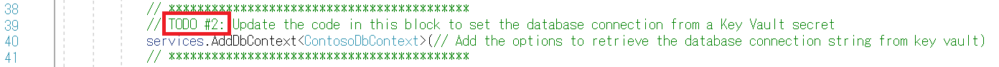
     
     ```
     services.AddDbContext<ContosoDbContext>(options =>  
         options.UseSqlServer(Configuration["SqlConnectionString"]));
     ```
    
  7. `Startup.cs` を保存し更新された `Configuration` プロパティは次のようになる
  
     
  
  8. これで Web API が完全に構成され、Azure Key Vault からシークレットを取得できるようになる
  
### **Task 3**: Azure 内の API App への Key Vault 構成セクションのコピー  
Web API を Azure に展開する前に、必要なアプリケーション設定を Azure API App の構成に追加する必要があります。このタスクでは、API App の構成エディターを使用して、Key Vault への接続と Key Vault からのシークレットの取得を行うために必要な構成設定を追加します。
  
  1. [Azure Portal](https://portal.azure.com/) 左側のナビゲーション メニューで**リソース グループ**選択し、**hands-on-lab-SUFFIX** リソース グループを選択し、リソースのリストから **contoso-api-UniqueId** App サービスを選択して **App Service** に移動
      
     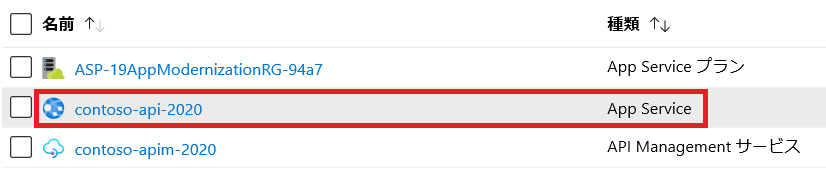
  
  2. App Service ブレードの左側のメニューで**構成**を選択
  
     
  
  3. 構成ブレードの**アプリケーション設定**タブで**高度な編集**を選択 ( Advanced edit では JSON を構成に直接貼り付け可能 )
  
     
  
  4. 詳細エディターを使用し 3 つの Key Vault 設定すべてを一度に追加するために詳細エディターの内容を以下で置き換え
  
     - `your-key-vault-name`: 以前の実習でテキストエディターにコピーしたキーコンテナーの名前に置き換え
     - `your-service-principal-application-id`: サービス プリンシパルを作成したときに出力として表示された `appId` の値で置き換え
     - `your-service-principal-password`: これは、サービス プリンシパルを作成したときに出力として表示された `password` の値で置き換え
       
     ```
     [
         {
             "name": "KeyVaultName",
             "value": "<your-key-vault-name>"
         },
         {
             "name": "KeyVaultClientId",
             "value": "<your-service-principal-application-id>"
         },
         {
             "name": "KeyVaultClientSecret",
             "value": "<your-service-principal-password>"
         }
     ]
     ```
  
  5. エディターの最終的なコンテンツ例は以下
  
       ```
       [
           {
               "name": "KeyVaultName",
               "value": "contosokvjt7yc3zphxfda"
           },
           {
               "name": "KeyVaultClientId",
               "value": "94ee2739-794b-4038-a378-573a5f52918c"
           },
           {
               "name": "KeyVaultClientSecret",
               "value": "b9a3a8b7-574d-467f-8cae-d30d1d1c1ac4"
           }
       ]
       ```
         
  6. **OK** を選択
  
     
  
  7. **構成** ブレードで**保存**を選択
  
     
  
  8. アプリケーションの再起動確認で**続行**を選択
  
     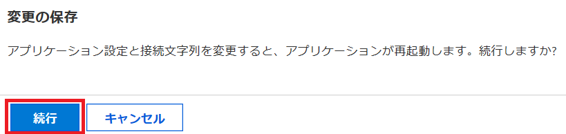
    
### **Task 4**: Azure への API の展開
このタスクでは、Visual Studio を使用して API プロジェクトを Azure の API App に展開します。
  
  1. Visual Studio ソリューション エクスプローラーで **Contoso.Web** プロジェクトを右クリックし、コンテキスト メニューから**発行**を選択
  
     
  
  2. **発行先を選択**ダイアログで **App Service** を選択し**既存のものを選択**を選択して**プロファイルの作成**を選択
  
     
  
  3. **App Service** ダイアログで使用する Azure サブスクリプションを選択し、必要に応じて適切な資格情報を使用してログインし以前に発行したサブスクリプションが選択されていることを確認。そして、hands-on-lab-SUFFIX リソース グループの下にある API App (contoso-**api** で始まるリソース) を選択
  
     
  
  4. **OK** を選択
  
  5. Visual Studio で `Contoso.WebApi` プロジェクトの発行ページに戻り、**発行**を選択して Web API を Azure API App に発行
  
     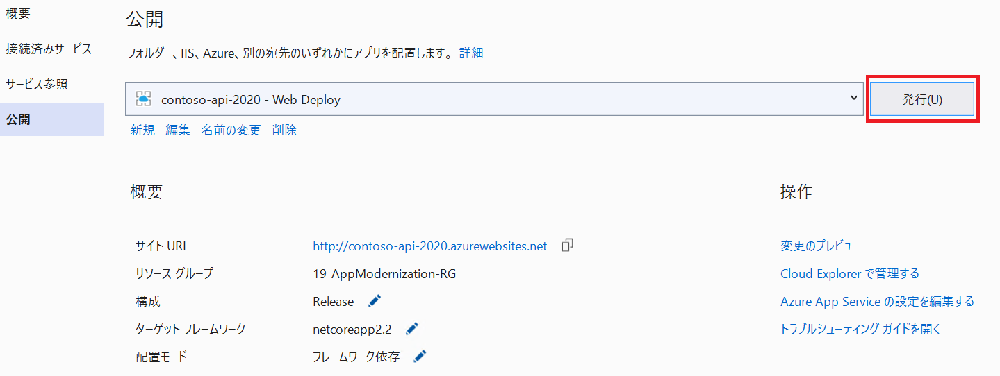
  
  6. Web API が正常に発行されたことを示すステータスがサイトへの URL と共に Visual Studio の **Web  公開アクティビティ** ビューに表示される
  
     
  
     >  **Web 公開アクティビティ** ビューが表示されない場合は、**表示**メニューから**その他のウィンドウ**、**Web 公開アクティビティ**の順に選択します
  
  7. Web ブラウザーが開いて発行済みサイトが表示される。表示されない場合は、ブラウザー ウィンドウで発行済み Web API の URL を開く。最初はページが見つからないことを示すメッセージが表示される。
  
     
  
  8. API App が正常に機能していることを確認するにはブラウザーのアドレス バーの末尾に `/swagger` を追加する。 ( 例 : https://contoso-api-jjbp34uowoybc.azurewebsites.net/swagger/ )。API の Swagger UI ページが表示され使用可能な API エンドポイントのリストが表示される )
  
     
  
     > [Swagger UI](https://swagger.io/tools/swagger-ui/) では、OpenAPI Specification に従い REST API の文書が自動的に生成される。開発者はこの文書を使用し実装ロジックなしで API のエンドポイントを可視化し容易に操作が可能
  
  9. いずれかの `GET` エンドポイントを選択し、**Try it out** を選択して API の機能をテスト
  
     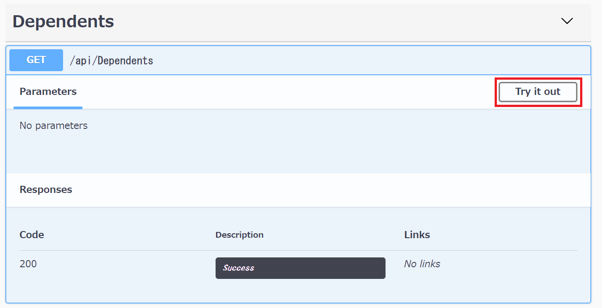
  
  10. **Execute** を選択
  
      
  
  11. 応答に 200 の Response Code が表示され、Response 本文に JSON オブジェクトが表示される
  
      
  
## **Exercise 6: Azure App Services への Web アプリケーションの展開**
この実習では、Contoso.Web Web アプリケーションを更新して新しく展開した API App に接続し、Web App を Azure App Services に展開します。
  
### **Task 1**: Web App のアプリケーション設定への API App URL の追加
所要時間：10分
  
このタスクでは、Azure Cloud Shell および Azure CLI を使用して発行済み API App の URL を Web App のアプリケーション設定に追加し、Web App が API App と連動するための準備を行います。  
  
  1. [Azure Portal](https://portal.azure.com/) の画面右上のメニューから Azure Cloud Shell アイコンを選択
  
     
    
  2. ブラウザー ウィンドウの下部に表示される Cloud Shell ウィンドウで **PowerShell** を選択
  
     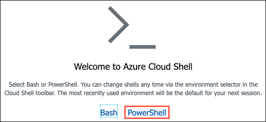
  
  3. PowerShell Azure プロンプトが表示される
  
     
  
  4. Cloud Shell プロンプトで以下のコマンドを `<your-resource-group-name>` の箇所をリソース グループの名前で置き換え実行し API App URL と Web App の両方の情報を取得
  
     ```
     $resourceGroup = "<your-resource-group-name>"
     az webapp list -g $resourceGroup --output table
     ```
     
      > メモ: 複数の Azure サブスクリプションがありこのハンズオン ラボで使用しているアカウントが自分のデフォルト アカウントでない場合、 Azure Cloud Shell プロンプトで `az account list --output table` を実行してサブスクリプションのリストを出力し、このラボで使用しているアカウントのサブスクリプション ID をコピーしてから `az account set --subscription <サブスクリプション ID>` を実行して Azure CLI コマンドに適切なアカウントを設定する必要がある可能性があります
  
  5. 出力された次の手順で使用する API App の **DefaultHostName** 値 ("contoso-**api**" で始まるリソース名) および Web App の **Name** の 2 つの値をコピーします
  
     
  
  6. 次にコマンドの値を以下のように置換し、Azure Cloud Shell コマンド プロンプトから実行
  
     - `<your-web-app-name>`: 以前の手順でコピーした Web App 名で置き換え
     - `<your-api-default-host-name>`: 以前の手順でコピーした Web API デフォルトホスト名で置き換え
     
     ```
     $webAppName = "<your-web-app-name>"
     $defaultHostName = "<your-api-default-host-name>"
     az webapp config appsettings set -n $webAppName -g $resourceGroup --settings "ApiUrl=https://$defaultHostName"
     ```
  
  7. 出力結果から Web App のアプリケーション設定に新しく追加された設定を確認
  
     
  
### **Task 2**: Azure への Web アプリケーションの展開
このタスクでは、Contoso.Web アプリケーションを Azure Web App に発行します。
  
  1. LabVM 上の Visual Studio のソリューション エクスプローラーで `Contoso.Web` プロジェクトを右クリックし、コンテキスト メニューから**発行**を選択
  
     
  
  2. **発行先を選択**ダイアログで **App Service** を選択し**既存のものを選択** を選択して**プロファイルの作成**を選択
  
     
  
  3. **App Service** ダイアログで使用する Azure サブスクリプションを選択し、必要に応じて適切な資格情報を使用してログインし、以前に発行したサブスクリプションが選択されていることを確認。そして、hands-on-lab-SUFFIX リソース グループの下にある Web App ("contoso-**web**" で始まるリソース) を選択
  
     
  
  4. **OK** を選択
  
  5. Visual Studio で `Contoso.Web` プロジェクトの発行ページに戻り、**発行**を選択して Web App を Azure Web App に発行
  
     
  
  6. Web App が正常に発行されたことを示すステータスがサイトへの URL と共に Visual Studio の **Web  公開アクティビティ** ビューに表示される
  
     
  
  7. Web ブラウザーが開いて発行済みサイトが表示される。表示されない場合は、ブラウザー ウィンドウで発行済み Web App の URL を開く
  
  8. PolicyConnect Web ページで以下の資格情報を入力して **Log in** を選択
  
     - **Username**: demouser
     - **Password**: Password.1!!
     
      
  
  9. ログイン後、上部のメニューから **Managed Policy Holders** を選択
  
     
  
  10. Policy Holders ページで契約名義人のリストおよび契約に関する情報をレビューするためにいずれかのレコードの横にある **Details** リンクを選択 ( この情報は、Azure Key Vault に格納された接続文字列を使用して Azure SQL Database から取得 )
  
      
  
  11. Policy Holder Details ページで **File Path** の下にあるリンクを選択し、ページが見つからないことを示すエラーページが表示されることを確認
      
      
  
  12. Contoso では保険契約ドキュメントはネットワーク ファイル共有に格納されているため、展開した Web アプリからはアクセスできない。次の実習では、この問題に対処する
    
      

  
## **Exercise 7: Blob ストレージへの保険契約ドキュメントのアップロード**
所要時間：10分
  
現在、Contoso では、スキャンしたすべての PDF ファイルをローカル ネットワーク内に格納しています。Contoso は、PDF ファイルをワークフローからクラウドに自動的に格納したいと考えています。この実習では、Blob コンテナーにファイルを格納するためのストレージ アカウントを準備します。次に、既存の PDF ファイルを一括アップロードします。
  
参考情報
- AzCopy  
<https://docs.microsoft.com/ja-jp/azure/storage/common/storage-use-azcopy-v10>
  
### **Task 1**: PDF ファイルを格納するコンテナーの作成
このタスクでは、ストレージ アカウントにスキャン済み保険契約ドキュメントを格納する新しい Blob コンテナーを作成します。
  
  1. [Azure Portal](https://portal.azure.com/)の 左側のナビゲーション メニューから**リソース グループ**を選択し、**hands-on-lab-SUFFIX** リソース グループを選択してリソースの一覧から **contosoUniqueId** ストレージ アカウントを選択して**ストレージ アカウント**リソースに移動
   
     
    
  2. ストレージ アカウントの概要ブレードのサービスの下にある**コンテナー**を選択
  
     
  
  3. コンテナーブレードで**コンテナー**を選択し、新しいコンテナーダイアログでコンテナー名として`policies` と入力しパブリック アクセス レベルを**プライベート:匿名アクセスなし**に設定して **OK**を選択
  
     
  
  4. 作成されたコンテナーをコンテナーブレードで選択し、左側のメニューで**プロパティ**を選択し、プロパティブレードから URL をコピーし、後で参照するために URL をテキスト エディターに貼り付け
  
     
  
  5. Azure Portal のストレージ アカウントブレードの左側のメニューから**アクセス キー**を選択し、タスク 3 の AzCopy でストレージ コンテナーに接続するために必要なストレージ アカウントのアクセス キーを取得し **key1 キー** の値をテキスト エディターにコピー
  
     
  
### **Task 2**: SAS トークンの作成
このタスクでは、ストレージ アカウントの SAS (Shared Access Signature) トークンを生成します。これは後の実習で Azure Function を使用して Azure ストレージの `policies` コンテナーからファイルを取得するために使用します。
  
  1. Azure Portal のストレージ アカウントブレードの左側のメニューから **Shared access signature** を選択
  
     
   
  2. Shared access signature ブレードで **SAS と接続文字列を生成する** を選択し、SAS トークン値の右側にあるクリップボードにコピーボタンを選択して SAS トークン値をコピー
  
     
  
  3. 後で使用するために、SAS トークンをテキスト エディターに貼り付け
  
### **Task 3**: AzCopy を使用した Blob ストレージへの PDF の一括アップロード
このタスクでは、AzCopy を使用して PDF ファイルを "オンプレミス" の場所から Azure ストレージの policies コンテナーにコピーします。
  
  1. LabVM で Web ブラウザーを開き https://aka.ms/downloadazcopy から最新バージョンの AzCopy をダウンロード
  
  2. ダウンロードしたインストーラーを実行し、ライセンス許諾書に同意した上ですべての既定値を受け入れて AzCopy のインストールを完了
  
  3. LabVM のタスク バーで検索を実行し **cmd** と入力して Enter キーを押しでコマンド プロンプト ウィンドウを起動
  
  4. コマンド プロンプトで以下のコマンドを実行しカレントディレクトリを AzCopy ディレクトリに変更 ( 既定では、AzCopy は 64 ビットのマシンでは `C:\Program Files (x86)\Microsoft SDKs\Azure\AzCopy` にあり、32 ビットのマシンの場合は `Program Files (x86)` を `Program Files` に変更)    
      ```
      cd C:\Program Files (x86)\Microsoft SDKs\Azure\AzCopy
      ```
  
  5. トークン化された値を置換し以下のコマンドをコマンド プロンプトに入力
  
     - `[FILE-SOURCE]`: これは GitHub repo からのダウンロード コピーを行った `policy-documents` フォルダーのパスとなり `C:\MCW` に解凍している場合のパスは `C:\MCW\MCW-App-modernization-master\Hands-on lab\lab-files\policy-documents`
     - `[STORAGE-CONTAINER-URL]`: これは以前のタスクの手順でコピーしたストレージ アカウントの policies コンテナーの URL (https://contosojt7yc3zphxfda.blob.core.windows.net/policieshttps://contosojt7yc3zphxfda.blob.core.windows.net/policies など )
     - `[STORAGE-ACCOUNT-KEY]`: これは以前のタスクの手順でコピーした Blob ストレージ アカウント キー (eqgxGSnCiConfgshXQ1rFwBO+TtCH6sduekk6s8PxPBxHWOmFumycTeOlL3myb8eg4Ba2dn7rtdHnk/1pi6P/w== など )
     ```
     AzCopy /Source:"[FILE-SOURCE]" /Dest:"[STORAGE-CONTAINER-URL]" /DestKey:"[STORAGE-ACCOUNT-KEY]" /S
     ```
  
  6. 最終的なコマンド例
      ```
     AzCopy /Source:"C:\MCW\MCW-App-modernization-master\Hands-on lab\lab-files\policy-documents" /Dest:"https://contosojt7yc3zphxfda.blob.core.windows.net/policies" /DestKey:"XJT3us2KT1WQHAQBbeotrRCWQLZayFDNmhLHt3vl2miKOHeXasB7IUlw2+y4afH6R/03wbTiRK9SRqGXt9JVqQ==" /S
      ```
  
  7. コマンドの出力で 650 ファイルが正常に転送されたことを確認
    
       
  
  8. Azure ストレージ アカウントの policies コンテナーに移動してアップロードを確認
  
      
  
## **Exercise 8: PDF にアクセスするための Azure Functions の作成**
所要時間：30分
  
Contoso はアプリケーションを準備するためにいくつかの更新を行いましたが、API に組み込むことのできていない機能がいくつかあります。Contoso は、PoC ( 概念実証 ) API ソリューションをセットアップして、アプリケーションのユーザーが Azure ストレージ アカウントから保険契約情報を直接取得できるようにしたいと考えています。この実習では、Azure Functions を作成し、サーバーレス テクノロジを使用して、この機能を有効にします。
  
### **Task 1**:  Azure Functions へのアプリケーション設定の追加
このタスクでは、Azure Cloud Shell および Azure CLI を使用して、ストレージ アカウントの policies コンテナー URL および SAS トークン値を Function App のアプリケーション設定に追加し、新しい関数と連動するよう Azure Function App を準備します。
  
  1. [Azure Portal](https://portal.azure.com/)で画面右上のメニューから Azure Cloud Shell アイコンを選択
    
     

  2. ブラウザー ウィンドウの下部に表示される Cloud Shell ウィンドウで **PowerShell** を選択
    
     
  
  3. Cloud Shell が正常に要求されたことを示すメッセージが表示され PS Azure プロンプトが表示
    
     
  
  4. `<your-resource-group-name>` をリソース グループ名で置き換え Cloud Shell プロンプトで以下のコマンドを実行し Function App 名を取得
     ```
     $resourceGroup = "<your-resource-group-name>"
     az functionapp list -g $resourceGroup --output table
     ```
   
     > メモ: 複数の Azure サブスクリプションがありこのハンズオン ラボで使用しているアカウントが自分のデフォルト アカウントでない場合、  
    Azure Cloud Shell プロンプトで `az account list --output table` を実行してサブスクリプションのリストを出力し、  
    このラボで使用しているアカウントのサブスクリプション ID をコピーしてから `az account set --subscription <サブスクリプション ID>`
    を実行して Azure CLI コマンドに適切なアカウントを設定する必要がある可能性があります  
  
  5. 次の手順で使用するために出力の Name の値をコピー
    
     
  
  6. `policies` コンテナーの URL および以前の手順でテキスト エディターにコピーした `SAS トークン`の値を以下のように置換し Azure Cloud Shell コマンド プロンプトから実行
     - `<your-function-app-name>`: 以前の手順でコピーした Function App 名で置き換え
     - `<your-policies-container-url>`: 以前の手順でコピーした `policies` コンテナー URL で置き換え
     - `<your-storage-account-sas-token>`: 以前の手順でコピーしたストレージ アカウントの `SAS トークン`で置き換え

     ```
     $functionAppName = "<your-function-app-name>"
     $storageUrl = "<your-policies-container-url>"
     $storageSas = "<your-storage-account-sas-token>"
     az functionapp config appsettings set -n $functionAppName -g $resourceGroup --settings "PolicyStorageUrl=$storageUrl" "PolicyStorageSas=$storageSas"
     ```
  
### **Task 2**: プロジェクト環境変数の追加
Azure Functions は環境変数を使用して構成設定を取得します。作成した Azure Functions をローカルでテストするには、これらの設定を開発用マシンでユーザー環境変数として追加するか、プロジェクト設定に追加する必要があります。
このタスクでは、LabVM でいくつかの環境変数を作成し、LabVM 上でローカルに Function App のデバッグを行えるようにします。
  
  1. ソリューション エクスプローラーで **Contoso-FunctionApp** プロジェクトを右クリックして **プロパティ** を選択
  
  2. **デバッグ**タブを選択
  
  3. **環境変数**セクションで**追加**を選択して以下の情報を入力
     - **名前**: **PolicyStorageSas**と入力
     - **値**: 以前の手順でコピーした **SAS トークン**を貼り付け
  
  4. **追加**を選択
  
  5. **追加**を再度選択し新しいユーザー変数ダイアログで次の情報を入力
     - **名前**: **PolicyStorageUrl** と入力
     - **値**: 以前の手順でコピーした **policies** コンテナーの URL を貼り付け
  
  6.  **追加**を選択
  
  7.  プロジェクトを保存
    
      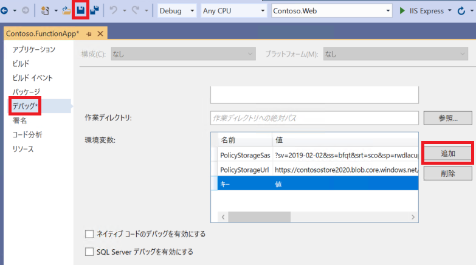
  
### **Task 3**: Visual Studio での Azure Functions の作成
このタスクでは、Visual Studio を使用して Azure Functions を作成します。この関数は、Blob ストレージから保険契約ドキュメントを取得するサーバーレス API として機能します。
  
  1. LabVM で Visual Studio に戻りソリューション エクスプローラーで `Contoso.FunctionApp` を展開し `PolicyDocsFunction.cs` をダブルクリックして開く
    
     
  
  2. `PolicyDocsFunction.cs` ファイルで `TODO #3` ブロック (14 行目以降) を確認
    
     
  
  3. 契約名義人リストおよび契約番号を渡すためのブロック内のコードと "get" リクエストだけを許可するようコードを以下のように更新
    
     ```
     [FunctionName("PolicyDocs")]
         public static async Task<IActionResult> Run(
            [HttpTrigger(AuthorizationLevel.Function, "get", Route = "policies/{policyHolder}/{policyNumber}")] HttpRequest req, string policyHolder, string policyNumber, ILogger log)
     ```
       

     > このコードでは許容可能な動詞から `"post"` を削除し、HttpTrigger のルートを `null` から `policies/{policyHolder}/{policyNumber}`に更新することで関数をパラメーター化し、Run メソッドに `string` パラメーターを追加することで関数内でこれらのパラメーターを取得および使用可能にする
  
  4. `PolicyDocsFunction.cs` ファイル内の `GetDocumentsFromStorage` メソッド内で `TODO #4`  ブロックを確認
    
      
  
  5. ブロック内のコードを更新し上記の手順で追加した環境変数から `PolicyStorageUrl` および `PolicyStorageSas` の値を取得するようコードを以下のように更新
    
      ```
      var containerUri = Environment.GetEnvironmentVariable("PolicyStorageUrl");
      var sasToken = Environment.GetEnvironmentVariable("PolicyStorageSas");
      ```
      

      > API を Azure API App に展開すると `Environment.GetEnvironmentVariables()` は指定された値を構成済みアプリケーション設定内で検索
  
  6. `PolicyDocsFunction.cs` を保存
  
  7. Function のコードをレビューし、その仕組みを理解しておいてください。 Azure Functions は Http リクエストを受け取るたびに `HttpTrigger` を実行します。また Http リクエストは `GET` リクエストにのみに制限するように構成されており、 
  Function App でリクエストを PolicyDocs 関数にルーティングするために、リクエストは `https://<function-name>.azurewebsites.net/policies/{policyHolder}/{policyName}` の形式である必要があります。関数内で、Http リクエストは ストレージ アカウントの `policies` コンテナー の URL に対して発行され、指定した契約名義人および契約番号の PDF ドキュメントが取得されます。PDF ドキュメントは PDF 添付ファイルとしてブラウザーに返されます
  
  8. これで Function App が完全に構成され、パラメーター化された値の取得およびストレージ アカウントの `policies` コンテナーからドキュメントの取得を行う  
  
### **Task 4**: ローカル環境での関数のテスト
このタスクでは、Visual Studio デバッガ―から関数をローカルで実行し、適切に構成されていること、およびストレージ アカウントの `policies` コンテナーからドキュメントを取得できることを確認します。
  
 > 重要: Windows Server 2008 R2 の Internet Explorer には PDF ドキュメントを開く機能が含まれていません。このタスクでダウンロードしてドキュメントを表示するには、LabVM で [Chrome ブラウザーをダウンロードしてインストール](https://www.google.com/chrome/)する必要があります。
  
  1. Visual Studio のソリューション エクスプローラーで `Contoso.FunctionApp` プロジェクトを右クリックし**デバッグ**、**新しいインスタンスを開始**の順に選択
    
     

  2. メッセージが表示されたら、Function App がローカル マシンのリソースにアクセスすることを許可
  
  3. 新しいコンソール ダイアログが表示され Function App が読み込まれるので、コンソールの出力で関数のローカル URL を確認
    
     
     
  
  4. `PolicyDocs` の後ろにある URL をコピーしてテキスト エディターに貼り付け
    
     ```
     http://localhost:7071/api/policies/{policyHolder}/{policyNumber}
     ```
  
  5. トークン化された値を次のように置換
    
     - {policyHolder}: Acevedo
     - {policyNumber}: ACE5605VZZ2ACQ

     更新した URL 例は以下
      ```
      http://localhost:7071/api/policies/Acevedo/ACE5605VZZ2ACQ
      ```
  
  6. 更新した URL を新しい Chrome Web ブラウザー ウィンドウのアドレス バーに入力して Enter 
  
  7. 契約ドキュメントが新しいブラウザー ウィンドウで開く
    
      
  
  8. 関数が適切に機能することを確認した後、コンソール ウィンドウを閉じるか、Visual Studio ツールバーの停止ボタンを選択して Visual Studio のデバッグ セッションを停止
    
### **Task 5**: Azure Functions への関数の展開
このタスクでは、関数を Azure Functions に展開します。Azure Functions では、Web アプリケーションが関数を使用して契約ドキュメントを取得します。
  
  1. LabVM 上の Visual Studio のソリューション エクスプローラーで `Contoso.FunctionApp` プロジェクトを右クリックし、コンテキスト メニューから**発行**を選択
    
      
  
  2. **発行先を選択**ダイアログで **Azure Functions Consumption Plan** を選択し、**既存のものを選択** を選択し、パッケージ ファイルから実行ボックスをオンにしたままにして**プロファイルの作成**を選択
    
      
  
  3. App Service ダイアログで使用する Azure サブスクリプションを選択し、必要に応じて適切な資格情報を使用してログインし、以前に発行したサブスクリプションが選択されていることを確認。そして、hands-on-lab-SUFFIX リソース グループの下にある Function App ("contoso-**func**" で始まるリソース) を選択
    
      
  
  4. **OK** を選択
  
  5. Visual Studio で `Contoso.FunctionApp` プロジェクトの発行ページに戻り、**発行**を選択して Function App を Azure Functions に発行
    
      
  
  6. 正常に発行されたことを示すメッセージが Visual Studio の出力パネルに表示されることを確認
    
      
  
  7. これで PolicyConnect Web アプリケーション内で Azure Function App を使用する準備が完了
  
### **Task 6**: Azure Functions での Application Insights の有効化
このタスクでは、Application Insights を Azure Functions に追加し、関数に対するリクエストのインサイトを収集します。
  
  1. [Azure Portal](https://portal.azure.com/) で左側のナビゲーション メニューで**リソース グループ**を選択し、**hands-on-lab-SUFFIX** リソース グループを選択し、リソースのリストから **contoso-func-UniqueId** App サービスを選択して **Function App** に移動
    
      
  
  2. Function App ブレードの上部に表示されている **新しい Azure Funtions 管理エクスペリエンスのプレビュー** を選択
    
      
  
  3. Azure Functions ブレードで設定から **Application Insights** を選択し、**Application Insights を有効にする**を選択
    
      
  
  4. **contoso-func-appinsights-SUFFIX** などのグローバルに一意の名前を入力し、場所を選択して**適用**を選択し再起動への同意に**はい**を選択
    
      
  
  5. 正常に変更が適用されたメッセージが表示された後、作成されたリソース名を選択
    
      
  
  6. Application Insights ブレードの左側のメニューから**Live Metrics**を選択
    
      
     
      > メモ: アプリがオフラインであることを示すメッセージが表示される場合もありますが、この問題は次のタスクで処理します。
  
  6. ライブ メトリックス ストリーム ウィンドウは、次のタスクで参照するために開いたままにする
  
### **Task 7**: Web Apps のアプリケーション設定への Azure Functions URL の追加
このタスクでは、Azure Functions の URL を Web App のアプリケーション設定に追加します。
  
  1. [Azure Portal](https://portal.azure.com/) の画面右上のメニューから Azure Cloud Shell アイコンを選択
    
      
  
  2. ブラウザー ウィンドウの下部に表示される Cloud Shell ウィンドウで **PowerShell** を選択
    
      
  
  3. PowerShell Azure プロンプトが表示される
    
      
  
  4. `<your-resource-group-name>` をリソース グループ名で置き換え Cloud Shell プロンプトで以下のコマンドを実行し Function App の URL を取得
     ```
     $resourceGroup = "<your-resource-group-name>"
     az functionapp list -g $resourceGroup --output table
     ```
        
        > メモ: 複数の Azure サブスクリプションがありこのハンズオン ラボで使用しているアカウントが自分のデフォルト アカウントでない場合、Azure Cloud Shell プロンプトで `az account list --output table` を実行してサブスクリプションのリストを出力し、このラボで使用しているアカウントのサブスクリプション ID をコピーしてから `az account set --subscription <サブスクリプション ID>` を実行して Azure CLI コマンドに適切なアカウントを設定する必要がある可能性があります
  
  5. 後で使用するために **DefaultHostName** 値をテキスト エディターにコピー
    
      
  
  6. `<your-resource-group-name>` をリソース グループの名前で置き換えCloud Shell プロンプトで以下のコマンドを実行し、Web App 名を取得
     ```
     $resourceGroup = "<your-resource-group-name>"
     az webapp list -g $resourceGroup --output table
     ```
  
  7. 後で使用するために Web App の名前 ("contoso-**web**" で始まるリソース名) をテキスト エディターにコピー
    
     
  
  8. Function App に必要な最後の設定の Default Host Key を取得するには、Azure Portal で Function App に移動し概要ブレードで **Function App** の設定を選択
    
     
  
  9. Function App の設定 タブの**ホスト キー**セクションでキーの右側にある**コピー**操作リンクを選択し、既定のキーをコピーし次の手順で参照するために値をテキスト エディターにコピー
    
     
  
  10. 次に、以下のコマンドのトークン化された値を次のように置換し、Azure Cloud Shell コマンド プロンプトから実行
    
      -`<your-web-app-name>`: コピーした Function App の DefaultHostName で置き換え
      -`<your-function-app-default-host-name>`: ピーした Function App の `DefaultHostName` で置き換え
      -`<your-function-app-default-host-key>`: コピーした Function App の既定のホスト キーで置き換え

      ```
      $webAppName = "<your-web-app-name>"
      $defaultHostName = "<your-function-app-default-host-name>"
      $defaultHostKey = "<your-function-app-default-host-key>"
      az webapp config appsettings set -n $webAppName -g $resourceGroup --settings "PolicyDocumentsPath=https://$defaultHostName/api/policies/{policyHolder}/{policyNumber}?code=$defaultHostKey"
      ```
  
  11. Web App のアプリケーション設定に新しく追加した `PolicyDocumentsPath` 設定が表示される
    
      
  
### **Task 8**: Web アプリからドキュメント取得のテスト
このタスクでは、PolicyConnect Web アプリを開いて保険契約ドキュメントをダウンロードします。以前の手順ではページが見つからないことを示すエラーが表示されていました。
  
  1. Web ブラウザーを開いて発行済みの Web App の URL に移動
     
     > メモ: URL が不明な場合は、Azure Portal の Web App リソースの概要ブレードから取得できます。
  
  2. PolicyConnect Web ページで以下の資格情報を入力して **Log in** を選択
    
       - **Username**: demouser
       - **Password**: Password.1!!
       
      
  
  3. ログインしたら、上部のメニューから **Managed Policy Holders** を選択
    
      

  4. Azure Key Vault に格納された接続文字列を使用して Azure SQL Database から取得された情報が Policy Holders ページに契約名義人のリストおよび契約に関する情報が表示された後、いずれかのレコードの横にある Details を選択
    
     
  
  5. Policy Holder Details ページでマウス カーソルを **File Path** の下のドキュメント リンクの上に置き、下部に表示されるパスが Function App をポイントしていることと契約名義人の姓と契約番号がパスの下に挿入されていることを確認しファイルパスを選択
    
     
  
  6. **File Path** の下のリンクを選択して、契約ドキュメントをダウンロード
    
     
  
### **Task 9**: ライブ メトリックス ストリームの表示
  
  1. Azure Portal で Application Insights のライブ メトリックス ストリームに戻る
  
  2. Function App に関するリクエストのテレメトリーを示すダッシュボードが表示され、右側の サンプル テレメトリ セクションの下に、先の手順で作成したドキュメント リクエストが表示されていることを確認。 "PolicyDocs function received a request..."で始まるメッセージのトレースを選択し、その下のパネルに詳細を表示
    
     
  
## **Exercise 9: 保険契約ドキュメントへのフルテキスト検索機能の追加**
所要時間：15分
  
Contoso は保険契約ドキュメントのフルテキスト検索を実行する機能を実装したいと考えています。以前、Contoso では、使用可能な状態でドキュメントから情報を取得することができませんでしたが、[Azure Search Service でのコグニティブ検索](https://docs.microsoft.com/en-us/azure/search/cognitive-search-concept-intro)で紹介されている技法を検索インデックスで活用することを検討しています。このタスクでは、Blob ストレージ コンテナーのコグニティブ検索を構成します。
  
参考情報
- Azure Cognitive Search における AI の概要  
<https://docs.microsoft.com/ja-jp/azure/search/cognitive-search-concept-intro>
  
### **Task 1**: ストレージ アカウントへの Azure Search の追加
  
  1. [Azure Portal](https://portal.azure.com/) の 左側のナビゲーション メニューから**リソース グループ**を選択し、**hands-on-lab-SUFFIX** リソース グループを選択して、リソースの一覧から **contoso-UniqueId** ストレージ アカウントを選択して**ストレージ アカウント** リソースに移動
    
     
  
  2. ストレージ アカウント ブレードの左側のメニューで **Azure Search の追加** を選択し、**検索サービスを選択します**タブで検索サービスを選択
  
  3. **次へ:データへの接続** を選択
    
      
  
  4. **データへの接続**タブで以下の構成を入力し**次: 認知技術を追加します ( 省略可能 )** を選択
    
     - **データ ソース**: **Azure Blob Storage** を選択
     - **名前**: **policy-docs** と入力
     - **抽出されるデータ**: **コンテンツとメタデータ**を選択
     - **Parsing mode**: **Default** を選択
     - **接続文字列**: ストレージ アカウント用に事前入力された接続文字列に設定したまま
     - **コンテナー名**: **policies**と入力
  
     　　
  
  5. **認知技術を追加します** タブで以下の構成を設定し**次: 対象インデックスをカスタマイズします** を選択
    
     - Cognitive Services をアタッチする展開して作成済みの Cognitive Services アカウントを選択
       
        

      - Add enrichments を展開
        - **スキルセット名**: **policy-docs-skillset**と入力
        - **テキストの認知技術**: このボックスをオンにしてすべてのスキルを選択
        
        
  
  6. **対象インデックスをカスタマイズします** タブで以下の構成を設定し**次: インデクサーの作成** を選択
    
     - **インデックス名**: **policy-docs-index** と入力
     - 上部の**取得可能**ボックスをオンにしてすべての項目を選択
     - 上部の**検索可能**ボックスをオンにして、すべての項目を選択
    
       
  
  7. **インデクサーの作成** タブで、名前に **policy-docs-indexer** と入力し、スケジュールに **1 度**を選択し**送信**を選択
    
      

      > メモ: このタスクでは、作成時にインデクサーを 1 回だけ実行しています。運用アプリケーションでは、インデクサーを実行するスケジュールを時間単位や日単位などのスケジュールで選択する場合があります。これにより、ターゲット BLOB ストレージ アカウントに到着する新しいデータを取り込むことができるようになります。
  
  8. インポートが正常に構成されたことを示す通知が Azure Portal に表示
  
### **Task 2**: 検索結果のレビュー
このタスクでは、検索インデックスに対してクエリーを実行し、コグニティブ検索によって保険契約ドキュメントに追加されたエンリッチメントをレビューします。
  
  1. [Azure Portal](https://portal.azure.com/) で左側のナビゲーション メニューで**リソース グループ**を選択し **hands-on-lab-SUFFIX** リソース グループを選択し、リソースのリストから  **contoso-search-UniqueId** リソースを選択して **Search サービス** リソースに移動
    
     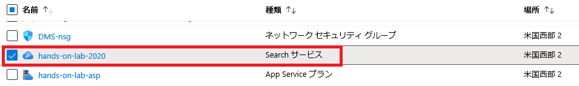
  
  2. Search サービス ブレードで**インデクサー**を選択し Policy-docs-indexer が**成功**のステータスで表示されることを確認。ステータスが**処理中**の場合は、**成功**に変わるまで 20 ～ 30 秒おきに**更新**を実行
    
     

     > **履歴がありません**のステータスが表示される場合は、policy-docs-indexer を選択してインデクサー ブレードで**実行**を選択します。  
  
  3. 次に、Search サービス ブレード ツールバーの**検索エクスプローラー**を選択
    
     
  
  5. **検索エクスプローラー**ブレードで**検索**を選択
    
     
 
  6. 検索結果で返ってきたドキュメントを特にあなたがサーチインデックスを作成した時に追加したコグニティブスキルによって追加されたフィールドに注意して検査する。
  該当するフィールドは、`People`, `Organizations`, `Locations`, `Keyphrases`, `Language`, `Translated_Text` です。
    
     ```
     {
         "@search.score": 1,
         "content": "\nContoso Insurance - Your Platinum Policy\n\nPolicy Holder: Igor Cooke\nPolicy #: COO13CE2ZLOKD\nEffective Coverage Dates: 22 July 2008 - 13 August 2041\nAddress: P.O. Box 442, 802 Pellentesque AveTaupo, NI 240\nPolicy Amount: $48,247.00\nDeductible: $250.00\nOut of Pocket Max: $1,000.00\n\nDEPENDENTS\nFirst Name Date of Birth\n\nIma 21 January 2002\nEcho 12 August 2003\n\nPage Summary\nDependents\n\n1 / 0 22 July 2008\n\n\nworksheet1\n\n\t\tFirst Name\t\tDate of Birth\n\n\t\tIma\t\t21 January 2002\n\n\t\tEcho\t\t12 August 2003\n\n\n\n\n\n\n",
         "metadata_storage_content_type": "application/octet-stream",
         "metadata_storage_size": 142754,
         "metadata_storage_last_modified": "2019-10-23T21:42:23Z",
         "metadata_storage_content_md5": "ksk3JZT5QPkHfAR0F17ZEw==",
         "metadata_storage_name": "Cooke-COO13CE2ZLOKD.pdf",
         "metadata_storage_path": "aHR0cHM6Ly9ob2xzdG9yYWdlYWNjb3VudC5ibG9iLmNvcmUud2luZG93cy5uZXQvcG9saWNpZXMvQ29va2UtQ09PMTNDRTJaTE9LRC5wZGY1",
         "metadata_content_type": "application/pdf",
         "metadata_language": "en",
         "metadata_author": "Contoso Insurance",
         "metadata_title": "Your Policy",
         "People": [
             "Igor Cooke",
             "Cooke",
             "Max"
         ],
         "Organizations": [
             "Contoso Insurance - Your Platinum Policy",
             "NI",
             "DEPENDENTS\nFirst",
             "Ima",
             "Page Summary\nDependents",
             "Echo"
         ],
         "Locations": [],
         "Keyphrases": [
             "Platinum Policy",
             "Policy Holder",
             "Date of Birth",
             "Echo",
             "DEPENDENTS",
             "Ima",
             "Box",
             "Pellentesque AveTaupo",
             "Address",
             "NI",
             "Contoso Insurance",
             "Igor Cooke",
             "Effective Coverage Dates",
             "Pocket Max",
             "Page Summary",
             "COO13CE2ZLOKD",
             "worksheet1"
         ],
         "Language": "en",
         "Translated_Text": "\nContoso Insurance - Your Platinum Policy\n\nPolicy Holder: Igor Cooke\nPolicy #: COO13CE2ZLOKD\nEffective Coverage Dates: 22 July 2008 - 13 August 2041\nAddress: P.O. Box 442, 802 Pellentesque AveTaupo, NI 240\nPolicy Amount: $48,247.00\nDeductible: $250.00\nOut of Pocket Max: $1,000.00\n\nDEPENDENTS\nFirst Name Date of Birth\n\nIma 21 January 2002\nEcho 12 August 2003\n\nPage Summary\nDependents\n\n1 / 0 22 July 2008\n\nworksheet1\n\nFirst Name\t\tDate of Birth\n\nIma\t\t21 January 2002\n\nEcho\t\t12 August 2003\n\n"
     }
      ```
  
  7. 比較目的でコグニティブ検索スキルが有効化されていない状態の同じドキュメントの例を以下に示す
    
     ```
     {
         "@search.score": 1,
         "content": "\nContoso Insurance - Your Platinum Policy\n\nPolicy Holder: Igor Cooke\nPolicy #: COO13CE2ZLOKD\nEffective Coverage Dates: 22 July 2008 - 13 August 2041\nAddress: P.O. Box 442, 802 Pellentesque AveTaupo, NI 240\nPolicy Amount: $48,247.00\nDeductible: $250.00\nOut of Pocket Max: $1,000.00\n\nDEPENDENTS\nFirst Name Date of Birth\n\nIma 21 January 2002\nEcho 12 August 2003\n\nPage Summary\nDependents\n\n1 / 0 22 July 2008\n\n\nworksheet1\n\n\t\tFirst Name\t\tDate of Birth\n\n\t\tIma\t\t21 January 2002\n\n\t\tEcho\t\t12 August 2003\n\n\n\n\n\n\n",
         "metadata_storage_content_type": "application/octet-stream",
         "metadata_storage_size": 142754,
         "metadata_storage_last_modified": "2019-10-23T21:42:23Z",
         "metadata_storage_content_md5": "ksk3JZT5QPkHfAR0F17ZEw==",
         "metadata_storage_name": "Cooke-COO13CE2ZLOKD.pdf",
         "metadata_storage_path": "aHR0cHM6Ly9ob2xzdG9yYWdlYWNjb3VudC5ibG9iLmNvcmUud2luZG93cy5uZXQvcG9saWNpZXMvQ29va2UtQ09PMTNDRTJaTE9LRC5wZGY1",
         "metadata_content_type": "application/pdf",
         "metadata_language": "en",
         "metadata_author": "Contoso Insurance",
         "metadata_title": "Your Policy"
     }
     ```
  
  8. これらの検索結果からわかるようにコグニティブ スキルを追加すると、検索インデックスに有用なメタデータが追加され、ドキュメントおよびそのコンテンツの利用性が向上する
  
## **Exercise 10: API Management への API のインポートと公開**
所要時間：30分

この実習では、API Management から API App および Azure Functions API エンドポイントを発行します。

### **Task 1**: API App のインポート
このタスクでは、OpenAPI 仕様を使用して、API App に関連付けられた Swagger 定義を活用し API Management に API App をインポートします。
  
  1. Azure Portal で hands-on-lab-SUFFIX リソース グループの下にあるリソースのリストから **PI Management サービス**を選択
    
     
  
  2. API Management サービスブレードで **APIs** を選択し、**+ API の追加**、**OpenAPI** の順に選択
    
     
  
  3. Create from OpenAPI specification ダイアログが表示された後、**Full** を選択し有効化する必要のあるすべてのオプションを展開
    
     
  
  4. API App の Swagger ページで PolicyConnect API タイルのすぐ下にある `swagger/v1/swagger.json` ファイル リンクを選択し **Copy link address** を選択
    
     
  
  5. API Management の Create from OpenAPI specification ダイアログに戻り以下の情報を入力し **Create** を選択
    
     - **OpenAPI specification**: Swagger ページからコピーしたリンク アドレスを貼り付け
     - **Display name**: これは Swagger 定義から自動的に入力
     - **Name**: これは Swagger 定義から自動的に入力
     - **URL scheme**: **HTTPS** を選択
     - **Products**: フィールドをクリックしてドロップダウン リストから **Unlimited** タグを選択
      
     
  
  6. API を作成した後、左側の API のリストから **PolicyConnect API** を選択し Design タブで、All operations が選択された状態で、Inbound processing タイルの **Policies** アイコンを選択
    
     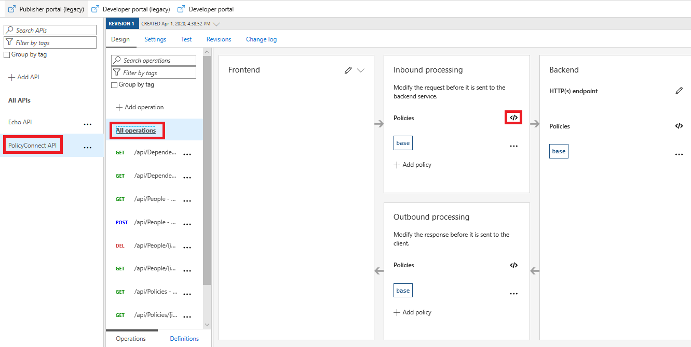
  
  7. Policies 画面で `<inbound></inbound>` タグの間、および `<base />` タグの下にコードを挿入。 `<Origin></origin>` タグの間にある `<your-web-app-url>` を **Web App** の URL で置換し **Save** を選択
    
     ```
      <cors allow-credentials="true">
          <allowed-origins>
              <origin>your-web-app-url</origin>
          </allowed-origins>
          <allowed-methods>
              <method>*</method>
          </allowed-methods>
          <allowed-headers>
              <header>*</header>
          </allowed-headers>
          <expose-headers>
              <header>*</header>
          </expose-headers>
      </cors>
     ```
    
     以下は更新した policies の値の例

     
   
     > メモ: 上記で追加したポリシーは、クロス オリジン リソース共有 (CORS) を処理するためのものです。Web App をローカルでテストしている場合は、` https://localhost:<port-number>` を含む `<allowed-origins></allowed-origins>` 内にもう 1 つの `<origin></origin> を追加する必要があります。ここでの `port-number` はデバッガーによって割り当てられたポートです (上のスクリーンショットを参照)。
  
  8. 次に**設定**タブを選択し `https://` を含む API アプリの URL を入力し **Save** を選択
    
     
  
### **Task 2**: Azure Functions のインポート
このタスクでは、Azure Functions を API Management にインポートします。
  
  1. **+ API の追加**をもう一度選択して、API のソースとして **Function App** を選択
    
     
  
  2. **Create from Function App** ダイアログで、**Function App** フィールドの横にある **Browse** ボタンを選択
    
     
  
  3. Import Azure Functions ブレードで Function App を選択し、リストから対象の Function App を選択し**選択**を選択
    
     
  
  4. [Import Azure Functions] ブレードに戻り、PolicyDocs Function が選択されていることを確認し**選択**を選択
    
     
  
  5. APIM の [Create from Function App] ダイアログに戻って、API のすべてのプロパティが Azure Function から設定されていることを確認し、以前の手順で行ったように **Products** を **Unlimited** に設定し **Create** を選択
    
     
  
### **Task 3**: 開発者ポータルからの API キーの取得
このタスクでは、開発者ポータルで API を確認してキーを取得します。開発者ポータルでは、API およびエンドポイントのリストに加えて、API とエンドポイントに関する有益な情報が表示されます。
  
  1. Azure Portal の API Management サービスの概要ブレードから **Developer portal (legacy)** を選択し APIM 開発者ポータルを開く
    
     
  
  2. Azure API Management ポータル上部のメニューから **APIs** を選択し Function App に関連付けられた API を選択
    
     
  
  3. API ページで次のタスクでの `PolicyDocumentsPath` 設定に使用する URL をコピーしテキストエディタ―に貼り付け
    
     > メモ: パスは Swagger で既に定義されているため、この手順を PolicyConnect API に対して実行する必要はありません。変更する必要があるのは、API App ではなく API Management をポイントしているベース URL です。
   
     
  
  4. 次に、API ページの右上にある **Administrator** ドロップダウンから **Profile** を選択し、プロファイル ページで **Unlimited** のプライマリ キーの横にある **Show** を選択し、キー値をコピーコピーしテキストエディタ―に貼り付け ( ここで取得する `Ocp-Apim-Subscription-Key` 値をは、PolicyConnect Web アプリケーションが APIM から API にアクセスするために必要 )
    
     
  
### **Task 4**: API Management エンドポイントを使用するための Web App の更新
このタスクでは、Azure Cloud Shell および Azure CLI を使用して、PolicyConnect Web App の Url および PolicyDocumentsPath 設定を更新します。API Management アクセス キーに新しい設定も追加します。
  
  1. [Azure Portal](https://portal.azure.com/) の画面右上のメニューから Azure Cloud Shell アイコンを選択
    
     
  
  2. ブラウザー ウィンドウの下部に表示される Cloud Shell ウィンドウで **PowerShell** を選択
    
     
  
  3. PowerShell Azure プロンプトが表示される
    
     
  
  4. Cloud Shell プロンプトで以下のコマンドを実行し、Web App 名を取得します。コマンドを実行する前に、<your-resource-group-name> をリソース グループの名前で置き換え
    
     ```
     $resourceGroup = "<your-resource-group-name>"
     az webapp list -g $resourceGroup --output table
     ```
  
  5. 後で使用するために出力の Web App の名前 ("contoso-web" で始まるリソース名) をテキスト エディターにコピー
    
     
  
  6. 次に、以下のコマンドのトークン化された値を次のように置換し、Azure Cloud Shell コマンド プロンプトから実行し WebApp の設定で反映されていることを確認
    
     - `<your-web-app-name>`: 以前の手順でコピーした Web App 名で置き換え
     - `<your-apim-url>`: Azure Portal の API Management サービスの 概要ブレードから取得可能な API Management インスタンスのゲートウェイ URL で置き換え
     - `<your-apim-function-app-path>`: 以前の手順でコピーした APIM の `PolicyDocumentsPath` URL で置き換え
     - `<your-apim-subscription-key>`: 以前の手順でコピーした APIM の `Ocp-Apim-Subscription-Key` 値で置き換え

     ```
     $webAppName = "<your-web-app-name>"
     $apimUrl = "<your-apim-gateway-url>"
     $apimKey = "<your-apim-subscription-key>"
     $policyDocsPath = "<your-apim-function-app-path>"
     az webapp config appsettings set -n $webAppName -g $resourceGroup --settings "PolicyDocumentsPath=$policyDocsPath" "ApiUrl=$apimUrl" "ApimSubscriptionKey=$apimKey"
     ```
     
     
  
  7. WebApp の再起動を実施
    
     
  
  8. Web ブラウザーで Web App の URL に移動し、タブを選択するとこれまで通りデータが表示されることを確認
    
     
  
## **Exercise 11: PowerApps でのアプリの作成**
所要時間：15分

モバイル アプリの作成には長い開発プロセスが必要なので、Contoso は PowerApps を使用してモバイル アプリケーションを作成し、現在のアプリでは提供されていない機能を迅速に追加することが検討されています。このシナリオでは、現在のアプリでは実行できない保険契約の値 (Silver、Gold、Platinum など) を編集する機能を実装します。このタスクでは、PowerApps で作成した新しいアプリを実行し、ContosoInsurance データベースに接続して基本的な CRUD (Create、Read、Update、および Delete) 操作を Policies テーブルに対して実行します。

### **Task 1**: PowerApps アカウントへのサインアップ
  
  1. https://web.powerapps.com にアクセスし Azure で使用しているアカウントと同一のものを使用して新しいアカウントにサインアップ
   
     > メモ: 既にサインインしたことがある場合、そのまま PowerApps のポータルが表示されます
    
  2. アカウント作成のリクエストを確認するためにプロセスを続行するリンクを含む電子メールが送信されることがあります
    
  3. Microsoft Store : https://www.microsoft.com/en-us/store/p/powerapps/9nblggh5z8f3 から **PowerApps Studio** をダウンロードしてインストール
    
     > メモ: PowerApps を LabVM にインストールできない場合、ローカル マシンにインストールして、この実習の手順を実行できます。  
  
### **Task 2**: 新しい SQL 接続の作成
  
  1. 作成した PowerApps アカウントを使用して PowerApps Web サイトにログインし **データ** オプションを展開し左側のナビゲーション メニューから **接続** を選択
    
     
  
  2. **新しい接続** ボタンを選択
    
     
  
  3. 検索ボックスに **SQL** と入力しリストから SQL Server を選択
    
     
  
  4. SQL Server 接続ダイアログで以下の情報を入力し**作成**を選択
    
     - **認証の種類**: **SQL Server 認証** を選択
     - **SQL サーバ名**: Azure SQL Database のサーバー名を入力 ( 例. `contosoinsurance-jjbp34uowoybc.database.windows.net` )
     - **SQL データベース名**: **ContosoInsurance** と入力
     - **ユーザー名**: **demouser** と入力
     - **パスワード**: **Password.1!!** と入力

     
  
### **Task 3**: 新しいアプリの作成
  
  1. 前の手順でダウンロードした PowerApps Studio アプリケーションを開き PowerApps アカウントでサインイン
  
  2. 左側にある**新規**を選択しブラウザー ウィンドウが開いたら、必要に応じて国/地域を確認して**開始**を選択
  
  3. 次に**データを使用して開始**リストの横にある**右向き矢印**を選択
    
     
  
  4. 以前のタスクで作成した **SQL Server 接続**を選択
    
     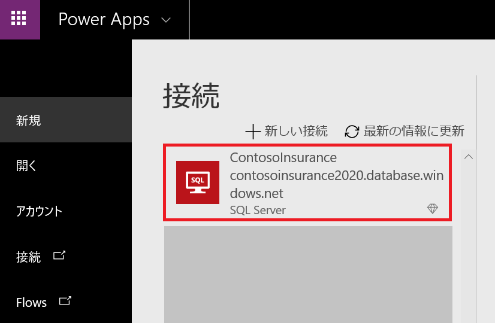
  
  5. テーブルの選択リストから **Policies** テーブルを選択し**接続**を選択
    
     
  
### **Task 4**: アプリの設計
  
  1. 新しいアプリが自動的に作成されデザイナー内に表示された後、最初のページタイトルを `[dbo].[Policies]` から式フィールドで **Policies** に編集
    
     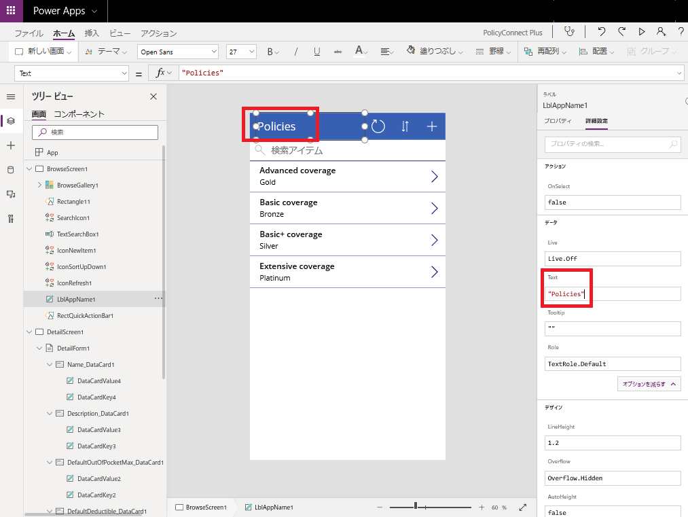
   
  2. 左側のメニューから **DetailScreen1** を選択
    
     
  
  3. フォーム上のフィールドを選択して **Card: <フィールド名>** タグに基づいて目的の場所にドラッグし **Name**, **Description**, **DefaultDeductible**, **DefaultOutOfPocketMax** の順に並び替え
    
     
  
  4. フォーム上で DefaultDeductible および DefaultOutOfPocketMax ラベルをそれぞれを Default Deductible および Default Out of Pocket Max に変更
    
     > ヒント: タイトルを変更する前に対象のカードにカーソルを合わせ、右クリックした後、ロックを解除してください。
    
     > 
  
  5. 式フィールド内で引用符に囲んで「Policy」と入力し、画面のタイトルを Policy に変更
    
     
  
  6. 左側のメニューで **EditScreen1** を選択し手順 4 ~ 6 を繰り返して画面を編集
  
### **Task 5**: アプリ設定の編集とアプリの実行
  1. 上部のメニューで [File] を選択
    
     
  
  2. [App settings]、[App name +] アイコンの順に選択して、新しいアプリ名 (PolicyConnect Plus など) を入力
    
     
  
  3. 左側のメニューで [Save] を選択してアプリをクラウドに保存し、下の [Save] ボタンを選択
    
     
  
  4. 保存した後、左側のメニューの上部にある左向きの矢印を選択
    
     
  
  5. 左側のメニューから **BrowseScreen1** を選択し上部のメニューで **Run** を選択してアプリをプレビューの実行
    
     
  
  6. プレビュー画面において現在の保険契約の表示、値の変更、および新規保険契約の作成を行うことができることを確認
    
     
  
  7. スマートフォンで PowerApps のアプリケーションをダウンロードし、ログインした後 **PolicyConnect Plus** を起動し動作を確認
  
## **ワークショップ後の作業**
ワークショップで使用した Azure リソースを削除します。

### **Task 1**: リソース グループの削除
  
  1. Azure Portal で 左側のメニューから**リソース グループ**を選択し **Delete resource group** から **hands-on-lab-SUFFIX** リソース グループを削除

### **Task 2**: Contoso-apps サービス プリンシパルの削除
  
  1. Azure Portal で **Azure Active Directory**を選択し、**アプリの登録**を選択

  2. **contoso-apps** アプリケーションを選択しアプリケーション ブレードの**削除**を選択
  
***
このドキュメントに含まれているURL およびその他のインターネット Web サイトの参照を始めとする情報は予告なく変更されることがあります。別途明示されている場合を除き、本書内で例として使用されている会社、組織、製品、ドメイン名、電子メール アドレス、ロゴ、人物、場所、およびイベントは架空のもので、実在する企業、組織、製品、ドメイン名、電子メール アドレス、ロゴ、人、場所、または人とは関係ありません。ユーザーは該当するすべての著作権法に従う責任があります。このドキュメントを使用する場合は、適用される著作権関連の法律に従っていただくものとします。このドキュメントのいかなる部分も、米国 Microsoft Corporation の書面による許諾を受けることなく、その目的を問わず、どのような形態であっても、複製または譲渡することは禁じられています。ここでいう形態とは、複写や記録など、電子的な、または物理的なすべての手段を含みます。ただしこれは、著作権法上のお客様の権利を制限するものではありません。
マイクロソフトは、この文書に記載されている事項に関して、特許、申請中特許、商標、著作権、および他の知的財産権を所有する場合があります。別途マイクロソフトのライセンス契約上に明示の規定のない限り、このドキュメントはこれらの特許、商標、著作権、またはその他の無体財産権に関する権利をユーザーに許諾するものではありません。
製造業者名、製品名、または URL は情報提供の目的でのみ使用されています。明示、黙示、または法律の規定にかかわらず、これらの製造業者やマイクソフト テクノロジを含む製品の使用に関してマイクロソフトはいかなる責任も負わないものとします。製造業者または製品が記載されていることにより、マイクロソフトによる製造業者または製品の保証が示唆されるものではありません。サード パーティのサイトへのリンクが記載されている可能性があります。そのようなサイトはマイクロソフトの管理下にないので、マイクロソフトは、リンク先のサイトのコンテンツやリンク先のサイトに含まれるリンク、またはそのようなサイトの更新に関していかなる責任も負わないものとします。マイクロソフトは、リンク先のサイトから提供されるウェブキャストまたはその他の形式の送信に責任を負わないものとします。マイクロソフトは、これらのリンクをユーザーの利便性のみを目的として提供しています。含まれるリンクは、サイトやそこに含まれる製品に対するマイクロソフトの保証を示唆するものではありません。

&copy; 2020 Microsoft Corporation. All rights reserved.

マイクロソフトおよび <https://www.microsoft.com/en-us/legal/intellectualproperty/Trademarks/Usage/General.aspx> に記載されている商標は、Microsoft グループ企業の商標ですその他すべての商標は各社が所有しています。
